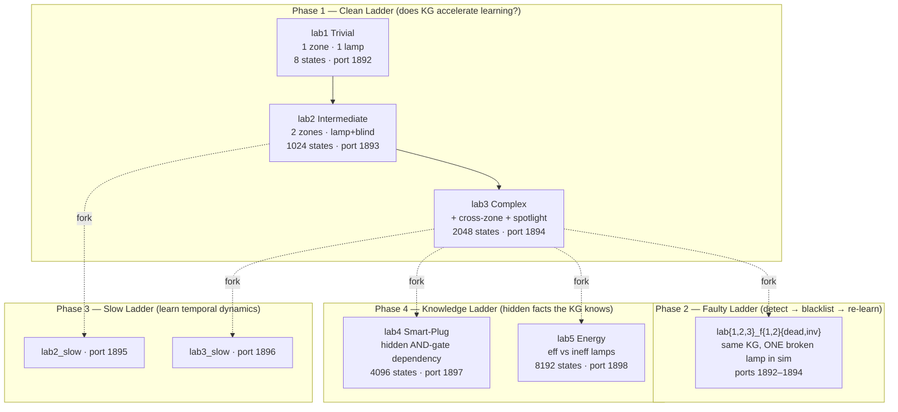
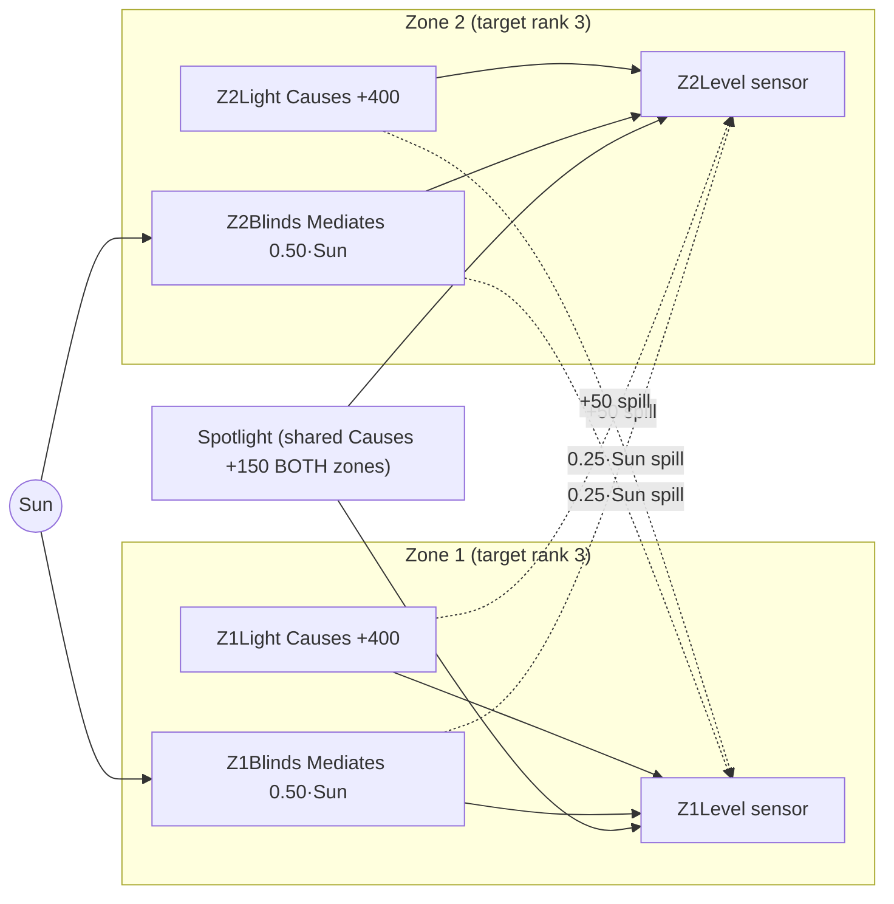
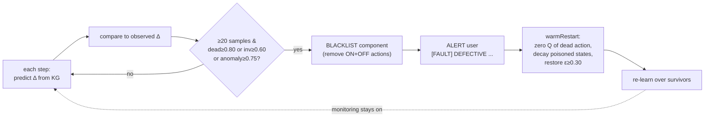
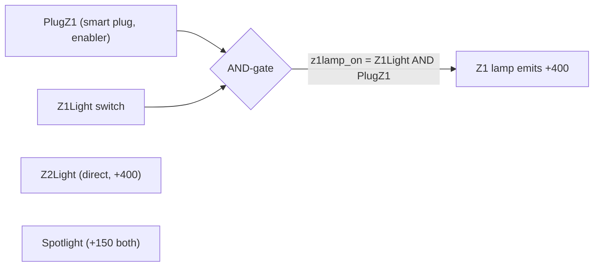
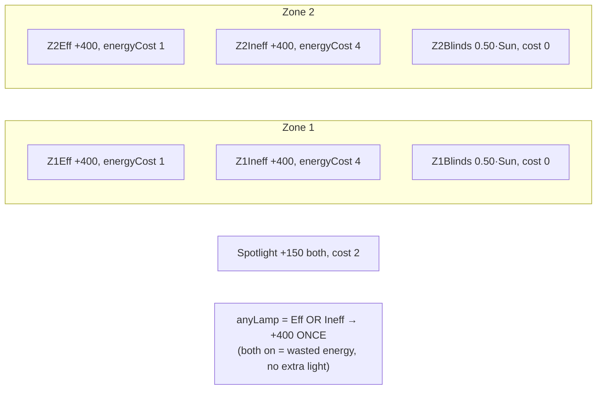

# Lab Reference — All Phases (lab-by-lab)

**Project:** MT-Esra (Knowledge-Guided RL for Building Automation)
**Stack:** JaCaMo (Jason BDI + CArtAgO) · tabular Q-learning · Knowledge Graph / stereotypes · Node-RED simulators
**Single source of truth for profiles:** [src/agt/lab_profiles.asl](../src/agt/lab_profiles.asl)

This document describes **every lab used in the four-phase thesis arc, one by one** — its components, topology, the simulator/environment physics (the exact lux/energy values), the agent-side state space, what knowledge it encodes, and what it is designed to test. Legacy pre-phase "custom" labs are summarised in the appendix.

---

## 0. Shared conventions (read this first)

Every lab is a **smart-lighting control problem**: a Node-RED simulator models one or more *zones*, each with a light-level sensor and a set of actuators (lamps, motorized blinds, a shared spotlight). An agent toggles actuators to drive every zone to its **target brightness rank** within a 20-step episode.

### The three control modes (compared in every lab)

| Mode | Knowledge | Role |
|---|---|---|
| `rule_based` | hand-written policy | non-learning reference |
| `ql_false` | **tabula-rasa** Q-learning | learns from scratch (the control arm) |
| `ql_true` | **KG-primed** Q-learning | same learner + stereotype priors from the Knowledge Graph (the treatment arm) |

The headline of every phase is the **within-lab `ql_true` vs `ql_false` delta** — the pure effect of the prior knowledge.

### Discretisation (how continuous lux becomes a rank)

The agent never sees raw lux; it sees a **rank 0–3** per zone, via per-lab bounds:

| Quantity | Phase 1/3/4 bounds | Rank meaning |
|---|---|---|
| Light level | `[50, 100, 300]` | 0 dark `<50` · 1 dim `[50,100)` · 2 medium `[100,300)` · 3 **bright** `≥300` |
| Sunshine | `[50, 200, 600]` | 0 `<50` · 1 `[50,200)` · 2 `[200,600)` · 3 `≥600` |

(The legacy custom labs use `[75,200,400]` / `[50,150,500]` — see appendix.)

### Sunshine (the exogenous context)

Sunshine is sampled **once per episode** from `{0, 100, 400, 900}` lux and **pinned** for the whole episode, so the simulator tick is a deterministic function of state (no PRNG in the physics). `sunshine_prob = 0.75` is `P(sun ≥ rank 1)`. Sunshine matters because **blinds only harvest daylight** — the central "stereotype" the KG encodes is `Mediates(blind, sunshine)`.

### Ambient & horizon

- **Ambient floor:** every zone sits at **25 lux** with everything off.
- **Episode horizon:** 20 steps (`max_steps = 20`); a scenario is *solved* when every zone hits its target rank.

### The lab ladder at a glance



### Master table

| Phase | Lab | Port | Zones | New mechanism | States | KG file |
|---|---|---|---|---|---|---|
| 1 | `lab1` | 1892 | 1 | single `Causes` lamp | 8 | `building_1_trivial.ttl` |
| 1 | `lab2` | 1893 | 2 | + `Mediates` blind (sun) | 1024 | `building_2_intermediate.ttl` |
| 1 | `lab3` | 1894 | 2 | + cross-zone spill + spotlight | 2048 | `building_3_complex.ttl` |
| 2 | `lab1_f1dead` | 1892 | 1 | dead lamp (no recovery) | 8 | `building_1_trivial.ttl` |
| 2 | `lab2_f1dead`/`f1inv` | 1893 | 2 | one dead / inverted lamp | 1024 | `building_2_intermediate.ttl` |
| 2 | `lab2_f2dead`/`f2inv` | 1893 | 2 | both lamps dead / inverted | 1024 | `building_2_intermediate.ttl` |
| 2 | `lab3_f1dead`/`f1inv` | 1894 | 2 | one dead / inverted lamp | 2048 | `building_3_complex.ttl` |
| 2 | `lab3_f2dead`/`f2inv` | 1894 | 2 | both lamps dead / inverted | 2048 | `building_3_complex.ttl` |
| 3 | `lab2_slow` | 1895 | 2 | blind response delay (60 s) | 1024 (dim 7) | `building_2_slow.ttl` |
| 3 | `lab3_slow` | 1896 | 2 | delay on **both** blinds | 2048 (dim 8) | `building_3_slow.ttl` |
| 4 | `lab4` | 1897 | 2 | hidden smart-plug AND-gate | 4096 | `building_4_smartplug.ttl` |
| 4 | `lab5` | 1898 | 2 | efficient vs inefficient lamps | 8192 | `building_5_energy.ttl` |
| 1b | `labrel0/4/8/16` | 1904–1907 | 1 | K stateless `EXPLICIT_OTHER_DV` decoys | 8 (all rungs) | `building_10_labrel{0,4,8,16}.ttl` |
| 1b | `labrel8s` | 1908 | 1 | the 8 decoys as observable state bits | 2048 | `building_10_labrel8s.ttl` |
| 1b | `labband` | 1912 | 1 | exact rank-2 band + inverse-direction awning (multi-IV gates) | 256 | `building_11_labband.ttl` |
| 1b | `lab4chain3` | 1913 | 1 | depth-3 `ws:powerGates` chain + 2 `UNKNOWN` decoys | 128 | `building_12_chain3.ttl` |

---

# Phase 1 — The Clean Ladder

**Question:** *does priming the learner with the Knowledge Graph make it converge faster than a tabula-rasa learner, on clean problems with no hidden traps?*

All three labs are **strictly clean**: the simulator physics is fully aligned with the KG, so every `ql_true − ql_false` difference is attributable to the prior. Each loads **only its own self-contained `building_*.ttl`** (schema + topology + WoT mappings + slot registry); `lab-ontology.ttl` is deliberately *not* loaded, so nothing can leak in extra actuators. The ladder adds **exactly one mechanism class per step**.

---

## lab1 — Trivial (port 1892)

**Role:** the acceleration baseline — the smallest possible lab where a `Causes` actuator (a lamp that unconditionally adds light) must be switched on.

### Components & topology

```
        ┌─────────────── Zone 1 ───────────────┐
 Sun ──▶ │  ambient 25 lux                       │
(distractor) │  [Sensor] Z1Level  ── rank 0..3       │
        │  [Actuator] Z1Light (Causes, +400)   │
        └───────────────────────────────────────┘
                target: Z1 = bright (rank 3)
```

- **1 zone, 1 sensor, 1 actuator** (`Z1Light`, a `Causes` lamp).
- Sunshine is present but is a **pure distractor**: it is *not* in the state vector and contributes only `0.10·Sun` (≤ 90 lux at sun 900), never enough to reach rank 3 alone.

### Simulator physics

$$Z1 = 25 + 0.10\cdot\text{Sun} + (Z1Light\;?\;400:0)$$

The lamp (`+400` → 425 lux) is the **only** path to rank 3, so the unique optimum in every scenario is `Z1Light = on`.

### Agent state & space

- State vector: `[Z1Level, Z1Light]` → `4 × 2 = 8 states`.
- Target: `target(1, 3)`. Held-out benchmark: 8 scenarios (2 per sun rank).

### Knowledge encoded

`Z1Light Causes Z1Level` (unconditional positive). What the KG buys here: the primed agent starts already believing "switch the lamp on," so its first-goal episode is earlier. `training_params(1000, 0.9920)`.

### What it tests

The simplest acceleration signal, plus a sanity check that the agent does **not** redundantly toggle an already-correct lamp (the "bright start" scenarios).

---

## lab2 — Intermediate (port 1893)

**Role:** introduces the **`Mediates(blind, sunshine)`** mechanism — a blind that harvests daylight only when the sun is up. This is the central stereotype of the whole thesis.

### Components & topology

```
   ┌──────────── Zone 1 ────────────┐   ┌──────────── Zone 2 ────────────┐
   │ [Sensor]  Z1Level               │   │ [Sensor]  Z2Level               │
   │ [Act] Z1Light  (Causes,  +400)  │   │ [Act] Z2Light  (Causes,  +400)  │
   │ [Act] Z1Blinds (Mediates,       │   │ [Act] Z2Blinds (Mediates,       │
   │        0.50·Sun)                 │   │        0.50·Sun)                 │
   └─────────────────────────────────┘   └─────────────────────────────────┘
        target Z1 = bright(3)                  target Z2 = bright(3)
   (the two zones are fully INDEPENDENT — no coupling)
```

- **2 independent zones**, each with a `Causes` lamp **and** a `Mediates` blind.
- No cross-zone coupling; the only shared exogenous input is the sun.

### Simulator physics (per zone, identical for Z1, Z2)

$$\text{Level} = 25 + (Light\;?\;400:0) + (Blinds\;?\;0.50\cdot\text{Sun}:0)$$

- Lamp **always** reaches rank 3 (425 lux) → every scenario is solvable.
- Blind-only reaches rank 3 **only at sun 900** (25 + 0.50·900 = 475) at **zero energy** — the cheap, sun-conditioned optimum the `Mediates` prior should find quickly. At sun 0/100/400 the blind tops out at ≤ 225 (rank 2), so the lamp is required.

### Agent state & space

- State vector: `[Z1Level, Z2Level, Z1Light, Z2Light, Z1Blinds, Z2Blinds, Sunshine]` (7 slots).
- States: **1024**. Targets: `target(1,3), target(2,3)`. Benchmark: 16 scenarios (4 per sun rank).

### Knowledge encoded

`Light Causes Level` (both zones) **and** `Blind Mediates Level via Sunshine`. The prior's payoff is **sun-conditioned action selection** — open the blind when sunny (free), use the lamp when dark. `training_params(2000, 0.9960)`.

### What it tests

Whether the KG-primed agent learns the sun-conditioned blind policy faster than a learner that must discover the sun-conditioning from scratch.

---

## lab3 — Complex (port 1894)

**Role:** the richest clean lab — adds **cross-zone light spill** and a **shared spotlight** (a redundant actuator the agent must learn to *avoid*). This is the template every Phase 2/3/4 lab forks.

### Components & topology



- lab2 + **cross-zone spill** (each zone's lamp/blind leaks light into the *other* zone) + **one shared Spotlight** (`Causes`, +150 to **both** zones).

### Simulator physics

$$Z1 = 25 + (Z1Light\;?\;400) + (Z2Light\;?\;50) + (Z1Blinds\;?\;0.50\cdot\text{Sun}) + (Z2Blinds\;?\;0.25\cdot\text{Sun}) + (Spotlight\;?\;150)$$

Z2 is symmetric. Note the **cross coefficients are smaller** than own-zone: lamp spill `+50` (vs `+400`), blind spill `0.25·Sun` (vs `0.50·Sun`).

- Lamp always reaches rank 3 → every scenario solvable.
- **Spotlight is a trap:** +150 is never enough alone (need ≥ 300), so the optimum *never* uses it — the agent must learn to **avoid the redundant actuator**.
- At sun 900, opening **both** blinds gives 25 + 450 + 225 = 700 per zone at **zero energy** = the cheap optimum.

### Agent state & space

- State vector adds `Spotlight`: `[Z1Level, Z2Level, Z1Light, Z2Light, Z1Blinds, Z2Blinds, Spotlight, Sunshine]` (8 slots).
- States: **2048**. Targets `target(1,3), target(2,3)`. Benchmark: 16 scenarios. `training_params(3000, 0.9970)`.

### What it tests

KG-primed acceleration in the presence of (a) cross-zone interactions and (b) a tempting-but-useless shared actuator — does the prior steer the agent away from redundant spotlight toggles?

---

# Phase 2 — The Faulty Ladder

**Question:** *when a real actuator silently breaks, can the agent detect it, blacklist it, alert the user, and re-learn over what survives — and does the KG-primed arm recover faster?*

### The fault model (simulator-side, KG unchanged)

Each faulty profile is a **clean Phase-1 parent** (lab1/lab2/lab3) whose **agent-side ontology, targets and bounds are identical** to the parent (the KG still believes the *nominal* physics), but whose **simulator flow injects exactly one hardware fault** into a `Causes` lamp:

| Fault suffix | Injection | KG predicts | Reality gives |
|---|---|---|---|
| `_f1dead` | lamp lux forced to **0** (relay clicks, bulb emits nothing) | `+Δ` | `0` |
| `_f1inv` | lamp lux **negated** (mis-wired) | `+Δ` | `0` (from dark) or `−Δ` (from an elevated zone) |
| `_f2dead` | **both** lamps dead (multi-fault) | `+Δ` each | `0` each |
| `_f2inv` | **both** lamps inverted | `+Δ` each | `0` / `−Δ` |

The faulty flow runs on the **same port + TD** as the clean parent (only one variant adapts at a time). `adapt_source/2` maps each faulty profile to the clean parent's Q-table suffix, so the adapt agent **warm-loads the Phase-1 Q-table** and measures *recovery from a working policy*.

### Detection → recovery pipeline



Detection constants: `FAULT_MIN_SAMPLES = 20`, `FAULT_DEAD_RATE = 0.80`, `FAULT_INV_RATE = 0.60`, `FAULT_ANOMALY_RATE = 0.75`, `FAULT_EPS_BOOST = 0.30`. Only **`Causes`** actuators are adjudicated — `Mediates` blinds are IV-gated (a healthy blind can look "dead" at sun 0), so they are skipped to avoid false positives. Headline metric: `RecoveryEpisodes = ReconvergeEpisode − DetectEpisode`.

---

## lab1_f1dead — single dead lamp (port 1892)

The **degenerate detection showcase.** lab1 has only one actuator, so after blacklisting **no lever survives** — the agent **detects + alerts but cannot recover** (recovery = N/A). Proves the monitor fires correctly even when remediation is impossible. Warm-loads `_lab1`.

## lab2_f1dead / lab2_f1inv — one broken lamp, recovery possible (port 1893)

The Z1 lamp is dead (`f1dead`) or inverted (`f1inv`). The **Z1 blind and all of Z2 survive**, so the agent re-learns a recovered policy (rank-3 Z1 reachable via the blind on sunny episodes). `f1inv` produces opposite-sign evidence when the zone is already lit. Warm-loads `_lab2`.

## lab2_f2dead / lab2_f2inv — both lamps broken (port 1893)

**Multi-fault**, iterative detect→blacklist→re-learn: both task lamps are dead/inverted. After both are blacklisted only the **blinds survive**, so full rank-3 recovery is only possible on **sunny** episodes — a medium-complexity "several-broken, partial-recovery" case proving multi-component detection. Warm-loads `_lab2`.

## lab3_f1dead / lab3_f1inv — one broken lamp in the complex lab (port 1894)

Z1 lamp dead/inverted in lab3. **Survivors are richer:** the shared spotlight + cross-zone spill keep Z1 partly elevated, so `f1inv` yields *genuine opposite-direction* evidence (not just dead-looking Δ=0) — the cleanest inversion-detection case. Warm-loads `_lab3`.

## lab3_f2dead / lab3_f2inv — both lamps broken in the complex lab (port 1894)

Both lamps dead/inverted. The **spotlight (+150 both zones) and the blinds survive**, giving the **cleanest several-dead-with-recovery** case in the suite (recovery via spotlight + blinds). Warm-loads `_lab3`. `training_params(4000, 0.9970)` (lab3 faults train longer).

> **Note on lab1:** there is no `lab1_f*inv` or `lab1_f2*` — with a single lamp, "inverted" and "several" are degenerate, so only `lab1_f1dead` exists.

---

# Phase 3 — The Slow Ladder

**Question:** *can the agent learn each actuator's temporal response delay online, write it back to the KG, and use it to satisfy time-bounded goals ("bright immediately" vs "bright within 5 min")?*

### The delay model

Each slow profile is **structurally identical** to its clean parent (same agent-side ontology shape, targets, bounds → **same Q-state space**), but the **simulator gives the motorized blind a temporal response delay** while lamps and the spotlight stay instantaneous:

```
flag flip ──▶ [ lamp / spotlight ]  ──▶  effect on NEXT tick   (immediate)

flag flip ──▶ [ motorized blind ]  ──▶  12-tick countdown  ──▶  effect
                                          │
              12 ticks × 50 ms wall = 600 ms wall-clock
              = 60 s of SIMULATED time at seconds_per_tick = 5.0
```

The Node-RED flow runs a **50 ms env-tick** (`inject repeat=0.05`) that increments `Tick` and integrates `EnergyCost` / `TotalEnergyCost`, exposed via a new `readLabStatusTimed` op. On `POST /setState` the blind countdown is **skipped** (the dynamics probe always starts from a clean `t=0`).

> **Important:** the slow labs **do not Q-learn** — a dedicated *dynamics agent* measures the per-actuator delay by probing, writes `ws:responseDelay` to `learned_dynamics_*.ttl`, then plans against deadlines. `training_params` is therefore unused. The building TTLs are *static* — `ws:responseDelay` is **not** asserted there; the writeback file is the canonical learned value. Config: `seconds_per_tick = 5.0`, `blind_delay_ticks = 12` (ground truth), probe `{probes_per_actuator: 8, settle_ms: 400, poll_ms: 50, max_wait_ticks: 60, target_rank: 3, probe_sun_rank: 900}`.

---

## lab2_slow — Intermediate + blind delay (port 1895)

- **Forks lab2.** Physics identical to lab2 (`Level = 25 + Light?400 + Blinds?0.50·Sun`), but the blind takes **~60 s** to actuate.
- State dim **7** (same as lab2). KG: `building_2_slow.ttl`, TD `interactions-lab2_slow.ttl`. Benchmark/training scenarios reused from lab2 (schema identical).
- **Tests:** can the agent learn one slow actuator's delay and prefer the *instant* lamp when the goal is "bright **now**," but the *free* blind when the goal allows "within 5 min" on a sunny episode?

## lab3_slow — Complex + delay on both blinds (port 1896)

- **Forks lab3.** Physics identical to lab3 (cross-zone spill + spotlight), but **both** motorized blinds are delayed (~60 s); lamps and spotlight instantaneous.
- State dim **8** (same as lab3). KG: `building_3_slow.ttl`, TD `interactions-lab3_slow.ttl`. Scenarios reused from lab3.
- **Tests:** delay learning when **two** slow actuators coexist with instantaneous ones and cross-zone coupling — the richest temporal-planning case.

---

# Phase 4 — The Knowledge Ladder

**Question (the thesis core):** *can the KG encode facts a tabula-rasa learner fundamentally cannot see — a hidden wiring dependency and a per-device energy datasheet — and does a KG-primed agent exploit them, provably, and beat an LLM's general knowledge?*

Both labs are **strictly clean** forks of lab3 (2 zones, target rank 3, ambient 25, sun ∈ {0,100,400,900}). Both use the **richer cross-zone coefficients** `LAMP_CROSS = +150` and `BLIND_CROSS = 0.40·Sun` (vs lab3's +50 / 0.25·Sun), and a Spotlight at +150 both zones.

---

## lab4 — Smart-Plug hidden dependency (port 1897)

**Role:** a **hidden-but-documented power dependency** — the Z1 ceiling lamp is wired behind a smart plug and emits light **only when BOTH its switch AND the plug are ON** (a logical AND-gate). The dependency lives in the KG (`ws:powerGates`); a tabula-rasa agent must discover it by trial and error.

### Components & topology



- lab3 topology **+ `PlugZ1`** (a new actuator) gating the Z1 lamp. Zone 2's lamp is direct (no plug).
- KG vocabulary: **`ws:powerGates`** (`plug ws:powerGates lamp`) + `ws:poweredBy` (inverse) + `ws:plugPowerSwitch`.

### Simulator physics

$$z1lamp\_on = Z1Light \wedge PlugZ1$$
$$Z1 = 25 + (z1lamp\_on\;?\;400) + (Z2Light\;?\;150) + (Z1Blinds\;?\;0.50\cdot\text{Sun}) + (Z2Blinds\;?\;0.40\cdot\text{Sun}) + (Spotlight\;?\;150)$$
$$Z2 = 25 + (Z2Light\;?\;400) + (z1lamp\_on\;?\;150) + (Z2Blinds\;?\;0.50\cdot\text{Sun}) + (Z1Blinds\;?\;0.40\cdot\text{Sun}) + (Spotlight\;?\;150)$$

Energy/tick (bookkeeping) `= (z1lamp_on?1) + (Z2Light?1) + (Spotlight?2)`; the plug itself draws nothing.

- **Signature trap (scenarios 3 & 11):** `Z1Light` is already ON but `PlugZ1` is OFF, so Z1 stays dark — the fix is to toggle the **plug**, not the lamp. A tabula-rasa learner that flips the lamp sees no effect and is punished by the no-effect penalty.
- At sun 900, both blinds give 0.50·Sun own + 0.40·Sun cross = 835/zone at zero energy (plug irrelevant) = cheap optimum.

### Agent state, KG mechanism & space

- State vector adds `PlugZ1` (slot 7): `[Z1Level, Z2Level, Z1Light, Z2Light, Z1Blinds, Z2Blinds, Spotlight, PlugZ1, Sunshine]`.
- States: **4096**. Targets `target(1,3), target(2,3)`. `training_params(3000, 0.9970)`.
- **How the KG exploits it:** the reasoner reads `ws:powerGates` and marks the Z1 lamp's ON action as **IV-gated on the plug slot** (`ivMinRank = 1`), reusing the existing instrumental-variable machinery — so the primed agent learns *enable the plug first*.

### What it tests

Efficiency under a hidden dependency: KG-primed vs tabula-rasa **steps, deviation, wasted/redundant actions** to reach the goal (both eventually reach it; the KG arm reaches it with materially fewer redundant toggles).

---

## lab5 — Energy-aware (port 1898)

**Role:** **two directly-actionable lamps per zone with identical brightness (+400) but different energy cost** (`ws:energyCost` 1 vs 4). The goal is energy-aware. Energy is **deliberately NOT in the Q-reward** — only a KG-primed agent (reading the cost via a **non-fading energy prior**) prefers the cheap lamp.

### Components & topology



- Per zone: an **efficient** lamp and an **inefficient** lamp, **optically identical** (`anyLamp = Eff OR Ineff` contributes +400 **once**), plus the lab3 blind/spotlight/cross-zone structure (richer cross coefficients).
- KG vocabulary: **`ws:energyCost`** (per-actuator datasheet: Eff 1, Ineff 4, Spotlight 2, blinds 0).

### Simulator physics

$$z\_anyLamp = Z\_Eff \vee Z\_Ineff$$
$$Z1 = 25 + (z1anyLamp\;?\;400) + (z2anyLamp\;?\;150) + (Z1Blinds\;?\;0.50\cdot\text{Sun}) + (Z2Blinds\;?\;0.40\cdot\text{Sun}) + (Spotlight\;?\;150)$$
$$\textbf{power} = (Z1Eff\;?\;1) + (Z1Ineff\;?\;4) + (Z2Eff\;?\;1) + (Z2Ineff\;?\;4) + (Spotlight\;?\;2)$$

### The energy budget & compliance metric

Each scenario carries an **`energyBudget`** (default **2**) — a scenario-level *scoring annotation*, not a simulator state field. A budget of 2 is met by two efficient lamps (1+1) or by free daylight (blinds 0); it is **violated** by any inefficient lamp (4), a redundant double-lamp (5/6/8), or the spotlight (+2).

$$\text{compliant} = \text{GoalReached} \;\wedge\; \text{steady-state power} \le \text{energyBudget}$$

### Agent state, KG mechanism & space

- State vector (10 slots): `[Z1Level, Z2Level, Z1Eff, Z1Ineff, Z2Eff, Z2Ineff, Z1Blinds, Z2Blinds, Spotlight, Sunshine]`.
- States: **8192**. Targets `target(1,3), target(2,3)`. `training_params(3000, 0.9970)`.
- **How the KG exploits it:** a **non-fading energy prior** subtracts `weight · energyCost` (weight 2.0) from the greedy Q of every costed ON action — so the inefficient lamp (−8) is dispreferred vs the efficient one (−2). This is the **only** channel for energy preference, since energy is not in the reward; it persists through prior decay into the benchmark (see [PHASE3_TO_PHASE4_CHANGES.md](PHASE3_TO_PHASE4_CHANGES.md) §6).

### What it tests

The decisive thesis claim: an energy-aware metric (compliance, steady power) that **only** the KG-primed agent can optimise, because the cost lives **only** in the KG. (Certified result: `energy_compliance` 0.784 vs 0.683, Wilcoxon p = 0.00093, Cliff δ 0.69 at n = 20 — see [PHASE4.md](PHASE4.md) §10a.)

---

# Phase 1b — Knowledge-Necessity Package (branch `phase1b-labs-2026-07`)

**Question:** *which qualitative fact does the learning improvement come from — relevance, state-dependent conditionality, qualitative direction, or dependency order?* The corrected protocol-v2 results showed the original clean labs under-test the hypothesis; these labs were designed to expose each channel, although Phase-1b subsequently found zero or below-SESOI incremental effects. Arms: `phase1b_v2_baseline` / `phase1b_v2_redundancy_only` / `phase1b_v2_kg_frozen` (byte-identical consumer to `phase1_v2_kg_only`) / `phase1b_v2_extended` (adds the registered relevance + band-mirror channels). See `docs/KNOWLEDGE_PROVENANCE.md` for the layer contract and `config/reachability_certificates/` for the per-scenario exhaustive transition certificates.

**Direction/gate scope boundary:** the current `ActionInfo` representation
stores one qualitative illuminance direction and one merged IV-gate collection
per WoT action. That is sufficient for every Phase-1b lab because each tested
action has one relevant illuminance response whose mechanisms agree in
direction. It is **not** a per-zone/per-DV representation: a future shared
action with mixed direct/inverse responses or different gate sets across DVs
would be collapsed to unknown direction plus a merged gate set. Such mixed
multi-DV actions are outside the implemented and tested Phase-1b claim.

## labrel0 / labrel4 / labrel8 / labrel16 — relevance ladder (ports 1904–1907)

**Role:** action count varies (K ∈ {0,4,8,16} decoys) while the observed state space, goal, physics, scenario schedule, and exploration decay stay fixed.

### Simulator physics
`Z1 = 25 + (Z1Light ? 400 : 0)`; no sun (Sunshine pinned 0). Decoys toggle internal flags (visible in `/status` for deterministic `PolicyEnergyCost`) but never affect lux.

### Agent state, KG mechanism & space
- State vector (2 slots): `[Z1Level, Z1Light]` on **every** rung → 8 states; only the action count changes (3/11/19/35 actions).
- Decoys are real WoT actions with **complete** non-Illuminance stereotypes (`ws:behavioralDescriptionComplete true`) → relevance `EXPLICIT_OTHER_DV`; the frozen arm can only endorse the lamp (Rule 5); the extended arm additionally applies `stereo.irrelevantDvPrior` to the decoys. `UNKNOWN`/kgSilent alone never trigger that prior.
- Target `target(1,3)`; `training_params(3000, 0.9970)`; `avg_wasted` is meaningful (decoys produce no observed state change).

### What it tests
The scaling law of the KG advantage in the action count (within-seed K-slope of frozen−baseline and extended−frozen `auc_goal`; family members M1/M2).

## labrel8s — state-fragmentation comparison (port 1908)

Same 8 decoys as `labrel8` but each gets a binary state slot: `4 × 2⁹ = 2048` states. The fixed-K contrast labrel8s vs labrel8 (difference-in-differences, member M3) isolates the pure table-fragmentation cost; report steps/cycling/deterministic policy energy instead of `avg_wasted` here.

## labband — exact-band control with honest decreasing physics (port 1912)

**Role:** target is rank 2 **exactly** (band 100–300 lux) — overshoot is a failure, so qualitative *direction* knowledge matters.

### Simulator physics
`daylight = Z1Blinds ? 0.50·Sun : 0`; deployed awning multiplies daylight by 0.25; `Z1 = 25 + (Strong?400) + (Weak?150) + daylight`; sun ∈ {0,100,400,900}.

### Agent state, KG mechanism & space
- State vector (6 slots): `[Z1Level, StrongLamp, WeakLamp, Z1Blinds, Awning, Sunshine]` → 256 states.
- KG: lamps/blind `elem:directProportion`, awning `elem:inverseProportion`, awning IV gates = {sun ≥ 1 AND daylight path open} via the multi-IV gate collection (`ws:gateWoTStateSemanticType`/`ws:gateMinValue`).
- The frozen arm sees the awning only as a generic IV-gated activation (Rule 5 endorses deploying it below target — deliberately honest); the extended arm's band mirror (`stereo.bandMirrorInit/Prior`) prefers positive-direction actions below the band and negative-direction actions above it.
- 16 benchmark scenarios (8 above-band starts), 10 held-in for training.

### What it tests
Whether declared qualitative direction (extended−frozen `auc_goal`, member
M4) is required for exact-band control. M5 is the full extended−baseline stack
contrast and does not isolate direction. Within-episode overshoot events and
cycling were registered supporting outcomes, but the run artifacts captured
cycling and not the overshoot-event trajectory; overshoot is therefore
explicitly unmeasured.

## lab4chain3 — depth-3 structural dependency (port 1913)

### Simulator physics
`lamp_effective = Z1Light ∧ PlugZ1 ∧ Breaker`; `Z1 = 25 + (lamp_effective ? 400 : 0)`; no sun; decoys AuxA/AuxB observable but inert.

### Agent state, KG mechanism & space
- State vector (6 slots): `[Z1Level, Z1Light, PlugZ1, Breaker, AuxA, AuxB]` → 128 states; 11 actions.
- KG: chained `ws:powerGates` breaker→plug→lamp (mirrored into the gate collection); AuxA has a deliberately partial stereotype (MV, no DV), AuxB none — both classify `UNKNOWN`, keeping the frozen-vs-baseline contrast about dependency topology, not the new irrelevance consumer.
- No `ws:energyCost` anywhere. Certificates prove every successful shortest route activates all three chain elements.

### What it tests
A directional frozen-KG benefit on RMST at the frozen censoring horizon (member M6; switches to goal rate under the frozen >25 % censoring rule). Per the corrected flat Phase-4 ladder trend, no monotonic-depth or solve-versus-fail claim is predicted.

---

# Appendix A — Legacy "custom" labs (pre-phase, exploratory)

Before the four-phase arc, the project used a series of exploratory labs (ports 1881–1891) with **different discretisation** (`light_bounds [75,200,400]`, `sunshine_bounds [50,150,500]`). They are retained for reproducibility but are **not** part of the thesis ladder. Most are 4-zone weakness labs that inject **one systematic ontology gap (W1–W6)** to stress-test resilience.

| Profile | Port | Zones | Injected weakness | Notes |
|---|---|---|---|---|
| `custom` / `custom_full_train` | 1881 | 2 | none | default 2-zone lab; `_full` = fixed-cycle training ablation |
| `custom2` | 1882 | 4 | **W1** missing-stereotype (hidden corridor +30 lux not in TD) | |
| `custom3` | 1883 | 4 | **W2** context-dependent (blind sun-flip at sun rank ≥ 3) | |
| `custom4` | 1884 | 4 | **W3** dynamics (ramp/residual/hysteresis) | |
| `custom5` | 1885 | 4 | **W4** shared resource (7-unit power cap, lowest priority dropped) | |
| `custom6` | 1886 | 4 | **W5** dynamic topology (partition toggles every 5 ticks) | |
| `custom7` | 1887 | 4 | **W6** multi-objective heat (+0.1 °C/tick per ON lamp) | |
| `custom8` | 1888 | 4 | none (clean IV-coupling demo) | wide sun coverage (`sunshine_prob 0.50`) |
| `custom9` | 1889 | 4 | none (clean, sun-dependent optimum) | spotlights disabled; H1 lab (4-zone, slow to converge) |
| `custom9s` | 1891 | 2 | none (simple constructive sibling) | 2-zone reduction that converges in ~1000 ep; spotlight repurposed as +150 corridor light |

The 4-zone weakness labs share one agent-side ontology (`lab-ontology.ttl` + `lab-ontology-custom2.ttl` + `wot-mappings-custom2.ttl`); the **simulator** is ground truth and injects the weakness, so the *observed Δ vs predicted Δ* is the experimental signal. `weakness_flags` selects the matching per-step fingerprint check in the bench agent.

---

# Appendix B — Where each lab's facts live

| Concern | File pattern |
|---|---|
| Profile (ports, bounds, targets, training) | [src/agt/lab_profiles.asl](../src/agt/lab_profiles.asl) |
| Knowledge Graph (schema, topology, WoT, slots) | `src/resources/building_*.ttl` |
| WoT Thing Description (action/state affordances) | `src/resources/interactions-lab*.ttl` |
| Simulator physics (the exact lux/energy values) | `simulator/simulator_flow_lab*.json` |
| Held-out benchmark scenarios (+ per-scenario `comment` documenting the physics) | `benchmark/scenarios_lab*.json` |
| Training scenarios | `benchmark/train_scenarios_lab*.json` |
| Phase narratives | [PHASE1_TO_PHASE2_CHANGES.md](PHASE1_TO_PHASE2_CHANGES.md) · [PHASE2_TO_PHASE3_CHANGES.md](PHASE2_TO_PHASE3_CHANGES.md) · [PHASE3_TO_PHASE4_CHANGES.md](PHASE3_TO_PHASE4_CHANGES.md) · [PHASE4.md](PHASE4.md) |

> **Tip:** every `benchmark/scenarios_lab*.json` opens with a `comment` field that states the exact physics formula and the intended optimum for that lab — the most authoritative one-line spec per lab.
