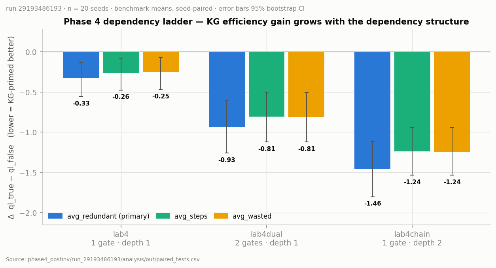

# Phase 4 Extension — The Dependency Ladder (smart-plug variants) + post-inversion re-certification

> **WITHDRAWN — historical, protocol-affected (2026-07-22).** Every empirical
> number in this document (including the §10 run of record `29193486193`) is
> superseded pending the Phase-4 protocol-v2 rerun: the training scheduler at
> the run-of-record commit silently substituted unseeded random resets for
> missing scenario IDs (~30% of episodes; training scenarios 11/13/16 were
> never presented), the benchmark used the legacy schema (wall-clock
> `avg_energy`, invalid legacy `mean_first_goal`), and the run-mode stacked
> PBRS + adaptive trust — the same arm-D confound the Phase-1 correction
> eliminated. `phase4_energy.py`'s steady-power measurement is itself
> deterministic, but it scored defect-trained policies. See
> `docs/PHASE4_PROTOCOL_AFFECTED_NOTICE_2026-07-22.md`. This document is
> retained as the historical record until the corrected rewrite.

**Date:** 2026-07-12 (implemented on branch `kg-crosszone-coupling-mid`, post action-space inversion)
**Builds on:** [PHASE4.md](PHASE4.md) (lab4 smart-plug + lab5 energy, certified pre-inversion) and
[ACTION_SPACE_INVERSION.md](ACTION_SPACE_INVERSION.md) (WoT-contract enumeration, 2026-07-10).
**Requirements implemented here (fourth thesis part):**

> Introduce more hidden dependencies: a lamp connected to a smart plug (the plug must be switched
> on before the lamp can work), and two lamps that have different energy consumptions with an
> energy-aware goal ("brightness level X using at most Y energy"). The environment must be fully
> known — it aligns completely with the Knowledge Graph, with no weaknesses or unexpected effects.
> Include further dependency variants where different components, and different numbers of
> components at a time, carry dependencies. Then place a fresh tabula-rasa Q-learning agent in the
> environment and let it learn, followed by a second fresh Q-learning agent primed with the
> physics knowledge from the Knowledge Graph, and compare.

---

## 1. What already existed, and what this change adds

The "fourth part of the thesis" maps to the repo's **Phase 4**, which already contained:

| Requirement | Existing artefact | Status before this change |
|---|---|---|
| Lamp behind a smart plug (new stereotype, toggle plug first) | **lab4** (`building_4_smartplug.ttl`, port 1897) | Implemented + certified (run 27905392725) |
| Two lamps with different energy consumption, KG-known, energy-budget goal | **lab5** (`building_5_energy.ttl`, port 1898, `energyBudget` per scenario) | Implemented + certified (same run) |
| Fully-known environment ("no weaknesses", simulator ≡ KG) | Both labs are strictly clean: `weakness_flags([])`, deterministic physics, no un-modelled term | Held |
| Fresh tabula-rasa QL vs fresh KG-primed QL, statistically compared | `phase4.yml` (train both arms from scratch per seed → 3-mode benchmark → paired stats) | Held |
| **"More dependencies … different components and different amounts at a time"** | — | **MISSING — added by this change** |

Two things therefore happen in this change:

1. **The dependency ladder is completed** with two new strictly-clean labs (§2), giving a
   Phase-2-style cell family: cells that vary *how many* components carry a
   dependency and *how deep* the dependency is.
2. **The certification debt is called out**: every number in `PHASE4.md` §10a comes from a
   **pre-inversion** run. The action-space inversion (2026-07-10) requires every cited result to be
   re-generated post-inversion (ACTION_SPACE_INVERSION.md §6.2 explicitly lists the Phase-4
   workflow). The dispatch described in §7 **is** that re-certification run — it supersedes
   `PHASE4.md` §10a for lab4/lab5 and produces the first (and confirmatory) numbers for
   lab4dual/lab4chain.

**A note on the "experiment analog to phase 2" phrasing:** the experimental *protocol* here is the
Phase-1/Phase-4 protocol — two *fresh* learners (no pre-training, no fault adaptation), one
tabula-rasa (`ql_false`) and one KG-primed (`ql_true`), trained independently per seed in the same
clean lab and compared paired-across-seeds. What is "analog to Phase 2" is the *cell family
structure*: like Phase 2's fault families (which component, how many components at a time), the
dependency ladder varies which/how many components carry a power dependency. No Phase-2 machinery
(fault detection, blacklisting, warm restarts) is involved — these labs have no faults to detect.

---

## 2. The dependency ladder

All cells fork the lab3/lab4 template: two zones, cross-zone lamp bleed +150 / blind bleed
0.40·sun, own-zone lamp +400 / blind 0.50·sun, shared spotlight +150, ambient 25, sun pinned per
episode from {0, 100, 400, 900}, bounds [50, 100, 300] → target rank 3 (≥ 300 lux) in both zones,
3000 training episodes, ε-decay 0.9970 — **identical budgets across cells so the only varied factor
is the dependency structure**.

| Cell | Gated components | Structure | State vector | States | Port | KG |
|---|---|---|---|---|---|---|
| lab3 (Phase-1 anchor) | 0 | — | 8 slots | 2048 | 1894 | `building_3_complex.ttl` |
| **lab4** (existing) | 1 (Z1 lamp) | 1 plug → lamp | 9 slots (`PlugZ1`@7) | 4096 | 1897 | `building_4_smartplug.ttl` |
| **lab4dual** (NEW) | 2 (both lamps) | 2 parallel plug → lamp arcs | 10 slots (`PlugZ1`@7, `PlugZ2`@8) | 8192 | 1901 | `building_8_dualplug.ttl` |
| **lab4chain** (NEW) | 1 (Z1 lamp), depth 2 | breaker → plug → lamp chain | 10 slots (`PlugZ1`@7, `MasterSwitch`@8) | 8192 | 1902 | `building_9_chainplug.ttl` |

### 2.1 lab4dual — "more components with a dependency at the same time"

Physics (`simulator/simulator_flow_lab4dual.json`, deterministic, no PRNG in the tick):

```
z1lamp_on = Z1Light AND PlugZ1          z2lamp_on = Z2Light AND PlugZ2
Z1 = 25 + 400·z1lamp_on + 150·z2lamp_on + 0.50·sun·Z1Blinds + 0.40·sun·Z2Blinds + 150·Spotlight
Z2 = 25 + 400·z2lamp_on + 150·z1lamp_on + 0.50·sun·Z2Blinds + 0.40·sun·Z1Blinds + 150·Spotlight
energy/tick = z1lamp_on·1 + z2lamp_on·1 + Spotlight·2      (plugs draw nothing)
```

KG: two independent arcs, both directions stated:

```turtle
lab:SmartPlug_Z1 ws:powerGates lab:CeilingLight_Z1 .   lab:CeilingLight_Z1 ws:poweredBy lab:SmartPlug_Z1 .
lab:SmartPlug_Z2 ws:powerGates lab:CeilingLight_Z2 .   lab:CeilingLight_Z2 ws:poweredBy lab:SmartPlug_Z2 .
```

Signature benchmark traps (`benchmark/scenarios_lab4dual.json`, 16 scenarios, 4 per sun rank):
scenario 3 = **double trap** (both switches ON, both plugs OFF, both zones dark — held OUT of
training), scenarios 7/11 = asymmetric single-plug traps (held IN).

### 2.2 lab4chain — "a deeper dependency" (depth-2 serial chain)

Physics (`simulator/simulator_flow_lab4chain.json`):

```
z1lamp_on = Z1Light AND PlugZ1 AND MasterSwitch          (Z2 lamp is direct)
Z1/Z2 as in lab4 with this z1lamp_on
energy/tick = z1lamp_on·1 + Z2Light·1 + Spotlight·2      (plug + breaker draw nothing)
```

KG: the same `ws:powerGates` property used **twice, chained** — plus a new stereotype for the
upstream device:

```turtle
lab:MasterSwitch ws:powerGates lab:SmartPlug_Z1 .      # level 1: breaker feeds the plug circuit
lab:SmartPlug_Z1 ws:powerGates lab:CeilingLight_Z1 .   # level 2: plug feeds the lamp
```

`ws:CircuitBreakerStereotype` (mechanism `ws:pm_master_circuit_feed`, MV `ws:breakerPowerSwitch`,
DV `elem:luminiscence` — transitively, via plug + lamp) makes the breaker a discoverable
light-affecting actuator, exactly like `ws:SmartPlugStereotype` did for the plug in lab4.

Signature traps (`benchmark/scenarios_lab4chain.json`): scenario 3 = **deep trap** (lamp + plug ON,
breaker OFF — the fix is two levels above the lamp; held OUT), scenario 7 = mid trap (plug is the
missing link; held IN), scenario 11 = double-deep trap (plug AND breaker missing; held IN).

### 2.3 How the KG becomes learning behaviour (no new mechanism — reuse, verified)

`StereotypeReasoner.discoverPowerGates()` (unchanged) binds, for **every** `gate ws:powerGates
gated` arc, the *gated* component's ON action as IV-gated on the *gate's* state-vector slot
(`ivMinRank=1`). This is completely generic over arcs, so:

- **lab4dual**: `SetZ1Light=ON` gated on slot 7, `SetZ2Light=ON` gated on slot 8; both plugs stay
  IV-free (enablers → they receive the unconditional Rule-5 constructive bonus).
- **lab4chain**: `SetZ1Light=ON` gated on slot 7 (plug), **`SetPlugZ1=ON` gated on slot 8
  (breaker)**, `SetMasterSwitch=ON` IV-free (the chain root). Q-init therefore encodes the correct
  total order **breaker → plug → lamp**: from all-off, only the breaker's ON action carries a
  positive bonus; after it, the plug's; after that, the lamp's (Rule 2 puts a −50 well on any gated
  ON action whose gate slot is 0; Rule 5 pays the +bonus only when the gate slot is satisfied).

The tabula-rasa arm (`ql_false`) sees none of this: since the action-space inversion the action set
comes from the WoT contract alone (identical for both arms), and the stereotype layer only adds
knowledge for `ql_true`.

**Known measurement property (chain middle link) — disclosed by design:** the *learned* IV
statistics (`recordActionOutcome` → `isIVSatisfied`) score an action "effective" only if a zone
level rises immediately after it. For the chain's middle link (`SetPlugZ1=ON` with breaker ON but
lamp switch still OFF) no light appears on that step, so the learned gate under-estimates the
plug's effectiveness at breaker=ON and may apply the soft −5 runtime prior to the correct enabler
mid-training. This is bounded (the prior is out-votable by O(1) Bellman updates, fades per-cell
after 25 visits, and the Q-init channel already encodes the correct order), affects only the
KG-primed arm, and if anything *shrinks* the measured KG advantage on lab4chain — i.e. it is a
conservative bias w.r.t. the hypothesis. It is worth one sentence in the thesis as a limitation of
reusing single-link IV statistics for multi-link chains.

### 2.4 lab5 (energy) — unchanged

The "two lamps with different energy consumptions plus a goal that mentions this" requirement is
lab5, already implemented (identical +400 lux lamps, `ws:energyCost` 1 vs 4, per-scenario `energyBudget`,
non-fading energy prior 2.0 for the KG arm only, compliance = goal AND steady-power ≤ budget,
scored by `analysis/phase4_energy.py`). Nothing about it changes here except that its certified
numbers must be re-generated post-inversion (§1, §7).

---

## 3. Everything that changed (file manifest)

**New files (12):**

| File | Purpose |
|---|---|
| `src/resources/building_8_dualplug.ttl` | lab4dual KG (self-contained; 2 powerGates arcs; slot registry len 10) |
| `src/resources/building_9_chainplug.ttl` | lab4chain KG (self-contained; chained powerGates; `ws:CircuitBreakerStereotype`) |
| `src/resources/interactions-lab4dual.ttl` | lab4dual WoT TD (port 1901; + `PlugZ2` property/action) |
| `src/resources/interactions-lab4chain.ttl` | lab4chain WoT TD (port 1902; + `MasterSwitch` property/action) |
| `simulator/simulator_flow_lab4dual.json` | Node-RED flow, dual AND-gate physics (deterministic tick) |
| `simulator/simulator_flow_lab4chain.json` | Node-RED flow, triple AND-gate physics (deterministic tick) |
| `benchmark/scenarios_lab4dual.json` / `train_scenarios_lab4dual.json` | 16 bench / 10 held-in training scenarios |
| `benchmark/scenarios_lab4chain.json` / `train_scenarios_lab4chain.json` | 16 bench / 10 held-in training scenarios |
| `config/golden_registry/registry_lab4dual.csv` / `registry_lab4chain.csv` | golden action-registry contracts (generated by `gradlew dumpActionRegistry`) |

**Modified files (8) — all additive; no Phase 1/2/3 artefact touched:**

| File | Change |
|---|---|
| `src/agt/lab_profiles.asl` | `lab4dual` / `lab4chain` profile entries + ladder comment block |
| `config/run_config.json` | port/flow/suffix/state-dim map entries; `phase4.phase4_profiles` → 4 labs; phase4 maps + description |
| `run_full_project.ps1` | `$KnownProfiles`, `$ProfileQtableSuffix`, `$Simulators` entries |
| `run_full_project_parallel.ps1` | `$Simulators` entries + comment |
| `src/env/tools/ActionRegistryDump.java` | `ONTOLOGY_SETS` += lab4dual, lab4chain (feeds `dumpActionRegistry`/`verifyActionRegistry`) |
| `src/test/java/tools/Phase4KgDiscoveryTest.java` | +2 tests: `lab4dualGatesBothLampsOnTheirOwnPlugs`, `lab4chainAppliesTheTwoLevelPowerChain` |
| `analysis/phase4_energy.py` | docstring only (behaviour already profile-generic via `phase4_profiles`) |
| `.github/workflows/phase4.yml` | default `profiles` → `lab4,lab4dual,lab4chain,lab5`; header/summary text; LLM-baseline step and input removed |

**Removed files (1):** `analysis/phase4_llm_baseline.py` — the offline LLM baseline is out of
Phase-4 scope (the phase compares KG-primed vs tabula-rasa Q-learning only); the script and its
workflow step were deleted 2026-07-12.

**Zero changes to:** `StereotypeReasoner.java`, `QLearner.java`, `LabEnvironment.java`, any agent
`.asl` logic, `build.gradle`, `sweep_report.py` — the entire dependency machinery is the existing,
already-audited code path. (This was verified, not assumed: the power-gate query, the IV
gate/penalty rules, `deriveSimulatorUrl`, scenario-key extraction, and the rule-based generic WoT
dispatch were all read and confirmed slot-/name-generic before building the labs.)

---

## 4. Verification record (all executed locally on 2026-07-12, this branch)

1. **Turtle syntax:** `gradlew validateTurtle` — all 40 TTLs OK, including the 4 new ones.
2. **Golden registry:** `gradlew dumpActionRegistry` — produced exactly 2 new files
   (`registry_lab4dual.csv`, `registry_lab4chain.csv`); `git status` confirms **all 15 pre-existing
   goldens are bit-for-bit unchanged** (the inversion contract holds). The new goldens show exactly
   the designed contract: dual = lamps gated on slots 7/8, plugs free; chain = lamp gated on 7,
   plug gated on 8, breaker free, Z2 lamp free; blinds gated on the sunshine slot 9 in both.
3. **Registry check + unit tests:** `gradlew verifyActionRegistry test` — BUILD SUCCESSFUL;
   `Phase4KgDiscoveryTest` runs 4/4 green (the 2 pre-existing + the 2 new chain/dual tests).
4. **End-to-end dev smoke (live Node-RED + JaCaMo + QLearner):**
   `./run_full_project.ps1 -RunMode dev -OnlyProfiles lab4chain -RunSeed 1 -SkipPreflight` —
   see §4.1 below.

### 4.1 Dev-smoke result (lab4chain, 50 episodes, live simulator) — PASSED, exit 0

Executed 2026-07-12 on this branch (seed 1, dev budget, Node-RED live on port 1902):

- **Slot registry** loaded from the KG exactly as designed:
  `len=10 domain=[4, 4, 2, 2, 2, 2, 2, 2, 2, 4] zoneLevel=[0, 1] sunshine=9`.
- **Both chain gates applied at runtime** by `discoverPowerGates` — in the training run and again
  in the benchmark run:
  `Power-gate: SetZ1Light=ON is now IV-gated on slot 7 (…PlugZ1) ivMinRank=1` and
  `Power-gate: SetPlugZ1=ON is now IV-gated on slot 8 (…MasterSwitch) ivMinRank=1`.
- **Label-keyed persistence round-tripped:** `mapHeaderToActions: … identity mapping (15 actions)`
  for Q-tables and visits sidecars in both arms; zero legacy-refusal `SEVERE` lines; zero
  "could not derive" simulator-URL warnings.
- Both arms trained 50/50 episodes with goal-reaching episodes from ep 1; the 3-mode benchmark
  completed over all 16 scenarios; `sweep_report: 27 cells processed`; the simulator was stopped
  cleanly and the patched `.asl` files restored.
- A handful of benchmark scenarios end `FAILED — max steps (20)` — expected under a 50-episode dev
  policy on an 8192-state lab; dev mode is a plumbing gate, not a performance run.

---

## 5. Registered expectations (written BEFORE the confirmatory dispatch)

To keep the confirmatory run clean (and avoid a repeat of the disclosed n=10→20 escalation in
`PHASE4.md` §10a), the protocol below is fixed *before* dispatching:

- **Design:** per lab ∈ {lab4, lab4dual, lab4chain, lab5}: train `ql_true` and `ql_false` from
  scratch per seed (`run_mode = phase4`, 3000 episodes), benchmark all three modes, and test
  `ql_true − ql_false` seed-paired.
- **Seeds (confirmatory): 1..20, fixed in advance** for all cells (n=20 was the post-hoc lesson of
  the lab5 compliance family; committing to it up front removes the data-dependent escalation).
- **Statistics:** exactly the pipeline's existing pre-registered treatment — paired bootstrap 95%
  CIs (10k iters), Wilcoxon signed-rank, Cliff's δ, BH-FDR within each emitted family
  (`learning_speed_tests.csv`, `paired_tests.csv`, `phase4_energy_paired.csv`).
- **Primary metric per dependency cell:** benchmark `avg_redundant` (lower better, ql_true wins);
  secondaries: `avg_steps`, `avg_wasted`, `mean_first_goal`, `auc_goal`, with `goal_rate` expected
  at parity (both arms eventually solve these clean labs — the KG advantage is *speed/efficiency*,
  not final success).
- **Primary metric for lab5:** `energy_compliance` (higher better), secondaries
  `mean_steady_power`, `over_budget_rate`, `goal_rate` (parity expected).
- **Ladder prediction (exploratory, descriptive):** the ql_true−ql_false efficiency deltas grow in
  magnitude along lab4 → lab4dual and lab4 → lab4chain (more/deeper KG-documented dependencies ⇒
  more for the prior to pay off). No formal trend test is emitted by the pipeline; report the three
  paired deltas side by side. lab4dual vs lab4chain ordering is left open (parallel breadth vs
  serial depth are different difficulty axes).
- **Supersedure rule:** the outputs of this dispatch are the citable Phase-4 numbers; `PHASE4.md`
  §10a becomes a pre-inversion-instrument measurement (kept for the methods narrative, never mixed
  into post-inversion tables).

---

## 6. Prerequisite: push the branch

The ladder change set was committed on `kg-crosszone-coupling-mid` as `efed25a`
(`phase4: dependency ladder … + post-inversion re-cert protocol`) and pushed. A follow-up commit
on the same branch removes the offline LLM baseline from Phase-4 scope
(`analysis/phase4_llm_baseline.py` deleted; `phase4.yml` step + `run_llm_baseline` input dropped;
`PHASE4.md`, this doc, and the state report updated):

```powershell
git add .github/workflows/phase4.yml analysis/phase4_llm_baseline.py `
        docs/PHASE4.md docs/PHASE4_DEPENDENCY_LADDER.md docs/_audit/THESIS_STATE_REPORT.md
git commit -m "phase4: drop offline LLM baseline (scope = KG-primed vs tabula-rasa QL only)"
git push origin kg-crosszone-coupling-mid
```

`phase4.yml` already exists on `main`, so GitHub lists the workflow; dispatching **from the branch**
(see step 3 below) runs the branch's updated YAML + code. (Once the results are accepted, merge to
`main` so the defaults apply there too.)

---

## 7. How to run it via GitHub Actions (step by step)

1. Push the branch (§6).
2. GitHub → repository → **Actions** → workflow **"Phase 4 (Dependencies + Energy)"** →
   **Run workflow**.
3. In the "Use workflow from" dropdown pick **`kg-crosszone-coupling-mid`** (critical — the `main`
   copy of the workflow does not know the new labs yet).
4. Inputs:

   | Input | Smoke run | **Confirmatory run (registered)** |
   |---|---|---|
   | `profiles` | `lab4chain` (or leave default) | leave default = `lab4,lab4dual,lab4chain,lab5` |
   | `seeds` | `1,2,3` | `1,2,3,4,5,6,7,8,9,10,11,12,13,14,15,16,17,18,19,20` |
   | `run_mode` | `dev` (50 episodes — plumbing only) | `phase4` (3000 episodes) |
   | `publish_results` | `false` | `true` |

5. Click **Run workflow**. Recommended sequence: one `dev`-mode smoke (validates the CI plumbing
   for the new labs in ~30–45 min), then the confirmatory dispatch.

The workflow is self-contained per cell: each training cell spins up its own Node-RED with the
lab's flow on the lab's port, trains one (profile × arm × seed) Q-learner from scratch, and each
benchmark cell replays the held-out scenarios against the trained tables. Nothing needs to run on
your machine.

### 7.1 How long it will take

Per-cell times (GitHub-hosted `ubuntu-latest`, from the certified lab4/lab5 run — lab4dual/lab4chain
are 8192-state labs like lab5, same episode budget, so the same envelope applies):

| Stage | Cells (4 profiles) | Per cell |
|---|---|---|
| setup (compile + cache) | 1 | 3–6 min |
| train | 4 × 2 arms × N seeds | ~40–60 min (`phase4`), ~4–8 min (`dev`) |
| bench | 4 × 3 modes × N seeds | ~5–15 min |
| aggregate | 1 | ~5–10 min |

Wall-clock is bounded by runner **concurrency** (free-tier public repos: 20 concurrent jobs), not
by cell count alone:

- **Confirmatory (seeds 1..20):** 160 train + 240 bench cells ⇒ roughly **8–12 hours** end-to-end
  (≈ 160/20 × ~50 min for training alone). Start it in the evening; it needs no supervision
  (`fail-fast: false`, per-cell retries, self-healing artifact downloads).
- **seeds 1..10:** 80 train + 120 bench ⇒ roughly **4–6 hours**.
- **dev smoke (seeds 1,2,3, run_mode dev):** ⇒ roughly **30–45 minutes**.

### 7.2 What results to expect

- **lab4 / lab4dual / lab4chain (dependency cells):** goal-rate near parity between arms; the
  KG-primed arm significantly better on `avg_redundant`, `avg_steps`, `avg_wasted` and (typically)
  `mean_first_goal` — it enables plugs/breaker in the KG-given order instead of toggling dead
  lamps. Pre-inversion lab4 showed exactly this signature (Δ avg_redundant −0.558, q≈0; goal_rate
  Δ +0.023). Expect the deltas to be at least as large on lab4dual/lab4chain (two traps / a
  deeper trap to fall into for the tabula-rasa arm); the ladder plot of the three deltas is the new
  thesis figure.
- **lab5 (energy):** the KG arm wins `energy_compliance` and `mean_steady_power` at equal
  goal-rate (pre-inversion: +0.101 compliance, −0.391 power, both q≈0). Directions should
  replicate post-inversion; treat magnitudes as fresh.
- **Null-risk note (honest):** these are clean labs with a 20-step budget and alternative routes
  to rank 3 (spotlight, blinds at high sun), so tabula-rasa agents *do* solve them — if a
  dependency cell comes out null on efficiency metrics, the ladder still reports it as a
  characterized boundary of where KG priming pays (that is a finding, not a failure; same framing
  as the Phase-1 lab3 outcome).

### 7.3 Where to find the results

For the dispatch run (Actions → the run page):

1. **Summary tab** — the aggregate job renders `learning_speed_tests.csv`, `paired_tests.csv`,
   `phase4_energy_paired.csv`, `phase4_energy_ci.csv`, `summary_table_ci.csv` inline.
2. **Artifacts** — `phase4-consolidated` = full `analysis/out/**`, all per-seed benchmark trees
   (`benchmark/results_seed<N>/<profile>/<mode>/…`), Q-tables, learned TTLs, IV stats. Per-cell
   artifacts (`train-<profile>-stereo-<b>-seed-<n>`, `bench-<profile>-<mode>-seed-<n>`) hold raw
   logs for any single cell.
3. **`results` branch** (only if `publish_results = true`) — versioned snapshot via
   `scripts/version_artifacts.ps1` (append mode; the force-orphan flag was removed 2026-07-12
   after it wiped the Phase-2 records once — do not re-add it).

Key files: `learning_speed_tests.csv` (AUC / first-goal, paired), `paired_tests.csv` (redundant /
steps / goal-rate, paired — **the dependency-ladder headline lives here**),
`phase4_energy_paired.csv` + `phase4_energy_ci.csv` (lab5 compliance).

---

## 8. Local smoke (optional, no GitHub needed)

```powershell
# End-to-end plumbing check for one new lab (starts Node-RED itself):
./run_full_project.ps1 -RunMode dev -OnlyProfiles lab4chain -RunSeed 1 -SkipPreflight

# Static gates:
./gradlew validateTurtle verifyActionRegistry test
```

---

## 9. Threats to validity / limitations (for the thesis chapter)

1. **Alternative routes dilute the traps.** Spotlight + one lamp, or blinds at sun=900, reach rank
   3 without the gated chain, so the dependency is load-bearing only in part of the state space —
   by design (realistic labs have redundancy); the efficiency metrics, not goal-rate, carry the
   contrast.
2. **Chain middle-link IV statistics** under-credit the plug enabler (§2.3) — a conservative bias
   against the hypothesis on lab4chain; disclosed, bounded, and identical in every seed.
3. **Pre-inversion vs post-inversion:** no number from run 27905392725 may be mixed into the new
   tables (RNG trajectories and action-space semantics differ). The re-run supersedes it.

---

## 10. Results — confirmatory run of record (run `29193486193`)

The registered dispatch of §5/§7 completed as run **`29193486193`** on branch
`kg-crosszone-coupling-mid` (head `d336fdf`): seeds **1..20**, `run_mode = phase4`,
profiles `lab4,lab4dual,lab4chain,lab5`, `publish_results = true`. It finished green
end-to-end — **402 / 402 jobs, 0 failures**, 1 h 44 m — and was published to the
`results` branch as commit `487d2512e` (`results-20260712-143949-phase4-d336fdf`).
The run of record (registered CSVs, learning-curve PNGs, learned TTLs, IV stats, the
ladder figure) is archived under
[`phase4_postinv/run_29193486193/`](../phase4_postinv/run_29193486193/) with a full
[MANIFEST](../phase4_postinv/run_29193486193/MANIFEST.md); the ~713 MB raw per-seed
tree stays in the `phase4-consolidated` artifact
(`sha256:7ebc2cd3…`) and the `results` branch. **This run supersedes `PHASE4.md`
§10a for lab4/lab5 and is the first, confirmatory record for lab4dual/lab4chain.**

All paired tests are `ql_true − ql_false` (KG-primed minus tabula-rasa), seed-paired
across n = 20, with paired bootstrap 95 % CIs, Wilcoxon signed-rank, Cliff's δ, and
BH-FDR within each emitted family (efficiency family `m = 56`, energy family `m = 10`,
learning-speed family `m = 16`).

### 10.1 Registered expectation → realized outcome

| Registered expectation (§5, §7.2) | Realized outcome | Verdict |
|---|---|---|
| **Primary per dependency cell:** `avg_redundant` lower for `ql_true` | lab4 −0.326, lab4dual −0.934, lab4chain −1.458 — all BH-significant (q ≈ 0) | **MET** (all 3) |
| Secondaries `avg_steps`, `avg_wasted` favour `ql_true` | all 3 cells significant, correct sign (q ≈ 0); `avg_dev`, `avg_cycling` too | **MET** |
| `goal_rate` at parity between arms | parity on lab4 (Δ +0.009 ns) and lab5 (Δ +0.006 ns); **`ql_true` significantly higher on lab4dual (+0.034) and lab4chain (+0.058)** | **MET (lab4/lab5); EXCEEDED, KG-favorable (lab4dual/lab4chain)** |
| **lab5 primary:** `energy_compliance` higher for `ql_true` | Δ +0.096 [0.059, 0.134], q ≈ 0 (0.791 vs 0.695) | **MET** |
| lab5 secondaries `mean_steady_power`↓, `over_budget_rate`↓ | −0.431 and −0.093, both q ≈ 0 | **MET** |
| **Pre-inversion lab4/lab5 directions replicate** | every pre-inversion sign replicates post-inversion (§10.6) | **CONFIRMED** |
| **Ladder prediction:** deltas grow lab4→lab4dual and lab4→lab4chain | monotone growth on every efficiency metric (§10.3, figure) | **MET** |
| `auc_goal` / `mean_first_goal` favour `ql_true` (learning-speed secondaries) | `auc_goal` MET on lab4dual/lab4chain; boundary on lab4 (ceiling) and lab4chain `mean_first_goal` (disclosed chain bias, §10.5) | **PARTIAL — characterized boundaries** |

### 10.2 The dependency ladder — benchmark efficiency (paired `ql_true − ql_false`)

Source: [`paired_tests.csv`](../phase4_postinv/run_29193486193/analysis/out/paired_tests.csv)
(confirmatory family, `m = 56`). Δ negative ⇒ KG-primed arm more efficient.

| Cell | Metric | Δ (true−false) | 95 % CI | Wilcoxon p | Cliff δ | BH q |
|---|---|---|---|---|---|---|
| **lab4** (1 gate, depth 1) | **avg_redundant** | **−0.326** | [−0.557, −0.131] | 0.0036 | −0.57 | **≈0** |
| | avg_steps | −0.259 | [−0.475, −0.079] | 0.0033 | −0.63 | ≈0 |
| | avg_wasted | −0.253 | [−0.469, −0.071] | 0.0038 | −0.55 | 0.0003 |
| | avg_dev | −0.327 | [−0.613, −0.087] | 0.024 | −0.50 | 0.0028 |
| | avg_cycling | −0.074 | [−0.118, −0.029] | 0.0077 | −0.53 | 0.0019 |
| **lab4dual** (2 gates, depth 1) | **avg_redundant** | **−0.934** | [−1.259, −0.609] | 3.6e-5 | −0.82 | **≈0** |
| | avg_steps | −0.809 | [−1.121, −0.501] | 2.5e-4 | −0.82 | ≈0 |
| | avg_wasted | −0.812 | [−1.120, −0.508] | 1.3e-5 | −0.81 | ≈0 |
| | avg_dev | −1.271 | [−1.704, −0.827] | 2.5e-4 | −0.82 | ≈0 |
| | avg_cycling | −0.122 | [−0.184, −0.059] | 0.0064 | −0.63 | 0.0008 |
| **lab4chain** (1 gate, depth 2) | **avg_redundant** | **−1.458** | [−1.803, −1.117] | 3.8e-6 | −0.90 | **≈0** |
| | avg_steps | −1.241 | [−1.536, −0.937] | 1.3e-4 | −0.93 | ≈0 |
| | avg_wasted | −1.244 | [−1.536, −0.946] | 1.0e-4 | −0.90 | ≈0 |
| | avg_dev | −1.567 | [−1.871, −1.251] | 1.0e-4 | −0.90 | ≈0 |
| | avg_cycling | −0.214 | [−0.394, −0.079] | 0.0014 | −0.64 | ≈0 |

Every dependency cell shows the registered signature: the KG-primed arm enables the
plug (and, on lab4chain, the breaker before the plug) in the KG-given order instead
of toggling a dead lamp, so it spends materially fewer redundant/wasted actions and
steps. On lab4chain the KG arm also uses **less energy** (avg_energy −1.498,
q ≈ 0) — fewer dead-lamp toggles — whereas on lab4 it uses slightly *more*
(avg_energy +0.532, q = 0.047) because it reliably lights the gated lamp; lab4 has no
energy budget, so this is descriptive, not a scored metric.

### 10.3 Ladder prediction — the three deltas side by side



*Figure — Ladder efficiency gain. `ql_true − ql_false` benchmark deltas (mean ± 95 %
bootstrap CI, n = 20) for the registered primary `avg_redundant` and the two
secondaries `avg_steps`, `avg_wasted`, along the ladder. Source:
`phase4_postinv/run_29193486193/analysis/out/paired_tests.csv`; regenerate with
`analysis/phase4_ladder_figure.py`.*

The registered exploratory prediction — that the deltas **grow in magnitude along
lab4 → lab4dual and lab4 → lab4chain** — is met on every efficiency metric:

| Metric | lab4 | lab4dual | lab4chain | Monotone? |
|---|---|---|---|---|
| avg_redundant | −0.326 | −0.934 | −1.458 | ✔ grows both ways |
| avg_steps | −0.259 | −0.809 | −1.241 | ✔ |
| avg_wasted | −0.253 | −0.812 | −1.244 | ✔ |
| goal_rate advantage | +0.009 | +0.034 | +0.058 | ✔ |

The lab4dual-vs-lab4chain ordering, left open in registration (parallel breadth vs
serial depth), resolves descriptively in favour of **depth**: lab4chain (one gate, two
levels) exceeds lab4dual (two gates, one level) on every efficiency metric. No formal
trend test is claimed — the three paired deltas are reported side by side as registered.

### 10.4 `goal_rate` — parity vs. a KG-favorable deviation (reported honestly)

The registration expected goal-rate parity ("both arms eventually solve these clean
labs — the KG advantage is speed/efficiency, not final success"). Realized benchmark
goal-rate (means, [`summary_table_ci.csv`](../phase4_postinv/run_29193486193/analysis/out/summary_table_ci.csv)):

| Cell | ql_true | ql_false | Δ | Wilcoxon p | BH q | Reading |
|---|---|---|---|---|---|---|
| lab4 | 1.000 | 0.991 | +0.009 | 0.083 | 0.092 | parity (as registered) |
| lab5 | 0.984 | 0.978 | +0.006 | 0.414 | 0.588 | parity (as registered) |
| lab4dual | 1.000 | 0.966 | +0.034 | 0.0023 | ≈0 | **KG arm significantly higher** |
| lab4chain | 1.000 | 0.942 | +0.058 | 2.2e-4 | ≈0 | **KG arm significantly higher** |

This is a **deviation from the registered parity expectation, in the
hypothesis-favorable direction, and is reported as such** (not folded silently into the
efficiency story). On the wider (lab4dual) and deeper (lab4chain) cells the tabula-rasa
arm does not always reach rank 3 within the 20-step benchmark cap, so KG priming lifts
benchmark *success*, not only efficiency; the KG arm reaches goal_rate 1.000 in all
three dependency cells. Parity held exactly where the single shallow gate (lab4) and
the alternative-route energy lab (lab5) leave the tabula-rasa arm enough room to solve.

### 10.5 Learning speed — `auc_goal`, `mean_first_goal` (incl. the disclosed chain bias)

Source: [`learning_speed_tests.csv`](../phase4_postinv/run_29193486193/analysis/out/learning_speed_tests.csv)
(`m = 16`).

| Cell | auc_goal Δ | q | mean_first_goal Δ | p | Reading |
|---|---|---|---|---|---|
| lab4 | ≈0 | 1.0 | −3.4 | 0.78 | ceiling — both arms already fast through one shallow gate (boundary) |
| lab4dual | +0.020 | ≈0 | −32.7 | 0.009 | KG reaches goal earlier in **training and** first-goal timing |
| lab4chain | +0.025 | ≈0 | +14.0 | 0.16 (ns) | KG earlier in training (δ = 1.0); first-goal timing **not** improved |
| lab5 | ≈0 | 1.0 | +20.1 | 0.70 | energy lab — goal-speed at parity by design (boundary) |

The lab4chain `mean_first_goal` non-improvement is exactly the **pre-disclosed
chain middle-link conservative bias** (§2.3, §9.2): the learned single-link IV
statistic under-credits the plug enabler when the breaker is on but the lamp switch
is still off (no light appears on that step), so first-goal *timing* on the chain does
not shorten — yet training-time `auc_goal` (δ = 1.0) and every benchmark efficiency
metric are strongly positive. The bias behaves precisely as registered: it shrinks the
first-goal signal without overturning the benchmark result. `auc_reward` favours the KG
arm on all four cells (+14.0 / +7.0 / +12.7 / +16.5, all q ≈ 0); `episodes_to_threshold`
is fully censored (both arms reach threshold) and carries no signal.

### 10.6 lab5 energy — primary `energy_compliance` + secondaries

Source: [`phase4_energy_paired.csv`](../phase4_postinv/run_29193486193/analysis/out/phase4_energy_paired.csv)
(`m = 10`), means from [`phase4_energy_ci.csv`](../phase4_postinv/run_29193486193/analysis/out/phase4_energy_ci.csv).

| Metric | ql_true | ql_false | Δ (true−false) | 95 % CI | Wilcoxon p | Cliff δ | BH q |
|---|---|---|---|---|---|---|---|
| **energy_compliance** ↑ | **0.791** | 0.695 | **+0.096** | [0.059, 0.134] | 0.00071 | 0.70 | **≈0** |
| mean_steady_power ↓ | 1.122 | 1.553 | −0.431 | [−0.594, −0.272] | 0.00046 | −0.71 | ≈0 |
| over_budget_rate ↓ | 0.196 | 0.289 | −0.093 | [−0.133, −0.052] | 0.0012 | −0.69 | ≈0 |
| goal_rate | 0.984 | 0.978 | +0.006 | [−0.009, 0.022] | 0.414 | 0.10 | 0.588 (ns) |

The KG-primed arm reaches **higher energy-budget compliance and ~28 % lower
steady-state power at goal-rate parity** — the energy win is not bought by sacrificing
the goal. The efficient-lamp / free-daylight preference costs the KG arm a little extra
settling behaviour (benchmark `avg_dev` +0.435, `avg_cycling` +0.077, both small and
significant) while cutting total benchmark energy (`avg_energy` −2.584, q = 0.0006) —
the registered trade the non-fading energy prior is designed to make.

### 10.7 Pre-inversion replication check (registered §7.2)

Every pre-inversion direction (run `27905392725`, `PHASE4.md` §10a) replicates
post-inversion; magnitudes are treated as fresh, as registered.

| Metric | Pre-inversion Δ | Post-inversion Δ | Direction |
|---|---|---|---|
| lab4 avg_redundant | −0.558 | −0.326 | ✔ replicated (significant) |
| lab4 avg_steps | −0.496 | −0.259 | ✔ |
| lab4 avg_dev | −0.589 | −0.327 | ✔ |
| lab4 avg_wasted | −0.504 | −0.253 | ✔ |
| lab4 avg_cycling | −0.053 (ns, p=0.086) | −0.074 (**now significant**, q=0.002) | ✔ strengthened |
| lab4 goal_rate | +0.023 | +0.009 | ✔ (ql_true ≥ ql_false) |
| lab5 energy_compliance | +0.101 | +0.096 | ✔ (near-identical) |
| lab5 mean_steady_power | −0.391 | −0.431 | ✔ |
| lab5 over_budget_rate | −0.090 | −0.093 | ✔ |
| lab5 goal_rate | +0.016 (ns) | +0.006 (ns) | ✔ parity |

lab5 magnitudes are essentially unchanged across the action-space inversion; lab4
efficiency magnitudes are somewhat smaller under the WoT-contract action space but stay
significant, and lab4 `avg_cycling` moves from directional to BH-significant.

### 10.8 Characterized boundaries (nulls, reported as registered)

Per the §7.2 null-risk note, boundaries are findings, not failures:

1. **No dependency cell is null on the primary efficiency metric** — `avg_redundant`
   is a significant KG win in lab4, lab4dual, and lab4chain.
2. **lab4 learning-speed metrics sit at the ceiling** (`auc_goal` ≈ 0, `mean_first_goal`
   ns): a single shallow gate is easy enough that the tabula-rasa arm reaches the goal
   about as fast; the KG advantage there is redundancy/steps, not goal-speed.
3. **lab4chain `mean_first_goal` is null / slightly reversed** — the disclosed chain
   middle-link conservative bias (§2.3), which suppresses first-goal timing while
   leaving `auc_goal` (δ = 1.0) and all benchmark efficiency metrics strongly positive.
4. **lab5 goal-speed is at parity** (`auc_goal` ≈ 0, `mean_first_goal` ns) and lab5
   `avg_dev`/`avg_cycling` are marginally *higher* for the KG arm — the energy prior
   trades a little settling behaviour for a large steady-power reduction; lab5's
   contrast is energy, not learning speed, by design.
