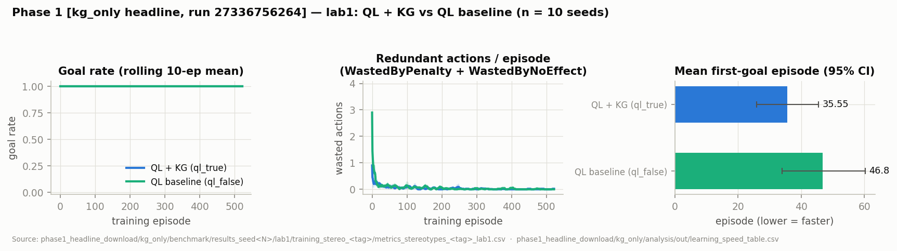
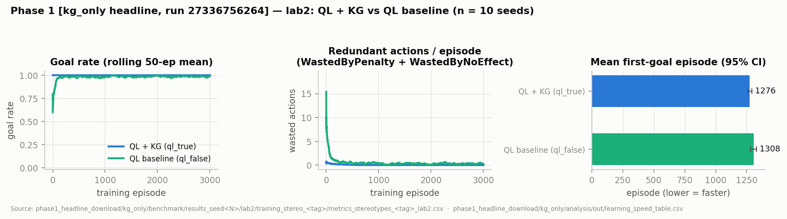
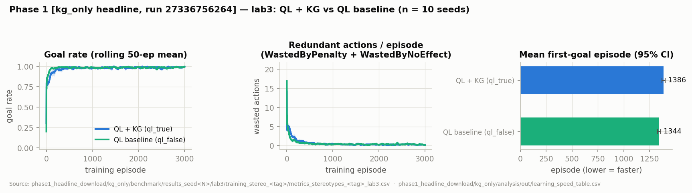

# Thesis status - notes for our meeting on 09.07

> **Post-meeting update (2026-07-12):** the Phase-2 numbers in §6 below were measured
> under the pre-inversion instrument and are **superseded** — after the action-space
> inversion (both arms now share the WoT-contract action space; the KG only enriches),
> all Phase-2 cells were re-run and the registered outcome changed from 8/8 to **3/8
> significant Tier-1 cells**. See the addendum at the end of this document and
> `pre_registration.md` §9.10. The Phase-1/Phase-3 sections still show pre-inversion
> numbers; green post-inversion re-runs exist (Phase 1: 29105464710, Phase 3:
> 29166356524) but their tables have not been re-extracted yet.

Here is an overview of where the work stands, with the figures and condition comparisons you asked for. Sections 1–4 describe the system (architecture, knowledge graph, learner, lab physics); sections 5–7 go through the results for the three phases. All headline numbers come from multi-seed CI runs, and I give the run ID next to each results table so everything is traceable.

The short version:

| Phase | Status | Headline result |
|---|---|---|
| 1 - clean labs | Complete | lab2: `auc_goal` Δ=+0.01707, q=0, δ=1.0; lab1 acts as a floor control (all contrasts null) |
| 1 - lab3 cross-zone | Complete (tested at three spill magnitudes) | `auc_reward` win (Δ=+12.66, q≈0) but a `mean_first_goal` *regression* (Δ=+23.95, q=0.011) - an honest weakness of the prior, and part of what motivates Phase 2 |
| 2 - fault detect → re-learn | Complete | ~~All 8 Tier-1 recovery cells significant~~ *(superseded 2026-07-12 — post-inversion: 3/8 significant, see addendum)* |
| 3 - dynamics learning | Complete | Blind delay learned to ≤1.77% error and written back into the KG; the KG arm then meets 6/6 deadline goals vs 3/6 without |

---

## 1. System architecture

The system is a JaCaMo application (Jason BDI agents plus CArtAgO artifacts) that drives Node-RED lab simulators over HTTP/WoT. There is one agent per phase: `_ql` does the Phase-1 training, `_bench` runs the benchmark, `_adapt` handles Phase-2 fault adaptation, and `_dynamics` does the Phase-3 delay probing. On the Java side, the important artifacts are `QLearner` (tabular Q-learning plus the fault machinery), `StereotypeReasoner` (KG parsing, priors, IV gate), `StereotypeLearner` (Welford-based effect discovery), and `DynamicsLearner` (delay estimation and KG write-back). All agents share a single configuration file (`lab_profiles.asl`), and the multi-seed experiments run on GitHub Actions.

During training, each step follows the same loop: the agent senses the lab (lux discretised to ranks 0–3), picks an action ε-greedily using the KG-primed score, sends it as a WoT HTTP action, senses again, applies the Bellman update, lets the stereotype learner observe the transition, and continues with the next step.

---

## 2. Knowledge graph & ontologies

### 2.1 Mechanism patterns

The building TTL files encode two mechanism patterns:

- **Causes** (lamp, spotlight, monitor): the manipulated variable drives the dependent variable directly, and `elem:increases` asserts the sign.
- **Mediates** (blind): `ws:blindApertureRatio` gates a transfer from `ws:outdoorIlluminance` to indoor illuminance. Since the sign depends on the state, `elem:increases` is deliberately left out and only a structural lower bound (`ws:ivMinRank 1`) is asserted - the quantitative sunshine threshold is exactly the thing the agent has to learn.

In lab3, the cross-zone spillage is encoded as `brick:feeds` arcs (primary vs. weak optical coupling), and the magnitude of the secondary coupling is intentionally absent. So the KG asserts *structure only*; the agent learns the magnitudes.

For Phase 3, the KGs assert a qualitative `ws:hasResponseDynamic` class (instantaneous vs. delayed) but leave `ws:responseDelay` without a value. The measured delays are written back after probing, as `learned:ResponseDynamic` records.

### 2.2 How the KG actually influences learning (three channels)

1. **Initial-Q penalties**, applied once when the tables are built (scale 0.5): redundancy −100, IV gate −100, cross-zone overshoot −50, shared actuator at goal −75, plus a constructive bonus of +15·gap toward helpful ON actions.
2. **Runtime soft priors** that fade over episodes: −1.0 for redundant actions, −5.0 when the IV is (as far as learned) unsatisfied. These get multiplied by an episode-decay weight, a per-cell visit fade, and - only in arm D - an adaptive-trust factor that tracks how often the KG's sign matched the observed sign.
3. **An IV gate driven by learned statistics**: the agent keeps per (action, sunshine-rank) counts, and the gate opens once learned effectiveness reaches ≥ 0.05 with ≥ 10 samples (under-sampled ranks are treated optimistically). This is the channel through which the blind's unquantified sunshine threshold gets learned empirically, and it persists from training into the benchmark.

The state layout itself also comes from the KG, via `ws:stateVecIndex` / `ws:stateDomainSize` triples (lab3: 2 048 states; lab1: 8 states). Indoor illuminance is discretised to ranks 0–3 at {50, 100, 300} lux, sunshine at {50, 200, 600} lux.

---

## 3. Q-learning

### 3.1 State & action space

- **State:** per-zone illuminance rank (0–3), one boolean per actuator, and the sunshine rank. Raw lux, energy, time, and fault status are deliberately not part of the state.
- **Q-tables:** one per zone (VDN-style); greedy selection uses the summed value $Q(s,a)=\sum_z Q_z(s,a)$.
- **Actions:** the ON/OFF pairs discovered from the KG for each actuator, plus DO_NOTHING; blacklisted actions are excluded.

### 3.2 TD update

$$
Q_z(s,a) \;\leftarrow\; Q_z(s,a) + \alpha \Big[ \tfrac{1}{Z}\bigl(\tilde r_z + F_z\bigr) + \gamma\, Q_z(s', a^{*}) - Q_z(s,a) \Big]
$$

with $a^* = \arg\max_{a'} \sum_z Q_z(s', a')$, i.e. all zones bootstrap on the same joint action - a deliberate choice to avoid over-estimation.

### 3.3 Reward

Per zone $z$, with $\Delta d = d_{\rm prev} - d_{\rm next}$ (change in distance to target):

$$
r_z = -1 + 40\,\Delta d + 200\cdot\mathbb{1}[\text{goal entered}] + 5\cdot\mathbb{1}[\text{goal held}] - 200\cdot\mathbb{1}[\text{goal lost}] - 10\cdot\mathbb{1}[\text{no-effect}] - 5\cdot\mathbb{1}[\text{idle stagnation}]
$$

clipped to [−200, 200] and normalised by the number of zones. Energy is *not* in the reward - it only appears as a non-fading greedy-selection penalty in lab5 (Phase 4, which is an extension beyond the three phases and not covered in these notes).

### 3.4 Action selection: ε-greedy with a fading KG prior

$$
\varepsilon_0 = 0.3,\qquad \varepsilon \leftarrow \max(0.01,\; \varepsilon\cdot\lambda)
$$

The greedy score in KG mode (arms C / D) is

$$
\mathrm{score}(s,a) = \sum_z Q_z(s,a) + \underbrace{w_{\rm prior}(e)\cdot \pi_a(s)\cdot \mathrm{calMul}_{a}\cdot \mathrm{cellMul}_{s,a}}_{\text{fading KG prior}} - \underbrace{w_E\cdot \mathrm{energyCost}(a)}_{\text{lab5 only}}
$$

with prior weight $w_{\rm prior}(e) = S\cdot\bigl[1 - \min(1,\,e/E)(1-f)\bigr]$. PBRS is switched *off* in the headline Phase-1 arm - arm C is set up to isolate the effect of the KG prior alone.

### 3.5 Key hyperparameters

| Parameter | Value |
|---|---|
| α / γ | 0.1 / 0.9 (compile-time constants) |
| ε₀ / ε_min | 0.3 / 0.01 |
| λ (ε-decay, per profile) | lab1 0.9920 · lab2 0.9960 · lab3–5 0.9970 · labmon 0.9950 · labmon2 0.9975 |
| Reward clip | 200 (all CI runs) |
| Prior scale S / decay horizon E / floor f | 1.0 / 10 000 ep / 0.0 |
| Prior fade visits V_f | 25 |
| Prior magnitudes (redundant / IV-unsat / init bonus) | 1.0 / 5.0 / 15.0 |
| IV gate (min samples / effectiveness threshold) | 10 / 0.05 |
| Convergence criterion | Bellman delta < 1e-3 for 100 consecutive episodes |
| Recovery criterion | Greedy policy unchanged for 50 consecutive episodes |

One thing to be aware of: with E = 10 000 and Phase-1 budgets of 1 000–3 000 episodes, the prior only decays part-way during training (in lab3 it is still at about 70% of its initial weight at the end).

---

## 4. Labs & physics

All profiles share `light_bounds([50,100,300])`, `sunshine_bounds([50,200,600])`, `sunshine_prob(0.75)`, and a target of rank 3 (≥ 300 lux). Sunshine is sampled once per episode and then pinned; the physics inside an episode is deterministic.

### 4.1 Phase 1 - the clean lab ladder

**lab1** - 1 zone, 1 lamp, 1 000 episodes:
```js
z1 = 25 + (z1light ? 400 : 0);
```

**lab2** - 2 independent zones, adds the Mediates blinds, 2 000 episodes:
```js
z1 = 25 + (z1l ? 400 : 0) + (z1b ? 0.50*sun : 0);
z2 = 25 + (z2l ? 400 : 0) + (z2b ? 0.50*sun : 0);
```
The blind contribution vanishes at sun = 0 - that's the IV threshold the agent has to discover on its own.

**lab3** - cross-zone spillage plus a shared spotlight, 3 000 episodes (current physics):
```js
var corridor = sp ? 150 : 0;
z1 = 25 + (z1l?400:0) + (z2l?100:0) + (z1b?0.50*sun:0) + (z2b?0.30*sun:0) + corridor;
z2 = 25 + (z2l?400:0) + (z1l?100:0) + (z2b?0.50*sun:0) + (z1b?0.30*sun:0) + corridor;
```
Note that the spill magnitudes changed over the study. The original physics used sub-rank bleed (lamp +50 lux, blind 0.25·sun); a controlled A/B raised it to 150 / 0.40·sun, which removed the KG penalties but only by making the task too easy; I then settled on the intermediate 100 / 0.30·sun shown above - rank-moving but not trivialising (0.30·900 = 270 < 300, so no cross-zone lever can reach the goal on its own). I keep results from the different physics versions strictly separate below.

### 4.2 Phase 2 - the faulty labs

Every faulty flow is generated from its clean parent by a literal string replacement in the physics, so the KG, Thing Description, and scenarios stay identical. The fault families:

| Family | Cells | Physics change |
|---|---|---|
| Lamp dead / inverted | lab1_f1dead; lab2, lab3 f1dead/f1inv; lab3 f1dead_z2/f1inv_z2 | `z1l?400` → `0` (dead) or `−400` (inverted) |
| Multi-lamp dead / inverted | lab2, lab3 f2dead/f2inv | Both lamp terms zeroed/negated; blinds intact |
| Blind dead / inverted | lab2, lab3 f1bdead/f1binv | `z1b?0.50*sun` → `0` / `−0.50*sun`; only falsifiable when the blind is OPEN under sun rank ≥ 2 |
| Monitor fallback | labmon_f1dead | Lamp dead → ceiling 285 lux (rank 2); the monitor becomes the best-effort actuator |
| Degraded multi-survivor | lab3_f2dead_lowsun, labmon2_f2dead_lowsun | Lamps dead + sun pinned to 100 → rank 3 provably unreachable |

labmon physics: `z1 = 25 + (z1l?400:0) + (z1mon?260:0)`, so the monitor alone only reaches rank 2. labmon2 puts a monitor and a blind in each of two independent zones. lab1_f1dead is a deliberately degenerate cell: with its single actuator dead, the agent can detect and alert but has nothing left to recover with.

### 4.3 Phase 3 - the slow labs

`lab2_slow` and `lab3_slow` keep the parent lux formula but route the blind commands through a 12-tick delay (≈ 60 s at 5 s/tick), while the lamps stay instantaneous:
```js
z1 = 25 + (z1l?400:0) + (z1bEff?0.50*sun:0);   // z1bEff lags the commanded state by DELAY=12 ticks
z2 = 25 + (z2l?400:0) + (z2bEff?0.50*sun:0);
```

---

## 5. Phase 1 results - KG acceleration on clean labs

### 5.1 Learning speed (headline run 27336756264, arm C)

Paired contrasts ql_true − ql_false, seed-paired, n = 10, BH-corrected (m = 12). The lab3 rows in this run were still measured under the original sub-rank spill physics (lamp bleed 50 lux, blind bleed 0.25·sun) and with the cross-zone bonus off; the rerun under the current physics follows in 5.2.

| Profile | Metric | Tier | Δ | 95% CI | Cliff's δ | BH q |
|---|---|---|---|---|---|---|
| lab1 | auc_goal | primary | 0 | [0, 0] | 0 | 1 |
| lab1 | mean_first_goal | secondary | −11.25 | [−28.4, 5.9] | −0.23 | 0.335 |
| **lab2** | **auc_goal** | **primary** | **+0.01707** | **[0.0126, 0.0226]** | **1.0** | **0** |
| lab2 | mean_first_goal | secondary | −32.03 | [−60.6, −4.4] | −0.52 | 0.070 |
| lab3 | auc_goal | primary | −0.00702 | [−0.0151, 0.0014] | −0.45 | 0.248 |
| **lab3** | **auc_reward** | secondary | **+15.95** | **[11.01, 20.84]** | **0.96** | **0** |
| lab3 | mean_first_goal | secondary | **+42.57** *(KG slower)* | [24.67, 62.59] | 0.74 | 0 |

The benchmark (execution) contrasts from the same run point the same way: on lab2 the KG arm wins across the board - goal_rate +0.038 (q=0.0065), avg_steps −0.96 (q=0), avg_wasted −0.97 (q=0), avg_cycling −0.24 (q=0), avg_redundant −1.21 (q=0). lab1 is all null (it sits at the ceiling). lab3 is null except for avg_cycling +0.33 *against* the KG arm (q=0.020).





### 5.2 Cross-zone rerun (run 28941204656, current physics, cross_zone_bonus = 3.0)

Same protocol, seed-paired, n = 10, now with the intermediate spill magnitudes and the cross-zone bonus active:

| Profile | Metric | Tier | Δ | 95% CI | Cliff's δ | BH q |
|---|---|---|---|---|---|---|
| lab2 | auc_goal | primary | +0.02124 | [0.0153, 0.0281] | 1.0 | 0 |
| lab2 | auc_reward | secondary | +5.965 | [1.94, 10.00] | 0.54 | 0.011 |
| lab3 | auc_goal | primary | −0.00045 | [−0.0055, 0.0055] | −0.12 | 1 |
| **lab3** | **auc_reward** | secondary | **+12.66** | **[8.76, 16.69]** | **0.88** | **0** |
| lab3 | mean_first_goal | secondary | **+23.95** *(KG slower)* | [7.68, 39.95] | 0.28 | 0.011 |

The benchmark family from this run also has two contrasts against the KG arm on lab3 (avg_cycling +0.575, q≈0, and avg_energy +2.073, q=0.012), while the lab2 wins persist.


### 5.3 What I take from Phase 1

1. **lab2 is the anchor finding.** The pre-declared primary metric (`auc_goal`) shows a maximal effect (δ=1.0, q=0), and it replicates across the headline run, the whole cross-zone run family (including independent seeds 11–20), and the current-physics rerun.
2. **lab1 behaves as a floor control.** An 8-state, one-lamp lab converges near-instantly in both arms, so all contrasts are null - which is what we'd want from a sanity check.
3. **lab3 is a weakness I can characterise, not a win - and I can now say why it happens.** Across all three spill-magnitude configurations, the KG arm is slower to its first goal and null on `auc_goal`, while `auc_reward` is a consistent, replicated win. The mechanism: the cross-zone structure the KG knows about is real but never *required* for the goal. At the original sub-rank magnitudes the spill almost never crossed a rank boundary (a structural audit found the cross-zone direction prediction wrong 80.5% of the time precisely because the rank doesn't move), and even at the current rank-moving magnitudes no cross-zone lever can reach rank 3 on its own (0.30·900 = 270 < 300) while the own-zone lamp (+400) always can. So the fastest route to the first goal is identical for both agents, and the optimistic KG bonus acts as an exploration schedule: the KG arm works through the "looks helpful" cross-zone levers and spends episodes learning their true sub-goal value, while the tabula-rasa agent stumbles onto "own lamp ON" and stops searching. That is exactly what `mean_first_goal` counts. The benchmark cycling and energy contrasts are the residue of the same thing: most of the 2 048-state space is visited only a handful of times in 3 000 episodes, so initial-Q orderings survive into the final policy in rarely-visited states and show up as on/off toggling. The suppressive half of the prior (no-effect and redundancy avoidance) pays from episode one, which is why `auc_reward` wins at every magnitude - the two metrics genuinely measure different things.
4. **Why I don't plan to "fix" lab3 by tuning.** The magnitude A/B was run in both directions: bumping the spill to 150 / 0.40·sun removed the penalties, but only because both arms then hit the ≈0.99 `auc_goal` ceiling (the task became too easy), and the init-bonus sweep is non-monotone (lowering the bonus made lab3 worse, not better). Design-level fixes exist - fading the initial-Q penalties with visits like the runtime prior, delivering the prior through PBRS (policy-invariant by theorem, so a final-policy cycling penalty becomes impossible), or restricting the prior to exploration only - but each would need a fresh registered run. More importantly, I think the regression is the finding: a static prior over redundant structure is a tax, and Phase 2 shows the same structural knowledge paying off the moment the environment makes it essential (in lab3_f2dead_lowsun the spotlight flips from redundant to essential and the KG arm re-learns 1.9× faster). That is the transition I want to write between the two chapters, and the framing I'd like your view on.

---

## 6. Phase 2 - fault detection, blacklisting, re-learning

### 6.1 Design

The pre-trained clean-lab agent warm-loads its Q-table into a faulty simulator and, on every step, rechecks the observed transition against the KG's physics claims. A component is blacklisted on its *first* unambiguous, falsifiable anomaly - DEAD if the claimed response drops to zero, INVERTED if it opposes the asserted sign. There is no evidence counter; false positives are instead prevented structurally: only falsifiable claims are scored, IV-gated blinds are only judged when OPEN under sun rank ≥ 2, contaminated zones are skipped, and a diagnostic probe actively opens untested blinds so that blind faults become visible at all.

The diagnostic probe deserves a word on why it exists. A blind is only soundly falsifiable when it is opened under sun rank ≥ 2 with headroom below saturation - below that a null response is expected-healthy (at sun ≥ 400 a healthy open adds ≥ 200 lux, which must cross a rank boundary; that derivation is where the ≥ 2 floor comes from). But the warm-started policy never opens blinds on its own: the lamp is deterministic, always sufficient, and energy is not in the reward, so daylight harvesting is never on the greedy path. Without the probe, a dead or inverted blind would therefore generate zero falsifiable observations - no detection, no alert, no re-learning - and the four blind-fault cells would not be measurable at all. So whenever the state allows a sound test (blind closed, sun high enough, zone below saturation), the agent takes the OPEN action as a one-off self-test instead of its greedy action; a healthy blind is verified exactly once and never re-probed, a faulty one is instantly blacklisted. In practice this puts blind-fault detection at ~6-8 episodes in both arms (the wait is just for the first episode with a high enough sunshine draw), with zero false positives. The probe is shared instrumentation - both arms run the identical detector and probe - so it cannot tilt the KG-vs-baseline comparison; and it is itself KG-directed, which makes it a concrete instance of "actively recheck against the physics knowledge" rather than passive monitoring.

On detection, both polarities of the component's actions are removed, the user is alerted, and a warm restart wipes the blacklisted Q-columns, halves Q in poisoned states, boosts ε back to 0.30, and lets the KG prior regain weight. Recovery is declared once the greedy policy has been stable for 50 consecutive episodes; the headline metric is **RecoveryEpisodes = ReconvergeEpisode − DetectEpisode**.

If the nominal goal rank becomes unreachable after blacklisting, a deterministic reachability probe (which enumerates the surviving actuator combinations) lowers the effective goal to the best achievable rank and notifies the user - this is proof-gated, not a heuristic.

The analysis for this phase runs under a frozen pre-registration (one pooled Tier-1 recovery family, m = 8; seed-keyed pairing; one run of record per cell), which I wrote and committed before the pooled analysis ran.

### 6.2 Results (seed-paired, BH-corrected, m = 8; n = 10 seeds per cell except lab3_f1binv with n = 9) — SUPERSEDED, see the 2026-07-12 addendum

| Cell | KG mean (ep) | Baseline mean (ep) | Δ | 95% CI | Cliff's δ | BH q |
|---|---|---|---|---|---|---|
| lab3_f1dead | 149.4 | 270.5 | −121.1 | [−202, −52] | −0.72 | 0.00027 |
| lab3_f1dead_z2 | 151.3 | 247.0 | −95.7 | [−141, −55] | −0.84 | 0 |
| lab3_f1bdead | 62.1 | 488.6 | −426.5 | [−1183, −19] | −0.55 | 0.0012 |
| lab3_f1binv | 112.0 | 1 021 | −908.9 | [−2139, −48] | −0.47 | 0.00091 |
| lab2_f1bdead | 70.8 | 297.5 | −226.7 | [−329, −143] | −0.92 | 0 |
| labmon_f1dead | 53.0 | 59.2 | −6.2 | [−8.5, −4.2] | −0.86 | 0 |
| lab3_f2dead_lowsun | 69.4 | 134.3 | −64.9 | [−97, −34] | −0.88 | 0 |
| labmon2_f2dead_lowsun | 218.4 | 366.9 | −148.5 | [−208, −79] | −0.75 | 0 |

All 8 Tier-1 cells come out significant (max q = 0.0012), with the KG arm faster in every one. The speed-ups derived from the means range from about 1.1× (labmon_f1dead, 59.2/53.0) up to about 9.1× (lab3_f1binv, 1021/112). The `lab3_f1dead` cell was additionally pre-registered for replication and confirmed on fresh seeds 11–20 (p_wilcoxon = 0.0137, q = 0.00027).

The detection family (also m = 8) is a different story: the only significant contrast there is `lab3_f1inv` DetectEpisode Δ = +3.0 (q = 0.0048), i.e. the KG arm is *slower* to detect the inverted lamp in lab3. Everything else is null, and several cells detect at episode 0 in both arms (those degenerate rows are excluded per the registration).

My interpretation of that one adversarial contrast (disclosed as-is; the interpretation is not registered inference): the mirrored cell `lab3_f1inv_z2` - same fault, other zone - shows the same 3-episode gap with the sign flipped (KG 0.9 vs baseline 3.9, q = 0.084, n.s.), and the dead-lamp pair seesaws the same way (3.8/2.1 vs 0.9/1.3, both null). Since the detector is identical instrumentation in both arms, the contrast measures exposure timing rather than sensing quality: the instant blacklist fires on the first falsifiable *execution* of the faulty action, and when that happens within the first few episodes depends on the arms' (legitimately different) warm-started policies and random streams - which zone hosts the fault flips the sign. Both arms detect within ~4 episodes of a 4 000-episode run, and RecoveryEpisodes is counted from detection, so none of this leaks into the recovery results above. A uniform fix would be to extend the active self-test from blinds to lamps (toggle each unverified actuator once in a falsifiable state), which would pin detection to ~episode 0-1 in both arms; since that would be a post-registration instrument change, I disclose the +3.0 as-is and list the lamp self-test as future work.


### 6.3 Monitor fallback & degraded-goal cells

- **labmon_f1dead:** with the lamp dead the ceiling is 285 lux (rank 2), so the nominal goal is unreachable. Both arms discover the monitor fallback and reach a 100% greedy goal-rate on the degraded (rank-2) goal; the KG arm recovers in 53.0 vs 59.2 episodes (q = 0). One caveat I want to flag: the run-of-record CSV shows `degraded_rate = 0` for this cell (unlike the `_lowsun` cells), so the 100% figure is the greedy goal-rate on the rank-2 goal, not a proof-gated degraded-goal count.
- **lab3_f2dead_lowsun:** both lamps dead plus pinned low sun → ceiling 265 lux; the previously redundant spotlight suddenly becomes essential, and both arms find that. KG 69.4 vs 134.3 episodes (q = 0), greedy goal-rate 1.0 in both arms.
- **labmon2_f2dead_lowsun:** an independent, spotlight-free, dual-zone replication of the same effect: 218.4 vs 366.9 episodes (q = 0), greedy goal-rate 0.99 vs 0.925.

### 6.4 What I take from Phase 2 (and the caveats)

1. **Detection works structurally.** Faults are caught at episode 0–8 with zero false positives on the confirmatory cells. The blind probe matters here: without it a dead blind is essentially invisible off-policy; with it the fault is caught within ~6–8 episodes.
2. **The inverted-lamp cells are descriptive, not confirmatory.** `lab3_f1inv` and `lab3_f1inv_z2` show no significant recovery difference (excluded from the registered family), and re-convergence takes ~1 400–1 600 episodes in both arms. The inverted-*blind* cell `lab2_f1binv` is also descriptive but re-converges far faster (~290 vs ~334 episodes, KG vs baseline).
3. **Two adversarial results, disclosed as-is:** the KG arm is slower to detect the inverted lamp in lab3 (Δ = +3.0 episodes, q = 0.0048 - see the exposure-timing interpretation and the sign-flipped mirror cell in 6.2), and in the ill-posed single-actuator cell lab1_f1dead (excluded from the family by registration) the KG arm actually reconverges slower (177.8 vs 107.2 episodes).

---

## 7. Phase 3 - response-delay learning

### 7.1 Design

No Q-table training here. The dynamics agent runs controlled probes - pin a baseline state, toggle one actuator, count simulator ticks until the target rank is reached - and feeds each measurement into a per-actuator Welford running estimate:

$$
\mu_n = \mu_{n-1} + \frac{x_n - \mu_{n-1}}{n}, \qquad \sigma^2_n = \frac{M_{2,n}}{n-1}
$$

with 8 probes per actuator, 5 s per tick, minSamples = 3, and a 30 s threshold separating instantaneous from delayed. The learned delays are written back into the KG as `ws:responseDelay`. In the exploitation stage, the KG arm plans with the measured delay while the baseline assumes zero delay, on six time-bounded goals (tight deadlines 15/45 s, loose 90/300 s).

### 7.2 Results (run 27621106006, n = 10 replicas)

Learned delay vs ground truth (12 ticks = 60 s); lamps and the spotlight are correctly classified as instantaneous in all cells:

| Profile | Arm | Slowest actuator | Learned ticks | Rel. error |
|---|---|---|---|---|
| lab2_slow | ql_false | SetZ2Blinds=ON | 12.11 | 0.94% |
| lab2_slow | ql_true | SetZ1Blinds=ON | 12.19 | 1.56% |
| lab3_slow | ql_false | SetZ1Blinds=ON | 12.21 | 1.77% |
| lab3_slow | ql_true | SetZ1Blinds=ON | 12.21 | 1.77% |

Temporal-goal compliance (reported as counts, not inference - see the caveat below):

| Profile | Arm | Tight met | Loose met | Overall | Mean delay (s) |
|---|---|---|---|---|---|
| lab2_slow | ql_true (KG delay) | all (1.0) | all (1.0) | 1.0 | 33.3 |
| lab2_slow | ql_false (zero-delay) | none (0.0) | all (1.0) | 0.5 | 60.6 |
| lab3_slow | ql_true | all (1.0) | all (1.0) | 1.0 | 33.1 |
| lab3_slow | ql_false | none (0.0) | all (1.0) | 0.5 | 60.6 |

The KG arm meets the tight deadlines by spending energy: knowing the blind can't respond in time, it switches to the instantaneous lamp instead.


### 7.3 What I take from Phase 3

1. This reproduces your example literally: the blind's ~60 s response delay is something the stereotype cannot express quantitatively, the agent measures it to ≤ 1.77% relative error, and the value is written back into the KG as `ws:responseDelay`.
2. One methodological point I want to be upfront about: the compliance contrast is deterministic given the learned delay table - ten replicas of a planner that knows the delays contribute the information of one, so p-values would be vacuous here. I therefore report it as a worked demonstration (6/6 vs 3/6 deadline goals met), not as statistical inference. The delay-accuracy numbers, in contrast, do sample real measurement jitter and are statistically sound.

---

## Addendum (2026-07-12) - action-space inversion changed the Phase-2 outcome

After our meeting I closed a design asymmetry we had discussed: under the old code **both** arms obtained their action space from the stereotype-based SPARQL discovery, so the "tabula-rasa" baseline silently depended on the KG for *what it can do*, not just what it knows. The inversion (commits `6fffd41` + `8c386f8`, equivalence-audited, docs/ACTION_SPACE_INVERSION.md) now enumerates the action space for both arms from the WoT Thing-Description contract alone; the stereotype layer is a pure knowledge overlay. This also updates §3.1 above: actions come from the WoT contract, not "discovered from the KG".

Because this is an instrument change, every Phase-2 cell was re-run wholesale on commit `6c727b6` (runs 29148475671, 29151540231, 29155539633, 29157197853, and 29163456132 = the seeds-11-20 `lab3_f1dead` replication; registered amendment in `pre_registration.md` §9.10; raw data `phase2_postinv/`). The registered outcome changed materially:

| Cell | Δ (KG − baseline) | 95% CI | BH q | Verdict |
|---|---|---|---|---|
| lab2_f1bdead | **−306.5** (75.6 vs 382.1) | [−440, −175] | **0** | significant |
| lab3_f2dead_lowsun | **−71.4** (63.5 vs 134.9) | [−102, −41] | **0** | significant |
| labmon2_f2dead_lowsun | **−147.6** (187.1 vs 334.7) | [−231, −61] | **0.0021** | significant |
| lab3_f1dead_z2 | −60.2 | [−120, −4] | 0.066 | marginal |
| lab3_f1bdead | −90.0 | [−265, +87] | 0.365 | null |
| lab3_f1binv | −6.5 | [−138, +116] | 0.929 | null |
| labmon_f1dead | +22.2 | [−16, +57] | 0.328 | sign flipped, ns |
| lab3_f1dead (seeds 11-20) | +85.0 | [−32, +205] | 0.276 | sign flipped, ns → **unsupported** under the one-shot rule |

The detection family is now entirely null - the one adversarial detection contrast from §6.2 (`lab3_f1inv` +3.0, q=0.0048) disappeared, and every lamp-fault cell detects at episode 0 in both arms. The lab1_f1dead caveat from §6.4(3) also dissolved (both arms reconverge at the 50-episode floor).

How I read this (and would like to discuss): the pre-inversion 8/8 conflated two effects - structural *knowledge* and action-space *access*. With access equalized, the KG advantage survives precisely in the cells where recovery requires re-ranking several surviving actuators (blind-survivor cells, multi-actuator triage under pinned low sun) and disappears where a single obvious lever remains. I think this is a stronger, more defensible thesis claim than the old blanket result, and the Phase-2.6 KG-silent-monitor variants (run 29157197853, descriptive) reinforce it: even with the monitor absent from the KG, the KG arm still recovers ~2× faster in the dual-zone cells (172 vs 370 and 163 vs 364 episodes). Both instruments' numbers stay reported side by side; only the post-inversion ones carry confirmatory weight. Phase 1 (run 29105464710) and Phase 3 (run 29166356524) already have green post-inversion re-runs; their result tables in §5 and §7 still need to be re-extracted from those runs before the same side-by-side reporting is complete there.
