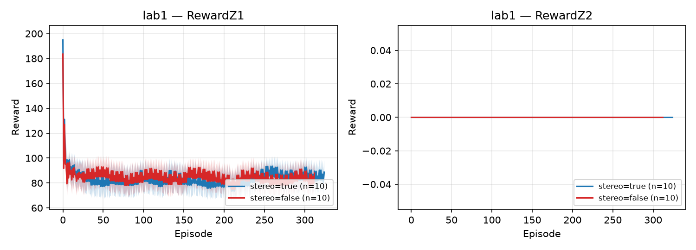
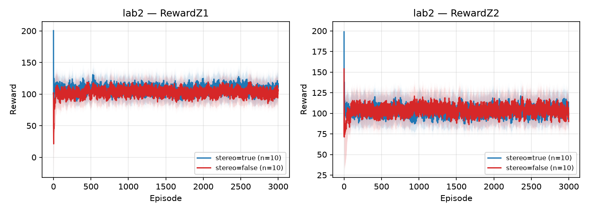
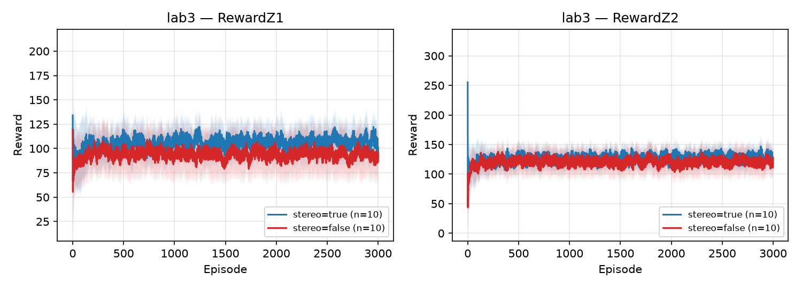
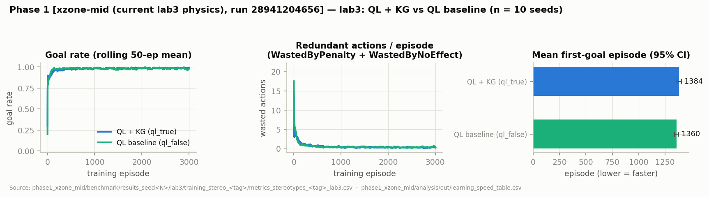
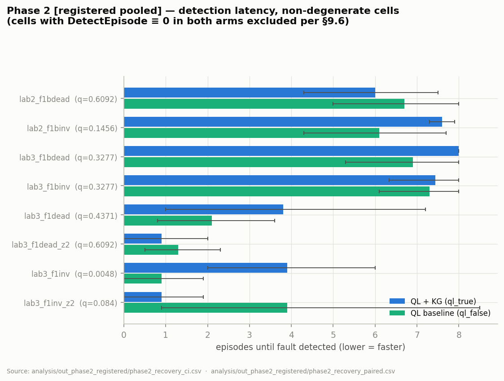
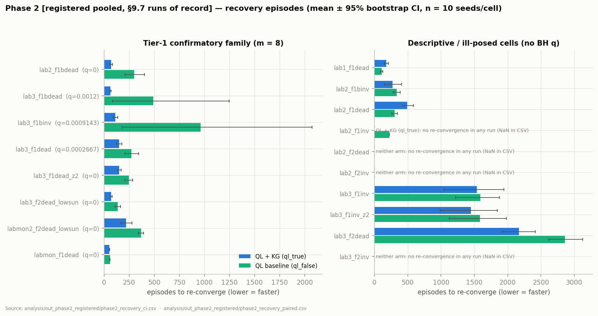
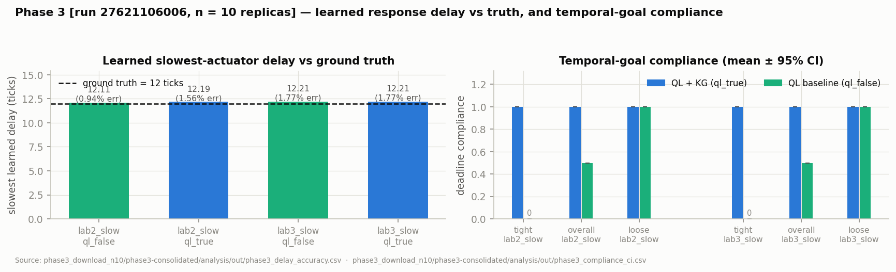
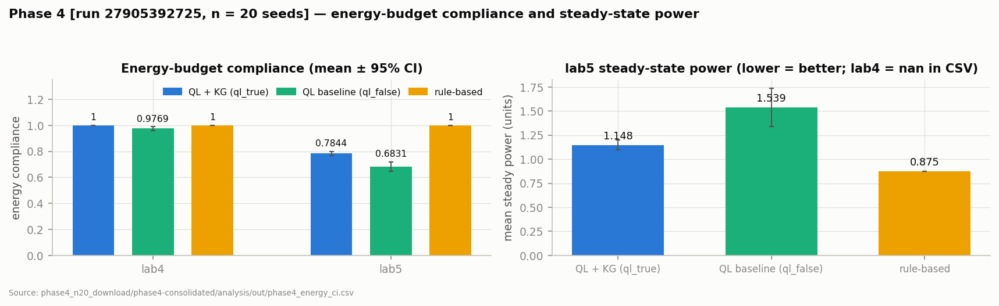
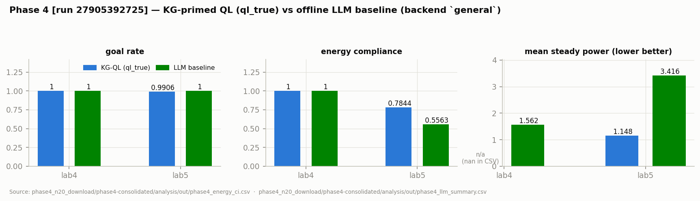

# Thesis State Report — Stereotype-Guided Q-Learning in Simulated Labs

**Assembled:** 2026-07-08, from the audit notes `docs/_audit/00_inventory.md`, `01_kg.md`,
`02_qlearning.md`, `03_agents_flow.md`, `04_labs_physics.md`, `05_results_index.md`,
`20_results_extracted.md`, and the caveats in `13_logic_report.md`.
**§11 (value-laden parameters: provenance, external grounding, open judgments) added 2026-07-09.**
**Repo state:** branch `kg-crosszone-coupling-mid`; audit baseline `phase2-instant-blacklist`
@ `ba0303e` (2026-07-07), delta-refreshed 2026-07-08 (00_inventory.md#L4-L5, 04_labs_physics.md#L11-L14).
**Era note:** the repo contains an OLD pre-pivot approach (custom8/custom9 labs, W1–W6
weakness labs, sweep workflows) and the NEW phase-based approach that implements the
advisor's redirection. **Everything in this report is the NEW era** unless explicitly
marked [OLD]; OLD-era result files at the repo root are orphaned and are not thesis results
(05_results_index.md §5).
**Traceability:** every number is cited as `path#Lstart-Lend` or to a canonical CSV/run ID.
Result-table captions name the CI run ID and the CSV the values were read from verbatim.

---

## 0. Executive Summary

**Thesis goal (one paragraph, from `ThesisGoalDescription_important.txt`).** The thesis
compares a tabula-rasa Q-learning agent against an identical Q-learning agent primed with
physics knowledge from a Knowledge Graph (component stereotypes with manipulated /
dependent / independent variables, after Cecconi et al. 2023), in three advisor-defined
phases. **Phase 1:** in clean simulated labs that fully align with the KG, show — with
statistically sound methods — that the KG-primed learner learns faster (time to goal,
avoidance of redundant actions) while being equally successful, on a complexity ladder from
a trivial one-zone lab to a two-zone lab with cross-zone light spillage whose *structure*
(but not magnitude) is in the KG, and with blinds whose sunshine threshold is deliberately
not quantified in the KG and must be learned. **Phase 2:** pre-trained agents placed in
faulty versions of those labs must not work around a fault but recognize that an action
produced unexpected behaviour, recheck against the physics knowledge, immediately discard
(blacklist) the faulty component, alert the user, and re-learn — with the KG-primed agent
expected to realign faster; this includes faulty/inverted blinds, a monitor whose light
emission is a side-effect usable as an emergency fallback, and best-effort behaviour with
user notification when the goal is unreachable. **Phase 3:** exploit the learner to acquire
what stereotypes lack — process dynamics (actuator response delays) — write the learned
delays back into the KG, and use them to satisfy temporally specified goals.

**State of the work, per phase:**

| Phase | Implementation | Headline evidence (canonical run) | Status |
|---|---|---|---|
| 1 — clean labs | Complete: lab1/lab2/lab3 ladder, factorial arms isolating the KG prior | **Post-inversion arm C (run 29639767776, headline of record):** lab2 `auc_goal` Δ=+0.01679 [0.00959, 0.02606], q=0, δ=1.0; lab1 = saturated null control (clean in every contrast under arm C). Anchor replicates across instrument (pre-inversion arm C +0.01707, run 27336756264) and arm (arm D +0.01924, run 29105464710), and is robust to the prior-decay horizon E ∈ {750, 3000, 10000} (E-sweep, n=5) | Arm-C re-run duty DISCHARGED; headline holds like-for-like under the post-inversion instrument (Addendum 2026-07-18b) |
| 1 — lab3 (cross-zone) | Complete, three spill-magnitude configurations run | **Post-inversion arm C (29639767776):** `auc_reward` win replicates (Δ=+16.62, q≈0, δ=1.0); the first-goal *regression is significant again* (Δ=+67.56, q=0.0104, δ=0.68 — the arm-D ns reading was arm-confounded; matched pre-inversion comparator +23.95, run 28941204656); efficiency tax under arm C = `avg_cycling` +0.744 (q=0.0154) only, `avg_redundant` ns (arm-D stacking). E-sweep: shorter E removes the timing tax but grows the policy-quality tax (Addendum 2026-07-18b) | Characterized weakness motivating Phase 2: under the headline arm the lab3 tax is *timing + cycling*; the Addendum-2026-07-13 "migrated from timing to policy quality" reading is retired as arm-D-specific |
| 2 — fault detect → blacklist → re-learn | Complete: instant (counter-free) blacklist, physics recheck, user alert, warm restart, monitor fallback, best-effort degradation | ~~All 8 Tier-1 recovery cells significant~~ **SUPERSEDED by the post-inversion re-run (`pre_registration.md` §9.10, 2026-07-12): 3 of 8 Tier-1 cells significant** (`lab2_f1bdead` −306.5 q≈0, `lab3_f2dead_lowsun` −71.4 q≈0, `labmon2_f2dead_lowsun` −147.6 q=0.0021), 1 marginal (`lab3_f1dead_z2` q=0.066), 2 null, 2 sign-flipped ns; detection family entirely null | Confirmatory under §9 + §9.10; the pre-inversion 8/8 result is reported as a pre-inversion-instrument measurement |
| 3 — dynamics learning | Complete: probe-based delay learner + KG write-back + temporal goals | **Pre-inversion (27621106006):** blind delay 12.11–12.21 ticks vs ground truth 12 (≤1.77% rel. err); KG arm meets 6/6 deadline goals vs 3/6. **Post-inversion (29166356524): fully replicates** — 12.11–12.18 ticks (≤1.46% rel. err), 6/6 vs 3/6, lamps/spotlight classified instantaneous in all cells | Unchanged by the inversion. Delay accuracy statistically sound; compliance reported as a worked demonstration (deterministic outcome) |
| 4 — energy + dependency ladder | Complete but **an extension beyond the advisor's three phases**; scope now KG-primed vs tabula-rasa QL only (LLM baseline removed 2026-07-12) | **Post-inversion confirmatory run `29193486193` (n=20):** dependency-ladder primary `avg_redundant` Δ = −0.326 / −0.934 / −1.458 for lab4 / lab4dual / lab4chain (all q≈0, monotone growth); lab5 `energy_compliance` Δ=+0.096 (q≈0), steady power −0.431. Pre-inversion directions replicated; goal-rate parity on lab4/lab5, KG-favorable lift on lab4dual/lab4chain (disclosed) | Clearly labeled extension chapter; supersedes PHASE4.md §10a (Addendum 2026-07-12e; `PHASE4_DEPENDENCY_LADDER.md` §10) |

The dominant remaining risk is presentational, not implementational: the lab3 Phase-1
result diverges from the advisor's stated expectation and must be led with `auc_reward`
and framed as the bridge to Phase 2, not as a win (13_logic_report.md §6).

---

## 1. System Architecture & Layers

Source: 03_agents_flow.md, 00_inventory.md.

The system is a JaCaMo application (Jason BDI agents + CArtAgO artifacts) driving Node-RED
lab simulators over HTTP/WoT:

| Layer | Components | Role |
|---|---|---|
| **Configuration** | `src/agt/lab_profiles.asl` (single `active_profile/1` belief; 13-field `lab_profile/13` facts), `config/run_config.json` (+ JSON Schema) | Single authority for ports, ontology paths, targets, bounds, training budgets. Runtime override via `-Dactive.profile` through the `tools.jia.system_prop` internal action — the only bridge from JVM properties to agent beliefs (03_agents_flow.md §2.5, §7) |
| **Agents (Jason `.asl`)** | `_ql` (Phase-1 training), `_bench` (3-mode benchmark), `_adapt` (Phase-2 fault adaptation), `_dynamics` (Phase-3 probing/exploitation), plus an OLD-era interactive demo agent | One agent binary per phase; all include `lab_profiles.asl` |
| **Artifacts (CArtAgO, Java)** | `LabEnvironment` (WoT TD → HTTP), `QLearner` (decomposed tabular Q-learning + fault machinery), `StereotypeReasoner` (KG parser, priors, IV gate — helper owned by QLearner), `StereotypeLearner` (Welford effect discovery → TTL), `DynamicsLearner` (delay estimation → TTL), `OntologyArtifact` (SPARQL, rule-based mode only), `BenchmarkLogger` | All environment interaction and learning state |
| **Simulators** | One Node-RED flow per lab profile, ports 1892–1900 (NEW era); endpoints `/was/rl/status`, `/action`, `/setState`, `/reset` | Deterministic lux physics in the `Update environment` node; PRNG only at episode reset (04_labs_physics.md §0) |
| **Orchestration / CI** | Gradle tasks `taskQl`/`taskBench`/`taskAdapt`/`taskDynamics`; PowerShell runners; GitHub Actions `phase1.yml`–`phase4.yml` (workflow_dispatch, seed matrices) | Reproducible multi-seed runs; artifacts published to a `results` branch (00_inventory.md §D, §F) |

Per-step control loop (training, `@do_step`, illuminance_controller_agent_ql.asl#L314-L353;
full 12-step trace in 03_agents_flow.md §3): sense (`readLabStatus` → HTTP GET, discretize
lux into ranks 0–3) → encode (slot-registry state vector) → terminal check → ε-greedy
action selection → translate to WoT action → HTTP POST → wait → re-sense → Bellman update
(`calculateQ`) → passive stereotype-learner observation → recurse.

### Runtime data-flow diagram

```mermaid
flowchart TD
    A["lab_profiles.asl\nactive_profile/1\nlab_profile/13"] -->|profile fields| B

    subgraph "Jason BDI Agent (illuminance_controller_agent_ql.asl)"
        B["@apply_profile_then_start\n!profile_td / !profile_ont\n!profile_zone_targets"]
        B --> C["@start\nmakeArtifact LabEnvironment\nmakeArtifact QLearner\nmakeArtifact StereotypeLearner\nconfigureQLearner(Goal,Stereo,Paths,SunProb)\n!train(0)"]
        C --> D["@train / @run_episode\nsetRandomLabState or setScenarioLabState\nbeginEpisode"]
        D --> E["@do_step\n(per step, recursive)"]
    end

    E -->|readLabStatus| F["LabEnvironment\n(CArtAgO Artifact)"]
    F -->|HTTP GET /status| G["Node-RED Simulator\nports 1892–1900\n(compute_levels tick)"]
    G -->|JSON: ZnLevel, Sunshine, ZnLight, …| F
    F -->|zoneLevels, sunshineRank, boolStateKeys, boolStateValues| E

    E -->|encodeState| H["QLearner\n(CArtAgO Artifact)"]
    H -->|stateVec int[]| E

    E -->|getActionFromState\n(ε-greedy)| H
    H -->|Action int| E

    E -->|actionToWoT| H
    H -->|WotType, WotValue| E

    E -->|invokeAction WotType=value| F
    F -->|HTTP POST /action\n{Z1Light:true}| G
    G -->|HTTP 200| F

    E -->|".wait(delay_ms)"| G

    E -->|readLabStatus 2nd time| F
    E -->|encodeState 2nd time → NextState| H
    E -->|calculateQ StateVec Action NextState| H
    H -->|Bellman update qTables[z][sIdx][a]| H

    E -->|observe StateVec Action NextState| I["StereotypeLearner\n(CArtAgO Artifact)\nWelford accumulators"]

    subgraph "End of Training"
        J["@train_done\nsaveQTable / saveMetrics / saveIVStats\nsaveCoverage / saveFirstGoal"]
        K["StereotypeLearner\nsaveLearnedStereotypes → .ttl"]
    end

    H --> J
    I --> K

    subgraph "Phase-2 Adapt Extension"
        L["@do_step_adapt\nobserveForFaults(svBefore,action,svAfter)"]
        L -->|newlyDefective non-empty| M["blacklistComponent\nwarmRestart\n+detected(EpN)"]
        M -->|ε boost, Q wipe, episode reset| H
    end

    subgraph "Phase-3 Dynamics Extension"
        N["probe_all\nreadLabStatusTimed + invokeAction\n→ DynamicsLearner.recordDelay"]
        O["exploit_all\nbelieved_delay → planner\n→ invokeAction + measure actual TTR"]
    end

    F -.->|readLabStatusTimed: tick counter| N
    N --> O
```

(Diagram reproduced from 03_agents_flow.md §4.)

---

## 2. Knowledge Graph & Ontologies

Source: 01_kg.md.

### 2.1 Design

The KG follows the three-layer stereotype design of Cecconi et al. 2023 / Ramanathan &
Mayer (BuildSys '23): `elem:` (Elementary) supplies physical mechanisms and stereotypes,
`brick:` supplies topology (`brick:feeds`, `brick:isLocatedIn`), `qudtqk:` quantity kinds,
`sosa:` observables (01_kg.md §A.0). NEW-era labs each ship a **self-contained**
`building_N_*.ttl` (domain KG + component actions + state-vector slot registry + WoT
bindings) plus a WoT Thing Description `interactions-<lab>.ttl` consumed only by the agent's
WoT stack (01_kg.md §A.9).

Two core mechanism patterns:

- **Causes** (lamp, spotlight, monitor): MV → DV directly, sign asserted via
  `elem:increases` (building_1_trivial.ttl#L68-L73).
- **Mediates** (blind): the MV (`ws:blindApertureRatio`) gates an IV→DV transfer
  (`ws:outdoorIlluminance` → `elem:luminiscence`); `elem:increases` is deliberately
  omitted because the sign is state-dependent, and only `ws:ivMinRank 1` (structure) is
  asserted — the numeric sunshine threshold is **not** in the KG and must be learned
  (building_3_complex.ttl#L83-L88; lab-ontology.ttl#L123-L133 documents the contract).

Cross-zone spillage (lab3) is asserted as `brick:feeds` arcs, each reified as an
`elem:InternalConnection` tagged `ws:PrimaryOpticalCoupling` (same-zone) or
`ws:WeakOpticalCoupling` (cross-zone spill); the SECONDARY mechanism carries **no
magnitude** — "gain/magnitude intentionally ABSENT — learned by the Q-agent"
(building_3_complex.ttl#L456-L520, #L322). The KG asserts *structure only*.

The monitor (Phase 2.5) is a Causes mechanism with **multiple DVs** — primary
`ws:displayed_information`, side-effect `elem:luminiscence` — so actuator discovery
(which filters DVs to `qudtqk:Illuminance`, StereotypeReasoner.java#L126) surfaces it as
one weak light action (building_6_monitor.ttl#L112-L128).

Phase-3 dynamics vocabulary: the `_slow` KGs assert only a **qualitative** class
(`ws:hasResponseDynamic` → `ws:InstantaneousResponse`/`ws:DelayedResponse`) and leave
`ws:responseDelay` valueless by design; the magnitude is measured online and written back
to `learned_dynamics_*.ttl` (building_2_slow.ttl#L78-L101; 01_kg.md §A.7–A.8). Note:
`ws:hasResponseDynamic` has no Java reader — the class marker is documentary
(01_kg.md Part D).

### 2.2 How KG triples become learning behaviour (three surfaces)

1. **Initial-Q penalties** (`getInitPenaltyForZone`, StereotypeReasoner.java#L1069-L1167;
   applied to every cell at construction, QLearner.java#L477-L486). Six rules × scale
   `INIT_PENALTY_SCALE = 0.5`: redundancy −100, **IV gate** −100 (only consumer of the
   static `ws:ivMinRank`), cross-zone overshoot −50, shared-actuator at-goal −75,
   **constructive bonus** +15·gap toward helpful ON actions, optional cross-zone bonus
   (`stereo.crossZoneBonus`, default 0).
2. **Runtime soft priors** (`getActionPriors` + `greedyAction`): −1.0 if redundant, −5.0
   if the IV is (learned-)unsatisfied, 0 otherwise; multiplied by an episode-decay weight,
   a per-cell visit fade, and (arm D only) an adaptive-trust calibration — full formula in
   §3.4 (StereotypeReasoner.java#L1029-L1064; QLearner.java#L2539-L2620).
3. **IV gating from learned statistics** (`isIVSatisfied`): per (action, sunshine-rank)
   trial/success counts (`recordActionOutcome`), gate opens when learned effectiveness
   ≥ 0.05 with ≥ 10 samples; under-sampled ranks are optimistically allowed
   (StereotypeReasoner.java#L909-L923, #L935-L966). This is the loop by which the blind's
   unquantified sunshine threshold is learned empirically, per rank, and persisted across
   train→bench via `iv_stats_*.json` (01_kg.md §C.4).

State-vector layout is itself KG-driven: `ws:stateVecIndex`/`ws:stateDomainSize`/
`ws:stateSlotRole` triples define the slots (lab3: `[Z1Level,Z2Level,Z1Light,Z2Light,
Z1Blinds,Z2Blinds,Spotlight,Sunshine]` = 2048 states; lab1: 8 states)
(building_3_complex.ttl#L28-L31, building_1_trivial.ttl#L27).

Discretisation thresholds live on the sensed variables: indoor `{50, 100, 300}` lux
(building_1_trivial.ttl#L96-L104; 01_kg.md §A.3) — so zone rank 3 ⇔ ≥ 300 lux. lab1 has
no outdoor-illuminance variable; the outdoor `{50, 200, 600}` lux bounds first appear on
lab2+ (building_2_intermediate.ttl `rankBound_2 "200"` ~L146) and are set for training via
`sunshine_bounds([50,200,600])` in lab_profiles.asl#L267.

---

## 3. Q-Learning: Math, Hyperparameters, Policies

Source: 02_qlearning.md (all line cites to `src/env/tools/QLearner.java` unless noted).

### 3.1 State & action space

- State: per-zone illuminance rank (0–3), one boolean bit per actuator, sunshine rank;
  layout data-driven from the KG slot registry (#L400-L410). NOT in the state: raw lux,
  energy, time, goal ranks, fault status (02_qlearning.md §1.1).
- Per-zone (VDN-style) Q-tables `qTables[numZones][nStates][nActions]`; selection and
  bootstrapping use the combined value $Q(s,a)=\sum_z Q_z(s,a)$ (#L186, #L2470-L2494).
- Actions: ontology-discovered ON/OFF pair per actuator + `DO_NOTHING`; blacklisted
  actions excluded from the applicable set (#L2517-L2537).

### 3.2 TD update

With $Z$ zones, clipped per-zone reward $\tilde r_z$, PBRS term $F_z$, and the **joint**
bootstrap action $a^{*} = \arg\max_{a'} \sum_z Q_z(s', a')$ over non-blacklisted actions
(#L571, #L2484-L2494):

$$
Q_z(s,a) \;\leftarrow\; Q_z(s,a) \;+\; \alpha \Big[ \tfrac{1}{Z}\big(\tilde r_z + F_z\big) \;+\; \gamma\, Q_z(s', a^{*}) \;-\; Q_z(s,a) \Big]
$$

(#L553-L657; the shared joint $a^*$ is a deliberate fix against over-estimation, #L566-L571.)

### 3.3 Reward decomposition

Per zone $z$, with $d = |\mathrm{level}-t_z|$ (distance to the effective target) and
$\Delta d = d_{\rm prev} - d_{\rm next}$ (#L2385-L2443):

$$
r_z \;=\; -1 \;+\; 40\,\Delta d \;+\; 200\cdot\mathbb{1}[\text{entered goal}] \;+\; 5\cdot\mathbb{1}[\text{held goal}] \;-\; 200\cdot\mathbb{1}[\text{lost goal}] \;-\; 10\cdot\mathbb{1}[\text{no-effect}] \;-\; 5\cdot\mathbb{1}[\text{idle stagnation}]
$$

then clipped to $[-C, C]$ with $C=$ `reward.clip` and zone-normalised by $1/Z$.
**Energy is NOT in the reward** — it enters only as a non-fading greedy-selection prior in
lab5 (weight 2.0 set only by the `phase4` profile) (02_qlearning.md §4).

### 3.4 Action selection: ε-greedy + fading KG prior

ε-greedy with per-episode decay:

$$
\varepsilon_0 = 0.3,\qquad \varepsilon \leftarrow \max(\varepsilon_{\min},\ \varepsilon\cdot\lambda),\qquad \varepsilon_{\min}=0.01
$$

Greedy score in stereotype mode (#L2540-L2618):

$$
\mathrm{score}(s,a) \;=\; \sum_z Q_z(s,a)\;+\;\underbrace{w_{\rm prior}(e)\cdot \pi_a(s)\cdot \mathrm{calMul}_{a,b}\cdot \mathrm{cellMul}_{s,a}}_{\text{fading KG prior}}\;-\;\underbrace{w_E\cdot \mathrm{energyCost}(a)}_{\text{non-fading, lab5 only}}
$$

with episode decay
$w_{\rm prior}(e) = S \cdot \big[1 - \min(1, e/E)\,(1-f)\big]$,
per-cell fade $\mathrm{cellMul} = \min(1, V_f/\mathrm{visits}(s,a))$, and adaptive-trust
$\mathrm{calMul}$ = running mean of KG-sign/observed-sign agreement per (action,
sun-bucket), applied only in arm D (02_qlearning.md §6.3).

Potential-Based Reward Shaping (Ng, Harada & Russell 1999), when enabled:

$$
\Phi_z(s) = -\big|\,\mathrm{level}_z(s) - t_z\,\big|, \qquad F_z = \gamma\,\Phi_z(s') - \Phi_z(s)
$$

**PBRS is OFF in the headline Phase-1 arm C** (`phase1_kg_only`: `reward_shaping="none"`,
run_config.json#L90) — the headline isolates the KG prior alone (02_qlearning.md §5).

### 3.5 Hyperparameters (effective CI values)

| Symbol / knob | Value | Source |
|---|---|---|
| $\alpha$ (learning rate) | 0.1 (compile-time, no config override) | QLearner.java#L53 |
| $\gamma$ (discount) | 0.9 (compile-time, no config override) | QLearner.java#L54 |
| Reward clip $C$ | code default 50.0; **effective 200.0** in all CI runs | QLearner.java#L60; run_config.json#L268 |
| $\varepsilon_0$ / $\varepsilon_{\min}$ | 0.3 / 0.01 | QLearner.java#L55, #L57 |
| $\lambda$ (ε-decay, per profile) | lab1 0.9920 · lab2 0.9960 · lab3/4/5 0.9970 · labmon 0.9950 · labmon2 0.9975 | lab_profiles.asl#L272, #L287, #L303, #L343, #L358, #L382, #L408 |
| Prior scale $S$ | 1.0 | QLearner.java#L67; run_config.json#L269 |
| Prior decay episodes $E$ | config-forwarded **10000** (positive sysprop disables the auto ¼-budget coupling) | run_config.json#L270; QLearner.java#L2172-L2177 |
| Prior decay floor $f$ | 0.0 | QLearner.java#L94; run_config.json#L271 |
| Prior fade visits $V_f$ | 25 | QLearner.java#L100 |
| Prior magnitudes: redundant / IV-unsat / init bonus | 1.0 / 5.0 / 15.0 | run_config.json#L272-L274 |
| Adaptive trust minSamples / floor | 50 / 0.1 (arm D only) | QLearner.java#L126-L127 |
| IV gate: min samples / effectiveness threshold | 10 / 0.05 | StereotypeReasoner.java#L223, #L235 |
| Convergence (training) | Bellman delta < 1e-3 for 100 consecutive episodes | QLearner.java#L251-L252 |
| Recovery (Phase 2) | greedy policy unchanged for 50 consecutive episodes | QLearner.java#L330 |
| Seeding | `baseSeed = 42 ^ (stereo ? 0x5A5A… : 0xA5A5…)`, `run.seed` mixed in via SplitMix64 | QLearner.java#L373-L374, #L152-L159 |

### 3.5.1 Per-parameter justification (what each value does, why it was chosen, sensitivity)

Two framing facts apply to every row and should lead any defense of this table:

1. **Every hyperparameter is shared identically between the ql_true and ql_false arms.**
   All thesis claims are *paired contrasts between otherwise-identical learners*, never
   absolute performance claims, so a suboptimal value degrades both arms equally and the
   internal validity of the Δ's does not rest on tuning.
2. **The prior-related values were not tuned toward the hypothesis.** They were set in a
   documented audit pass (code comments cite the audit items, e.g. "Audit Step 3b §S3b-4"
   at QLearner.java#L63-L66), and every audit change *lowered* the prior's influence
   (S 5.0→1.0, redundant 5→1, IV-unsat 25→5, floor 0.1→0.0, init scale halved). The zero
   setting is exercised as a negative control: arm A (`stereo_prior_scale=0`,
   `stereo_init_bonus=0`, run_config.json#L61-L73) comes out null, confirming the harness
   carries no built-in bias (05_results_index.md §1.2).

The values group into three tiers: textbook RL constants left untuned by design (α, γ, ε);
prior-calibration constants set by the audit under one guiding principle — *the prior must
be out-votable by O(1) contradicting observations*; and detector windows shared across
arms, where miscalibration shifts both arms' numbers by the same constant.

**α = 0.1 (learning rate, QLearner.java#L53).** Step size of the TD update. The textbook
tabular default, appropriate because the environment is near-deterministic: the lux
physics has no noise, so the only stochasticity a Q-cell sees is the per-episode sunshine
draw and exploration; α = 0.1 effectively averages a cell's last ~10 visits without
oscillating. Higher (0.5) would make blind-action values chase the most recent sunshine
condition and prevent the 1e-3 Bellman convergence test from ever settling; lower (0.01)
is safe but ~10× slower than the training budgets allow. Untuned and identical in both
arms — a different α rescales both learning curves, not the contrast.

**γ = 0.9 (discount, QLearner.java#L54).** Effective planning horizon ≈ 1/(1−γ) = 10
steps, matched to the task: an optimal trajectory in any lab needs only a handful of
actions, so 10 steps covers every useful plan while keeping the −1/step cost meaningful.
Lower (0.5) makes the agent myopic against multi-step plans ("open blind now, gain the
rank next step"); higher (0.99) inflates the goal-*holding* loop — a held goal is worth
≈ 5/(1−γ), i.e. 50 at γ = 0.9 but 500 at γ = 0.99 — which would dwarf the one-shot ±200
entry/loss events the reward design is built around.

**ε₀ = 0.3, ε_min = 0.01 (QLearner.java#L55-L57).** Standard annealed ε-greedy. 0.3 gives
broad early coverage without drowning the thing being measured: early *greedy* choices are
exactly where the KG prior acts, so ε near 1 would mask the prior and ε near 0 would
starve the tabula-rasa arm of any path to the goal — 0.3 is conservative w.r.t. the
hypothesis (a lower ε₀ would *inflate* the KG advantage by starving the baseline). The
0.01 floor is the GLIE-style guarantee that every (s,a) keeps being visited while leaving
late-training curves essentially greedy, so `auc_goal` reflects policy rather than dice; a
0.1 floor would put a permanent ~10% random-action haircut on both arms' goal rates. The
same 0.30 is reused as the Phase-2 post-blacklist boost (`fault.relearn.epsBoost`,
QLearner.java#L311): the warm restart deliberately returns exploration to the
initial-training regime over the surviving actuators.

**λ (ε-decay) per profile (lab_profiles.asl).** Each λ is paired with its profile's
episode budget in the same `training_params(Budget, Lambda)` fact and chosen so ε reaches
its floor at a roughly constant *fraction* of the budget: ε hits 0.01 after
n = ln(30)/(−ln λ) episodes ≈ 423 for lab1 (42% of 1 000), ≈ 849 for lab2 (42% of 2 000),
≈ 1 132 for lab3 (38% of 3 000). So λ is not a free per-lab knob — it is one annealing
schedule expressed in units of the training budget, and the budget scales with state-space
size (8 → 2 048 states). Faster decay causes premature exploitation and starves the IV
statistics (which need ≥ 10 samples per sunshine rank) — hurting the *baseline* arm most;
slower decay leaves the training tail dominated by exploration noise, flattening both
arms' `auc_goal` and preventing convergence detection.

**Reward clip C = 200 effective (code default 50; QLearner.java#L60,
run_config.json#L268).** Clamps per-zone per-step reward to [−C, C]. 200 equals the
largest single reward component (goal entry +200 / loss −200), so no *individual* event is
ever truncated — clipping only caps pathological stacking of multiple components in one
step (e.g. −200 lost-goal − 40 regression − 10 no-effect). The code default 50 predates
the current reward scale; all CI runs override to 200 precisely because clipping at 50
would squash the goal events down to the order of one progress step (40·Δd). Anything
≥ ~250 is behaviourally identical; anything below 200 progressively flattens the goal
signal in both arms. Disclose plainly that the effective value in every reported run
is 200.

**Prior scale S = 1.0 (QLearner.java#L67).** Global multiplier on the runtime soft prior.
Lowered 5.0 → 1.0 by the audit with an explicit calibration recorded in the comment: at
S = 1 the prior's magnitude on a discouraged action is O(one combined-Q Bellman swing per
visit) (~5), so a handful of contradicting observations out-vote it — the design principle
for the whole channel: advisory, data-overridable. Larger S turns advice into a mask and
re-creates the wrong-prior failure mode of the [OLD] W1–W6 labs; S = 0 *is* arm A / the H5
ablation, which confirms the null.

**Prior decay horizon E = 10 000 episodes (run_config.json#L270;
QLearner.java#L2172-L2177).** Episodes over which the prior weight decays linearly from S
toward the floor; the positive config value deliberately disables the auto ¼-budget
coupling. The defense has two parts. (a) *Division of labour*: global episode decay is not
the mechanism that retires the prior — the per-cell visit fade (next entry) is. E is long
so the prior stays available in *unvisited* regions of the 2 048-state space, where it is
the only information the agent has, while the visit fade retires it cell-by-cell wherever
real data accumulates. (b) *Disclosed consequence*: with 1 000–3 000-episode budgets the
prior has only decayed part-way at end of training (lab3 ≈ 70% of S, §3.6), and bench-time
restoration pins the prior to its floor regime (QLearner.java#L2235-L2249), so measured
benchmark behaviour is not propped up by a still-live prior. A short E (the auto default)
would make arm C converge to baseline behaviour early — purer "prior as initialization,"
but no guidance left in late-discovered corners of large state spaces. E is the value most
deserving of a sensitivity note in the thesis.

**Prior decay floor f = 0.0 (QLearner.java#L94).** Residual prior weight after decay.
Lowered 0.1 → 0.0 by the audit so the asymptotic and bench-time policies carry **no
permanent prior bias**. This is what licenses "the KG *accelerates* learning" rather than
"the KG substitutes for learning": in the limit both arms are pure Q-learners. Any f > 0
makes the final policies structurally different between arms, confounding every benchmark
contrast with "still being steered."

**Prior fade visits V_f = 25 (QLearner.java#L100).** Per-cell multiplier
min(1, 25/visits(s,a)): after 25 visits the prior in that cell shrinks hyperbolically. The
comment records the calibration: above ~25 visits the local Bellman averaging (targets
±12.5 per zone at these reward scales) carries enough weight to out-vote a magnitude-≤5
prior on its own — 25 is the visit count at which the data provably no longer needs the
prior. Smaller retires the prior before data can replace it (hurts arm C in sparsely
visited states); larger lets a wrong prior linger where data already contradicts it — the
knob that would matter most in the Phase-2 faulty labs if it were large.

**Prior magnitudes 1.0 / 5.0 / 15.0 (redundant / IV-unsat / init bonus,
StereotypeReasoner.java#L248, #L258, #L293).** The ordering 1 < 5 < 15·gap mirrors how
expensive each mistake is to learn from data alone. Redundancy is self-announcing (the −10
no-effect penalty catches it in one visit), so the prior only needs a tie-breaker: −1.0,
one Bellman swing (audit: lowered from 5). IV violations are expensive to learn (≥ 10
samples *per sunshine rank*), so the steer is stronger: −5.0, pinned by the audit at 10%
of the reward clip (historically −125 — effectively a hard mask). The constructive bonus
+15·gap must make the agent *try* the KG-favoured lever early while staying far below the
+200 goal signal, so one real corrective transition outweighs it — the comment argues
recoverability on a wrong-prior lab from exactly this inequality; bounded optimistic
initialization only re-orders early exploration and leaves the converged policy unchanged.
Alongside these, the static init penalties (−100/−75/−50) are all scaled by
`INIT_PENALTY_SCALE = 0.5` (StereotypeReasoner.java#L271-L272) with an escape-well
argument: unscaled, stacked penalties formed a −250 well needing ~80 visits to escape
while mean visits per cell were ~9; halving brings the worst case within what the Bellman
target overcomes inside the budget. Raising any negative magnitude converts advice into
constraint; lowering toward 0 converges to arm A; raising the bonus much beyond ~50/rank
would start competing with real reward differences.

**Adaptive trust minSamples = 50, floor = 0.1 (arm D only, QLearner.java#L126-L127).**
The calibration multiplier (running KG-sign vs observed-sign agreement per action) is only
applied after 50 observations of an action, so an unlucky early streak cannot down-weight
a correct prior; the 0.1 floor prevents a prior from being permanently zeroed by transient
disagreement, keeping it recoverable if later evidence rehabilitates it. Fewer samples
make trust twitchy (variance in the calibration dominates); no floor makes early errors
irreversible. Headline results do not depend on either value — arm D is not the headline
arm (arm C runs with trust OFF).

**IV gate: ≥ 10 samples, effectiveness ≥ 0.05 (StereotypeReasoner.java#L223-L236).** The
learned replacement for the deliberately-unquantified sunshine threshold: per (action,
sunshine-rank), a blind action is deemed effective once ≥ 5% of ≥ 10 trials produced a
rank change; under-sampled ranks are optimistically allowed. Both values are justified in
comments: 10 is a floor set against the actual sample budget (~50 trials at the rarest
relevant sun rank over a training horizon — reachable at every rank, yet enough to average
out single-episode flukes); 0.05 was lowered from 0.10 because rank discretisation makes a
genuine single-step rank crossing structurally rare near a boundary, so 0.10 misclassified
*healthy* blinds at marginal sun as ineffective. The comment concedes 0.05 is the
minimally-invasive approximation and a raw-lux-Δ criterion would be the proper fix — a
ready-made limitation sentence. Stricter settings produce false "ineffective" verdicts
(directly damaging the arm-C mechanism under study); looser settings only close the gate
later, costing wasted blind actions but no bias. The optimism-under-undersampling default
is the key defensible choice: the learned threshold is seeded by data, never by the static
prior (StereotypeReasoner.java#L909-L923).

**Convergence: Bellman delta < 1e-3 for 100 consecutive episodes
(QLearner.java#L250-L252).** 1e-3 is 3–5 orders of magnitude below the Q-value scale
(tens to hundreds), so it means "the tables have genuinely stopped moving," not "moving
slowly." The 100-episode window exists because ε_min = 0.01 keeps injecting exploratory
actions: one quiet episode can be luck; 100 consecutive quiet episodes under residual
exploration cannot (the window is also the α-averaging horizon ×10). Since training runs
to a fixed episode budget regardless, this criterion *labels* runs rather than truncating
them — miscalibration cannot bias the paired metrics.

**Recovery: greedy policy unchanged for 50 consecutive episodes
(QLearner.java#L320-L330).** The Phase-2 re-convergence detector behind RecoveryEpisodes.
Policy stability replaces Bellman stability for a reason stated in the comment: post-fault,
the ε-boost keeps perturbing TD targets and sun-gated survivors make the goal only
stochastically reachable, so the 1e-3 Bellman test never settles even when behaviour has;
what the thesis cares about is the *ranking* of actions, which this test tracks. 50 is
long enough that a plateau under boosted exploration is not coincidence, short enough that
recovery counts stay interpretable (and is half the convergence window). A shorter window
risks declaring recovery during a transient plateau; a longer one adds a constant to every
cell. Either error applies to both arms identically, so the paired Δ's and the ~1.1–9.1×
speed-up ratios are robust to the exact window — the strongest single sentence in defense
of this row.

**Seeding: `baseSeed = 42 ^ armConstant`, `run.seed` mixed via SplitMix64
(QLearner.java#L373-L374, #L152-L159).** Fully deterministic reproducibility with two
deliberate properties: the arm-specific XOR constants give ql_true and ql_false
*different* exploration streams, so a paired win cannot be an artefact of both arms
sharing one lucky noise sequence; and SplitMix64 mixing of `run.seed` = 1…N gives
well-separated independent replicas from consecutive small integers, which is what makes
the seed-paired bootstrap/Wilcoxon machinery (§9.2) valid. The values 42 / 0x5A5A… /
0xA5A5… are arbitrary constants — only their fixedness and distinctness matter.

### 3.6 Q-learning caveats (from 02_qlearning.md)

- With $E = 10000$ and 1000–3000-episode Phase-1 budgets, **the KG prior only decays
  part-way** during training (lab3: still at 70% of $S$ at end of training)
  (02_qlearning.md §6.3).
- α and γ have **no config override path** — they are compile-time literals
  (02_qlearning.md "NOT FOUND").
- Bench-time restoration sets the prior to its floor regime and restores visit/trust
  sidecars, so benchmark greedy behaviour is not re-inflated by the prior (#L2235-L2249).
- The training agent's `action_delay_ms(65)` was previously paired with a ">200 ms tick"
  comment block that contradicted the actual value. That block has since been deleted in the
  working tree; the line now reads `action_delay_ms(65)` with a corrected "exceeds one 50 ms
  simulator tick" note (illuminance_controller_agent_ql.asl#L51; 03_agents_flow.md §1.2) —
  the instrument-hygiene item is fixed-in-tree (§10).

---

## 4. Labs & Physics per Phase

Source: 04_labs_physics.md. All physics quoted from the `Update environment` function at
`#L130` of the named Node-RED flow file. Physics is deterministic (no PRNG in the env
tick); sunshine is sampled once per episode from `[0, 100, 400, 900]` and pinned. Shared
profile values: `light_bounds([50,100,300])`, `sunshine_bounds([50,200,600])`,
`sunshine_prob(0.75)`, all targets rank 3 (≥ 300 lux).

### 4.1 Phase 1 — clean ladder

**lab1** (1 zone, 1 lamp; port 1892; 1000 episodes) — simulator_flow_lab1.json#L130:

```js
var z1 = 25 + (z1light ? 400 : 0);
```

(The former un-modelled `0.10·sun` ambient term was deleted 2026-07-08 so the "clean lab
fully aligns with KG" premise holds; building_1_trivial.ttl#L25 updated to match —
04_labs_physics.md §1.1, §6.2.)

**lab2** (2 independent zones, adds Mediates blinds; port 1893; 2000 episodes) —
simulator_flow_lab2.json#L130:

```js
var z1 = 25 + (z1l ? 400 : 0) + (z1b ? 0.50 * sun : 0);
var z2 = 25 + (z2l ? 400 : 0) + (z2b ? 0.50 * sun : 0);
```

The blind term is zero when sun = 0 — the unquantified IV threshold the agent must learn.

**lab3** (cross-zone spillage + shared spotlight; port 1894; 3000 episodes) —
simulator_flow_lab3.json#L130 (current physics, commit `ad3cb3b`):

```js
var corridor = sp ? 150 : 0;
var z1 = 25 + (z1l ? 400 : 0) + (z2l ? 100 : 0)
       + (z1b ? 0.50 * sun : 0) + (z2b ? 0.30 * sun : 0) + corridor;
var z2 = 25 + (z2l ? 400 : 0) + (z1l ? 100 : 0)
       + (z2b ? 0.50 * sun : 0) + (z1b ? 0.30 * sun : 0) + corridor;
```

⚠️ **Magnitudes changed 2026-07-08** (commit `ad3cb3b`): lamp bleed 150 → **100**, blind
bleed 0.40 → **0.30**·sun ("rank-moving but non-trivialising": 0.30·900 = 270 < 300).
lab3 spill physics history: **50 / 0.25·sun** (original, sub-rank — headline run
27336756264 and the xzone as-is control 27440842780) → **150 / 0.40·sun** (bumped —
runs 27461188614, 27462446044, 27464846574, and the Phase-2/3 lab3-derived flows) →
**100 / 0.30·sun** (intermediate, current — run 28941204656 only)
(04_labs_physics.md §1.3; phase1_xzone_asis_analysis.md header).

### 4.2 Phase 2 — faulty ladder

Every faulty flow is generated from its clean parent by literal string replacement
(`simulator/generate_faulty_flows.ps1`); faulty profiles reuse the parent's TD, ontology,
port, scenarios, and bounds, and `adapt_source/2` maps them to the clean parent's Q-table
for warm-loading (04_labs_physics.md §2). Fault families:

| Family | Cells | Example physics edit |
|---|---|---|
| Single lamp dead/inverted | lab1_f1dead, lab2_f1dead/f1inv, lab3_f1dead/f1inv, lab3_f1dead_z2/f1inv_z2 | `z1l ? 400` → `z1l ? 0` (dead) or `? -400` (inverted), incl. the cross-zone term in lab3 |
| Multi-lamp | lab2_f2dead/f2inv, lab3_f2dead/f2inv | both lamps' terms zeroed/negated; blinds stay healthy |
| Blind (Mediates) faults | lab3_f1bdead/f1binv, lab2_f1bdead/f1binv | `z1b ? 0.50*sun` → `0` / `-0.50*sun` — only falsifiable on OPEN under sun rank ≥ 2 |
| Monitor fallback | labmon_f1dead | lamp dead ⇒ ceiling 25+260 = **285 lux = rank 2**: goal unreachable, monitor is the best-effort fallback |
| Degraded multi-survivor | lab3_f2dead_lowsun (ceiling 265 lux), labmon2_f2dead_lowsun (ceiling 275 lux) | lamps dead + sun pinned to 100 at reset ⇒ rank 3 provably unreachable every episode |

labmon clean physics (port 1899): `z1 = 25 + (z1l ? 400 : 0) + (z1mon ? 260 : 0)` —
monitor is a weak Causes side-effect light (rank 2 alone); labmon2 (port 1900) puts a
+200-lux monitor and a blind in each of two independent zones
(simulator_flow_labmon.json#L130, simulator_flow_labmon2.json#L130).

`lab1_f1dead` is the degenerate detect-only cell: the single actuator dies, so the agent
detects + alerts but cannot recover (lab_profiles.asl#L470-L472).

Budget note: lab3-based faulty profiles train 4000 episodes vs clean lab3's 3000
(04_labs_physics.md §6.3).

### 4.3 Phase 3 — slow labs

`lab2_slow` / `lab3_slow` (ports 1895/1896) keep the parent lux formula but route blind
terms through a delayed effective state: the commanded flag becomes effective only after
`DELAY = 12` env ticks (≈ 60 s at `seconds_per_tick = 5.0`); lamps and spotlight stay
instantaneous; a monotonic `Tick` counter is exposed for delay measurement
(simulator_flow_lab2_slow.json#L130):

```js
var z1 = 25 + (z1l ? 400 : 0) + (z1bEff ? 0.50 * sun : 0);
var z2 = 25 + (z2l ? 400 : 0) + (z2bEff ? 0.50 * sun : 0);
```

(lab3_slow additionally lags the cross-zone blind terms; note its bleed magnitudes are the
pre-`ad3cb3b` 150 / 0.40·sun values — 04_labs_physics.md §3.2.)

### 4.4 Phase 4 — lab4 / lab5 ⚠️ extension

Not part of the advisor's Phase 1–3 (04_labs_physics.md §4). **lab4** (port 1897): Z1 lamp
AND-gated by a smart plug (`var z1lamp_on = z1l && plug;`), documented in the KG via
`ws:powerGates`. **lab5** (port 1898): two lamps per zone OR-ing into one +400 term with
energy costs 1 (efficient) vs 4 (inefficient) units/tick matching KG `ws:energyCost`;
energy is not in the Q-reward — it enters via the KG energy prior and benchmark
compliance scoring.

---

## 5. Phase 1 — KG Acceleration on Clean Labs

### 5.1 Design

- **Question:** does KG physics priming make an otherwise identical Q-learner learn
  faster (first goal, redundant-action avoidance) at equal final success?
- **Arms (factorial isolation, run_config.json profiles):** A `phase1_baseline` (KG, PBRS,
  trust all OFF), B `phase1_pbrs_only`, **C `phase1_kg_only` (headline: KG prior ON, PBRS
  OFF, trust OFF)**, D `phase1_full` (00_inventory.md §E).
- **Protocol:** `phase1.yml`, profiles lab1–lab3 × stereo {true,false} × seeds 1–10;
  train (3000-episode cap, per-profile budgets §4.1) then 3-mode benchmark
  (rule_based / ql_false / ql_true); aggregate via `analysis/sweep_report.py` with paired
  bootstrap + Wilcoxon + Cliff's δ + BH-FDR (00_inventory.md §D.2; 05_results_index.md §1).
- **KG role:** initial-Q penalties/bonuses + fading soft prior (§2.2, §3.4); the blind's
  sunshine threshold and all spill magnitudes are learned, never asserted.

### 5.2 Headline results (arm C, post-inversion run 29639767776)

> **POST-INVERSION INSTRUMENT, LIKE-FOR-LIKE.** This table is the post-inversion arm-C
> re-run registered as outstanding in Addendum 2026-07-13, dispatched 2026-07-18 on head
> `e631877` with pure workflow defaults (`phase1_kg_only`, lab1–lab3, seeds 1–10,
> 152/152 green). It **supersedes the pre-inversion arm-C table (run 27336756264)** as
> the headline of record; run of record archived at `phase1_postinv/run_29639767776/`
> (MANIFEST with artifact id + sha256). ⚠️ lab3 here runs the current intermediate spill
> physics (100 lux / 0.30·sun, `ad3cb3b`), so the matched *pre-inversion* lab3 comparator
> is run 28941204656 (§5.3), not 27336756264. The superseded pre-inversion table
> (run 27336756264: lab2 `auc_goal` +0.01707 [0.01264, 0.02262] q=0, δ=1.0; lab2
> `mean_first_goal` −32.03 q=0.0702; lab3 `auc_reward` +15.95 q=0; lab3 `mean_first_goal`
> +42.57 q=0) stays available verbatim in 20_results_extracted.md §1.1 and
> `phase1_headline_download/kg_only/`. Arm-C adjudication of the arm-D deltas:
> **Addendum 2026-07-18b**.

Learning-speed paired tests (ql_true − ql_false, seed-paired, n = 10):

| profile | metric | tier | direction | Δ (true−false) | 95% CI | p_boot | Cliff's δ | BH q |
|---|---|---|---|---|---|---|---|---|
| lab1 | auc_goal | primary | higher better | 0 | [0, 0] | 1 | 0 | 1 |
| lab1 | mean_first_goal | secondary | lower better | +5.85 | [−18.15, +29.25] | 0.6214 | 0.24 | 1 |
| **lab2** | **auc_goal** | **primary** | higher better | **+0.01679** | **[0.00959, 0.02606]** | **0** | **1.0** | **0** |
| lab2 | mean_first_goal | secondary | lower better | +21.29 | [+1.49, +40.29] | 0.0346 | 0.24 | 0.1038 (ns) |
| lab3 | auc_goal | primary | higher better | +0.00035 | [−0.00420, +0.00458] | 0.8664 | 0.09 | 1 |
| **lab3** | **auc_reward** | secondary | higher better | **+16.62** | **[13.06, 19.96]** | **0** | **1.0** | **0** |
| lab3 | mean_first_goal | secondary | lower better | **+67.56** (KG slower) | [26.03, 108.95] | 0.0026 | 0.68 | **0.0104** |

*Caption — run 29639767776 (`phase1_kg_only`, commit `e631877`, lab3 = current
intermediate spill physics 100 lux / 0.30·sun; `cross_zone_bonus = 0.0` in this arm;
`run_mode` verified in all 60 per-cell `TRAINING_OK.json`); source CSV
`phase1_postinv/run_29639767776/analysis/out/learning_speed_tests.csv` (BH family m = 12).
Note the lab2 `mean_first_goal` **sign flip** vs pre-inversion (−32.03 → +21.29): the
pre-inversion marginal "KG faster to first goal on lab2" does not survive the inversion
in either direction (ns after BH here and in arm D) and must not be claimed.*

Benchmark (execution) contrasts from the same run: lab2 keeps the KG efficiency win —
avg_steps −0.594 (q=0.0154), avg_wasted −0.595 (q=0.0106), avg_redundant −0.714
(q=0.0121), avg_dev −1.494 (q=0.0072), avg_energy −1.365 (q=0) — but goal_rate +0.025
slips to marginal (q=0.1027; it was q=0.0065 pre-inversion) and avg_cycling −0.119 is
marginal (q=0.0764). lab1 is a clean floor in every contrast (incl. avg_wasted /
avg_redundant +0.0175, q=0.369 ns — the arm-D blemish does not appear under arm C).
lab3 is null except avg_cycling +0.744 **against** the KG arm (q=0.0154, δ=0.79);
avg_redundant +0.994 is ns (q=0.211). Source:
`phase1_postinv/run_29639767776/analysis/out/paired_tests.csv` (m = 42).





*(Pre-inversion learning-curve figures `p1_kgonly_lab<n>_curves.png` retained on disk for
the superseded record.)*

### 5.3 Cross-zone (lab3) investigation and the current-physics rerun

Because lab3 is where the advisor expects the KG spillage knowledge to pay off, a
dedicated run family probed it: as-is control (27440842780), targeted `cross_zone_bonus`
bump (27461188614) + seeds 11–20 replication (27462446044), untargeted-bonus ablation
(27464846574), and — after the physics change to intermediate bleed — run **28941204656**
(`phase1_xzone_mid/`, `cross_zone_bonus = 3.0`, current 100 / 0.30·sun physics)
(05_results_index.md §1.3).

Learning-speed paired tests, run 28941204656 (seed-paired, n = 10):

| profile | metric | tier | Δ (true−false) | 95% CI | p_boot | Cliff's δ | BH q |
|---|---|---|---|---|---|---|---|
| lab2 | auc_goal | primary | +0.02124 | [0.01527, 0.02811] | 0 | 1.0 | 0 |
| lab2 | auc_reward | secondary | +5.965 | [1.942, 9.995] | 0.0036 | 0.54 | 0.0108 |
| lab3 | auc_goal | primary | −0.0004502 | [−0.005485, 0.005502] | 0.822 | −0.12 | 1 |
| **lab3** | **auc_reward** | secondary | **+12.66** | **[8.762, 16.69]** | **0** | **0.88** | **0** |
| lab3 | mean_first_goal | secondary | **+23.95** (KG slower) | [7.679, 39.95] | 0.0036 | 0.28 | 0.0108 |

*Caption — run 28941204656 (branch `kg-crosszone-coupling-mid` @ `ad3cb3b`, intermediate
bleed, `cross_zone_bonus = 3.0`); source CSV
`phase1_xzone_mid/analysis/out/learning_speed_tests.csv` (20_results_extracted.md §1.2;
m = 12). Benchmark family from the same run: lab3 avg_cycling +0.575 (q≈0) and avg_energy
+2.073 (q=0.0118) against the KG arm; lab2 wins persist —
`phase1_xzone_mid/analysis/out/paired_tests.csv`.*



### 5.4 Findings

> **Amended 2026-07-13 by the post-inversion arm-D extraction; re-adjudicated 2026-07-18
> under the like-for-like arm-C run 29639767776 (Addendum 2026-07-18b).** Item 1 (lab2
> anchor) **holds** under both instruments and both arms. Item 2 (lab1 clean floor) is
> **restored for the headline arm**: the arm-D +0.0225 `avg_wasted`/`avg_redundant`
> blemish does not appear under arm C (+0.0175, q = 0.369, ns) — the 2026-07-13 narrowing
> applies to arm D only. Item 3 stands **as originally written**: under arm C the lab3
> first-goal regression is significant again post-inversion (+67.56, q = 0.0104), so the
> 2026-07-13 downgrade to "directional observation" was an arm-D artifact, not an
> inversion effect; the arm-C efficiency tax is confined to `avg_cycling` (+0.744,
> q = 0.0154), with `avg_redundant` ns (arm-D stacking).

1. **lab2 is the anchor finding:** the pre-declared primary (`auc_goal`) is a maximal
   effect (δ = 1.0, q = 0) that replicates across the headline run, the xzone family
   (incl. independent seeds 11–20), and the current-physics rerun (13_logic_report.md §2.2).
2. **lab1 behaves as a floor control:** a one-lamp 8-state lab converges near-instantly in
   both arms; all contrasts null (20_results_extracted.md §1.1–1.2).
3. **lab3 is a characterized weakness, not a win:** across all three spill-magnitude
   configurations the KG arm is *slower to first goal* and null on `auc_goal`, while
   `auc_reward` is a robust, replicated win — the KG prior collects more reward along the
   way but over-explores the 2048-state space toward the first goal. The frozen
   presentation decision is REFRAME: lead with `auc_reward`, disclose all three magnitude
   runs (14_presentation_rules.md via 05_results_index.md §1.3; 13_logic_report.md §3
   item 3).
4. **Negative controls close the isolation argument:** arm A (baseline, run 27344626272)
   and the re-dispatched arm B (pbrs_only, run 28929859927, success 2026-07-08) show the
   expected nulls; every §§8–20+ headline number is value-verified against local CSVs in
   `phase1_headline_download/PROVENANCE.md` (05_results_index.md §1.2).

### 5.4.1 Mechanism: why the KG arm regresses on lab3, and whether it is fixable

The lab3 penalties have one consistent causal story across all three physics magnitudes:
**the cross-zone structure the KG knows is real but never *required* for the goal, so a
prior that promotes it can only charge an exploration tax.**

- **Headline run (50 / 0.25·sun, sub-rank, bonus off).** At the original magnitudes the
  spill almost never crosses a boundary of the fixed `[50,100,300]` discretisation; the
  structural audit over the full lab3 transition space found the cross-zone direction
  prediction "wrong" 80.5% of the time *precisely because the rank does not move*
  (phase1_xzone_asis_analysis.md §6.3). With `cross_zone_bonus = 0.0` the only active KG
  channels are the generic ones (init-Q landscape + soft priors), and optimistic
  initialisation acts as an exploration schedule: in lab3 every actuator affects both
  zones, so the +15·gap constructive bonus lands on many (state, action) cells and the KG
  arm systematically works through the "looks helpful" list before settling, while the
  tabula-rasa arm stumbles onto "own lamp ON" and stops searching. The benchmark cycling
  penalty (+0.325) is the residue: with 2048 states × 11 actions and 3000 episodes, most
  cells get only a handful of visits, so init-Q orderings survive into the final greedy
  policy in rarely-visited states and produce on/off/on toggling. (The sub-rank/no-value
  analysis and the over-exploration framing are documented; the residual-init-Q toggling
  micro-mechanism is interpretation, consistent with the non-monotone init-bonus
  sensitivity — lowering the bonus 15 → 5 made lab3 *worse*,
  phase1_xzone_asis_analysis.md §8 — but not separately instrumented.) *(An
  upgrade-or-drop test of this micro-mechanism is registered pre-data in Addendum
  2026-07-18c; until it reports, this sentence remains interpretation.)*
- **Intermediate rerun (100 / 0.30·sun, rank-moving, bonus 3.0).** Here "nothing to learn"
  no longer applies — but by construction of the non-trivialising magnitudes, no
  cross-zone lever can reach rank 3 on its own (0.30·900 = 270 < 300; neighbour-lamp bleed
  +100 likewise), while the own lamp (+400) always can. The fastest route to first goal is
  therefore identical in both arms, and the KG arm's seeded cross-zone bonuses buy
  episodes spent discovering those levers' true sub-goal value — exactly what
  `mean_first_goal` counts (+23.95). The benchmark energy (+2.073) and cycling (+0.575)
  contrasts are the same residue (the spotlight costs 2 energy/tick and energy is not in
  the reward, 04_labs_physics.md §1.3). Meanwhile `auc_reward` stays a large KG win at
  every magnitude (+14.5 / +12.7 / +14.3, all q ≈ 0, δ 0.80–1.0) because the *suppressive*
  half of the prior — no-effect, redundancy, and IV-unsat avoidance — pays from episode
  one; the two metrics genuinely measure different things.
- **Bumped run (150 / 0.40·sun).** The penalties vanish (cycling Δ = −0.0375 n.s.,
  `auc_goal` n.s.) but only because the stronger spill trivialises the task — both arms
  sit at the ≈0.99 `auc_goal` ceiling (phase1_xzone_bumped_analysis.md §1). A ceiling
  effect, not a fix.

**Fixability.** Within the current design the record says *characterized, not tunable
away*: the magnitude A/B was run in both directions, the init-bonus sweep is non-monotone,
and the frozen decision is REFRAME (14_presentation_rules.md rule 5). Genuine fixes are
design changes, each requiring a fresh (ideally registered) run: (a) make the init-Q
penalties/bonuses fade with visits the way the runtime soft prior already does, so no
residual ordering survives into the benchmark policy; (b) deliver the prior via PBRS,
which is policy-invariant by theorem, making a final-policy cycling penalty structurally
impossible; (c) inject the prior only into exploration (ε-draws), never into the greedy
score. The thesis-level answer, though, is that the regression is the *finding*: a static
prior over redundant structure is a tax — and Phase 2 shows the same structural knowledge
paying off the moment the environment makes it essential (`lab3_f2dead_lowsun`: lamps
dead, the previously redundant spotlight flips to essential, KG arm re-learns 1.9× faster,
§6.3). Same knowledge, opposite value, depending on whether the structure is load-bearing
— this is the explicit Phase-1 → Phase-2 transition that §10.2 item 4 calls for.

### 5.5 Phase-1 caveats

- The registration for Phase 1 was written close to, not strictly before, the first runs
  (post-hoc timing must be disclosed) (13_logic_report.md §5).
- Wilcoxon near ceiling has a tie floor (effective n ≈ 5 after zero-dropping in some
  goal_rate cells); the bootstrap is the primary test, Wilcoxon a sensitivity check
  (13_logic_report.md §3 item 8).
- The headline arms run with `cross_zone_bonus = 0.0`; the spillage-knowledge channel is
  only active in the xzone runs — this must be stated wherever lab3 is discussed
  (13_logic_report.md §1).
- lab3's spill physics changed on 2026-07-08 (`ad3cb3b`); numbers from before/after the
  change must never be mixed (04_labs_physics.md §1.3).

---

## 6. Phase 2 — Fault Detection, Blacklist, Re-Learn

### 6.1 Design

The advisor's redirection rendered in code (13_logic_report.md §2.4): the pre-trained
clean-lab agent warm-loads its Q-table into a faulty simulator (same ontology, same TD)
and, per step, **rechecks the observed transition against the KG's physics claims**
(`observeForFaults`): DEAD = actuator bit dropped or every falsifiable claimed zone showed
zero rank response; INVERTED = any claimed zone moved opposite to the KG sign. **There is
no fault counter** — the evidence-accumulation thresholds were deleted (QLearner.java
#L306-L310); a component is blacklisted on its **first** unambiguous, falsifiable,
component-attributable anomaly. False positives are prevented structurally (only
falsifiable claims scored; multi-zone Causes feeders never adjudicated; IV-gated blinds
adjudicated only on OPEN with sun rank ≥ 2; contaminated zones skipped; abstention when a
suspect co-feeder could mask the response), and an active diagnostic probe opens untested
blinds under adequate sun (02_qlearning.md §9).

**Why the diagnostic probe exists, and what it does.** A blind fault is invisible to
passive on-policy monitoring: a blind is only *soundly falsifiable* when opened under sun
rank ≥ 2 with headroom below saturation — below that, a null response is expected-healthy,
and adjudicating it would manufacture false DEAD verdicts (the ≥ 2 floor is derived in
code: at sun ≥ 400 a healthy open adds ≥ 200 lux, which crosses a rank boundary from every
achievable pre-open lux in labs 2/3, QLearner.java#L332-L345). But the warm-started
converged policy never opens blinds on its own — the lamp is deterministic, always
sufficient, and energy is not in the reward, so daylight harvesting is never on the greedy
path ("the blind is otherwise never opened", QLearner.java#L990-L1010). Without
intervention, a dead or inverted blind would produce **zero falsifiable observations,
ever**: no detection, no alert, no re-learning — the four blind-fault cells would be
unmeasurable and the fault would silently persist. The probe closes this: when the current
state satisfies the falsifiability preconditions (blind closed, sun rank ≥ 2, zone below
saturation, not blacklisted, not yet verified), the adapt agent takes the OPEN action as a
diagnostic probe instead of its greedy action and `observeForFaults` adjudicates it; a
healthy blind is verified on its **first** probe and never re-probed (`probeVerified`), a
faulty one is instantly blacklisted. Effect: blind-fault DetectEpisode lands at ~6–8
episodes in both arms (the wait is for the first episode whose pinned sunshine draw is
rank ≥ 2), at a cost of one action per blind, with zero false positives. The probe is
**arm-neutral instrumentation** — ql_true and ql_false run the identical detector + probe
— so it cannot tilt the KG-vs-baseline recovery comparison; and it is itself KG-*directed*
(the agent knows which components are IV-gated and what would falsify them), a concrete
instance of the advisor's "recheck against the physics knowledge" being active rather than
passive.

On detection: `blacklistComponent` removes **both polarities** of the component's actions
and alerts the user (console + belief + CSV); `warmRestart` wipes blacklisted Q-columns,
halves Q in poisoned states, boosts ε to 0.30, resets the prior-decay clock so KG priors
regain weight, and resets the detectors (02_qlearning.md §9). Recovery is declared when
the greedy policy is unchanged for 50 consecutive episodes; the headline metric is
**RecoveryEpisodes = ReconvergeEpisode − DetectEpisode** (QLearner.java#L330, #L1437-L1474).

**Best-effort degradation (Phase 2.5b):** after blacklisting, a deterministic reachability
probe enumerates all surviving-actuator combinations; if the nominal rank is unreachable,
`effectiveGoal` is lowered to the closest achievable rank and the user is notified — this
is proof-gated, not heuristic (QLearner.java#L1649-L1729).

**Statistical governance:** Phase 2 is governed by the frozen registration addendum
`docs/pre_registration.md` §9 (commit `b9bf4cb`, written before the pooled re-analysis
ran): one pooled Tier-1 recovery BH family (m = 8 by enumeration), a detection family
(m = 8, degenerate DetectEpisode ≡ 0 cells excluded), one run of record per cell,
seed-keyed pairing (fixing an earlier positional-pairing bug), and a pre-registered
`lab3_f1dead` replication on seeds 11–20 (05_results_index.md §2.2, §2.4).

### 6.2 Registered pooled results (pre-inversion instrument — SUPERSEDED as confirmatory)

> **SUPERSEDED 2026-07-12.** Everything in this subsection was measured under the
> pre-inversion instrument (stereotype-gated action discovery in both arms). The
> action-space inversion changed the instrument, every cell was re-run on commit
> `6c727b6`, and the confirmatory result of record is now `pre_registration.md` §9.10
> — **3 of 8 Tier-1 cells significant**, detection family entirely null. See the
> Addendum 2026-07-12 at the end of this report. The tables below stay as the
> pre-inversion-instrument measurement, reported alongside per §9.10.

Tier-1 recovery cells (ql_true − ql_false, seed-paired):

| profile | n | ql_true mean | ql_false mean | Δ | 95% CI | Cliff's δ | BH q |
|---|---|---|---|---|---|---|---|
| lab3_f1dead | 10 | 149.4 | 270.5 | −121.1 | [−201.6, −51.8] | −0.72 | 0.00027 |
| lab3_f1dead_z2 | 10 | 151.3 | 247.0 | −95.7 | [−141.2, −55.2] | −0.84 | 0 |
| lab3_f1bdead | 10 | 62.1 | 488.6 | −426.5 | [−1183, −19.3] | −0.55 | 0.0012 |
| lab3_f1binv | 9 | 112.0 | 1021 | −908.9 | [−2139, −48] | −0.47 | 0.00091 |
| lab2_f1bdead | 10 | 70.8 | 297.5 | −226.7 | [−328.7, −142.5] | −0.92 | 0 |
| labmon_f1dead | 10 | 53.0 | 59.2 | −6.2 | [−8.5, −4.2] | −0.86 | 0 |
| lab3_f2dead_lowsun | 10 | 69.4 | 134.3 | −64.9 | [−97.31, −34.4] | −0.88 | 0 |
| labmon2_f2dead_lowsun | 10 | 218.4 | 366.9 | −148.5 | [−208.1, −78.7] | −0.75 | 0 |

*Caption — registered pooled analysis over the §9.7 runs of record (28590019536,
28745352239, 28750100413, 28863439179, 28866807391, 28884717500, 28913465680);
source CSV `analysis/out_phase2_registered/phase2_recovery_paired.csv`
(20_results_extracted.md §2; frozen Tier-1 family m = 8, `pre_registration.md` §9.5).*

**All 8 Tier-1 cells are significant** (max q = 0.0012), every Δ negative — the KG-primed
agent re-learns faster in every confirmatory cell, with speed-up factors derived from the
cited means ranging from ≈1.1× (labmon_f1dead, 59.2/53.0) through ≈1.8× (lab3_f1dead,
270.5/149.4) and ≈1.9× (lab3_f2dead_lowsun, 134.3/69.4) up to ≈7.9× (lab3_f1bdead,
488.6/62.1) and ≈9.1× (lab3_f1binv, 1021/112). The §9.9 pre-registered replication of
`lab3_f1dead` on fresh seeds 11–20 (run 28913465680) CONFIRMED the cell
(p_wilcoxon = 0.0137, q = 0.00027) (05_results_index.md §2.4).

Detection family (m = 8): the only significant contrast is `lab3_f1inv`
DetectEpisode Δ = +3.0, q = 0.0048 — the KG arm is *slower to detect* the inverted lamp in
lab3; all other detection contrasts null, and many cells detect at episode 0 in both arms
(degenerate rows registered as excluded) (20_results_extracted.md §2).

*Interpretation of the adversarial detection cell (disclosed as-is; interpretation is not
registered inference).* The mirrored cell `lab3_f1inv_z2` shows the **same 3-episode gap
with the sign flipped** (ql_true 0.9 vs ql_false 3.9, Δ = −3.0, q = 0.084 n.s.), and the
dead-lamp pair seesaws identically (`lab3_f1dead` 3.8/2.1, `lab3_f1dead_z2` 0.9/1.3, both
null) (20_results_extracted.md §2). Since the detector is identical instrumentation in
both arms, the contrast measures **exposure timing, not sensing quality**: the instant
blacklist fires on the first falsifiable *execution* of the faulty action, and when that
happens within the first episodes is set by the arms' (legitimately different)
warm-started clean policies and arm-specific exploration streams — which zone hosts the
fault flips the sign. Both arms detect within ~4 episodes of a 4000-episode run, and
RecoveryEpisodes is counted *from* detection, so nothing leaks into the Tier-1 recovery
family. A uniform fix existed on paper — extend the active self-test from blinds to Causes
actuators (toggle each unverified lamp once in a falsifiable state; the `probeVerified`
scaffolding generalizes), pinning DetectEpisode to ~0–1 in both arms — but the §9.10
post-inversion re-run dissolved its motivation before it was ever needed: on the
capability-equalized instrument every lamp-fault cell detects at episode 0 in both arms
and the +3.0 contrast did not survive (detection family entirely null). The lamp
self-test is therefore **dropped**, not carried as future work
(Addendum 2026-07-12b).




### 6.3 Monitor fallback & best-effort cells

- **labmon_f1dead:** lamp dead, ceiling 285 lux = rank 2 — nominal goal unreachable. Both
  arms discover the monitor fallback and reach a 100% greedy goal-rate on the degraded
  (rank-2) goal; KG arm recovers in 53.0 vs 59.2 episodes (q = 0)
  (`labmon_ci_results/phase2-consolidated/…`, run 28863439179). Caveat: the run-of-record
  row for this cell reports `degraded_rate = 0`, `n_degraded = 0` and an empty
  `best_effort_rank`, so — unlike the `_lowsun` cells (`degraded_rate = 1`, best-effort
  rank 2, nominal rank 3) — the "proof-gated degraded goal" accounting is **not** populated
  in the cited CSV; the 100% figure is the greedy goal-rate only.
- **lab3_f2dead_lowsun:** both lamps dead + sun pinned 100 → ceiling 265 lux; survivors
  {Z1Blinds, Z2Blinds, Spotlight}; the previously redundant spotlight flips to essential.
  KG arm 69.4 vs 134.3 episodes (q = 0), greedy goal-rate 1.0 both arms
  (run 28866807391).
- **labmon2_f2dead_lowsun:** spotlight-free dual-zone independent replication; 218.4 vs
  366.9 episodes (q = 0), greedy 0.99 vs 0.925 (run 28884717500).

Sources: `analysis/out_phase2_registered/phase2_recovery_ci.csv`
(20_results_extracted.md §2, per-cell means table).

### 6.4 Phase-2 findings & caveats

1. Detection recall is structural: faults are caught at episode ≈ 0–8 with zero false
   positives on confirmatory cells — the physics recheck plus the blind probe converts an
   off-policy-undetectable blind fault into one caught within ~6–8 episodes
   (13_logic_report.md §2.4–2.5).
2. **Descriptive (non-family) cells stay descriptive:** the inverted-lamp full-relearn
   cells (`lab3_f1inv`, `lab3_f1inv_z2`) show no significant recovery difference
   (q = nan by registration); recovery there takes ~1400–1600 episodes in both arms
   (`lab3_f1inv` 1537.5/1591.5, `lab3_f1inv_z2` 1424.6/1585.2). The inverted-**blind** cell
   `lab2_f1binv` is likewise descriptive, but re-converges far faster (~290/334 episodes,
   KG/baseline) — it is not an inverted-lamp full-relearn cell (20_results_extracted.md §2).
3. **Ill-posed cells are excluded by registration, not hidden:** cells where detection is
   degenerate (DetectEpisode ≡ 0 in both arms, e.g. all lab1/lab2 lamp-dead cells) or
   recovery is undefined carry `ill_posed` tier in the CI table; in `lab1_f1dead` (single
   actuator) the agent detects + alerts but cannot recover by design
   (20_results_extracted.md §2; 04_labs_physics.md §2.1).
4. The one adversarial detection result (KG slower on `lab3_f1inv` detection) is disclosed
   as-is (§6.2).
5. Superseded iterations v1–v5 (runs 27470382799…27547019772) are registered as history /
   instrument-development only — never confirmatory inputs (§9.7;
   05_results_index.md §2.2).

---

## 7. Phase 3 — Process Dynamics / Response-Delay Learning

### 7.1 Design

No Q-table training. The dynamics agent (`illuminance_controller_agent_dynamics.asl`)
runs controlled probe trials: pin a baseline via `/setState`, read the simulator `Tick`
clock, toggle one actuator, poll until the target rank is reached; each measured delay
feeds a per-action Welford running mean/variance (`DynamicsLearner.recordDelaySample`):

$$
\mu_n = \mu_{n-1} + \frac{x_n - \mu_{n-1}}{n}, \qquad
M_{2,n} = M_{2,n-1} + (x_n - \mu_{n-1})(x_n - \mu_n), \qquad
\sigma^2 = \frac{M_{2,n}}{n-1}
$$

with 8 probes/actuator, `seconds_per_tick = 5.0`, minSamples = 3, and an
instant/delayed classification threshold of 30 s (02_qlearning.md §10). Learned delays
are **written back to the KG** as `learned:ResponseDynamic` records carrying
`ws:responseDelay` (seconds) — augmenting the asserted qualitative markers with measured
magnitudes (DynamicsLearner.java#L176-L230). Exploitation: six time-bounded goals
(deadlines 15/45/90/300 s); the KG arm plans with the learned delay, the tabula-rasa arm
assumes zero delay (run_config.json#L443-L451).

### 7.2 Results (canonical run 27621106006, n = 10 replicas)

> **PRE-INVERSION INSTRUMENT — but fully replicated.** The post-inversion re-run
> (29166356524, commit `6c727b6`) reproduces every conclusion: delays 12.11–12.18 ticks
> (≤ 1.46 % rel. err), lamps/spotlight classified instantaneous in all cells, compliance
> 6/6 vs 3/6. Phase 3 is the one phase the inversion left untouched. See
> **Addendum 2026-07-13**.

Learned delay vs ground truth (12 ticks = 60 s):

| profile | mode | slowest actuator | learned ticks | truth | rel. err |
|---|---|---|---|---|---|
| lab2_slow | ql_false | SetZ2Blinds=ON | 12.11 | 12 | 0.94% |
| lab2_slow | ql_true | SetZ1Blinds=ON | 12.19 | 12 | 1.56% |
| lab3_slow | ql_false | SetZ1Blinds=ON | 12.21 | 12 | 1.77% |
| lab3_slow | ql_true | SetZ1Blinds=ON | 12.21 | 12 | 1.77% |

*Caption — run 27621106006 (n = 10 replicas, 8 probes/actuator); source CSV
`phase3_download_n10/phase3-consolidated/analysis/out/phase3_delay_accuracy.csv`
(20_results_extracted.md §3). Lamps/spotlight correctly classified instantaneous in all
cells (n_instantaneous column).*

Temporal-goal compliance — **reported as counts, not inference** (see caveat below):

| profile | arm | tight deadlines met | loose deadlines met | overall | mean actual delay (s) |
|---|---|---|---|---|---|
| lab2_slow | ql_true (KG delay) | all (1.0) | all (1.0) | 1.0 | 33.33 |
| lab2_slow | ql_false (zero-delay) | none (0.0) | all (1.0) | 0.5 | 60.58 |
| lab3_slow | ql_true | all (1.0) | all (1.0) | 1.0 | 33.08 |
| lab3_slow | ql_false | none (0.0) | all (1.0) | 0.5 | 60.58 |

*Caption — run 27621106006; source CSVs
`phase3_download_n10/phase3-consolidated/analysis/out/phase3_compliance_ci.csv` and
`phase3_compliance_paired.csv` (20_results_extracted.md §3). The KG arm spends energy
(total_energy 3.2/3.3 vs 0) choosing the instantaneous lamp when the blind cannot meet
the deadline.*



### 7.3 Findings & caveats

1. The advisor's example is reproduced literally: the blind's ~60 s response delay is
   learned to ≤ 1.77% relative error and written back to the KG as `ws:responseDelay`
   (13_logic_report.md §2.7).
2. Delay accuracy is statistically sound as registered — the replicas sample real
   measurement jitter (13_logic_report.md §5).
3. **The compliance contrast is deterministic given the delay table** — ten replicas
   contribute the information of one, so the paired p-values (0.00195) are vacuous and the
   result is presented as a worked demonstration (6/6 vs 3/6 goals), not as inference
   (13_logic_report.md §3 item 5).
4. Narrative alignment: the advisor phrased "stereotypes lack dynamics" as appearing in
   part 1; the repo demonstrates it in the Phase-3 `_slow` labs — the thesis text must
   align this (13_logic_report.md §3 item 11).

---

## 8. Phase 4 [PRE-INVERSION RECORD — SUPERSEDED] — Hidden Dependencies + Energy-Aware Goals + LLM Baseline

*Current Phase-4 scope and results: Addendum 2026-07-12d/e and
`PHASE4_DEPENDENCY_LADDER.md` §10. The LLM baseline named in this heading is
**out of scope** as of 2026-07-12; the heading is kept because it names what run
`27905392725` actually measured.*

> ⚠️ **This phase is an extension.** It maps to no requirement in the advisor's
> three-phase redirection and is kept as a clearly labelled extension chapter
> (13_logic_report.md §1; 04_labs_physics.md §4).
>
> **SUPERSEDED 2026-07-12 (see Addendum 2026-07-12e).** Everything in this section is
> **pre-inversion** (run `27905392725`) and the LLM baseline has been **removed from
> Phase-4 scope** (Phase 4 now compares KG-primed vs tabula-rasa QL only). The citable
> post-inversion record is the dependency-ladder confirmatory run `29193486193`
> (`PHASE4_DEPENDENCY_LADDER.md` §10; run of record `phase4_postinv/run_29193486193/`).
> The table below stays as a pre-inversion-instrument measurement; do not mix it into
> the post-inversion tables, and do not cite the `p4_kg_vs_llm.png` figure (out of scope).

**Design:** lab4 tests whether the KG's `ws:powerGates` triple (smart plug AND-gates the
Z1 lamp) accelerates learning of a hidden dependency; lab5 tests whether a KG
`ws:energyCost` prior (weight 2.0, `phase4` profile) steers the learner toward the
efficient lamp without putting energy in the reward. A third analysis compares KG-guided
QL to an offline LLM action-selection baseline (05_results_index.md §4).

**Results (canonical run 27905392725, n = 20 seeds):**

| profile | metric | ql_true | ql_false | Δ | 95% CI | BH q |
|---|---|---|---|---|---|---|
| lab4 | goal_rate | 1.0 | 0.9769 | +0.02312 | [0.0094, 0.0394] | 0.00024 |
| lab5 | energy_compliance | 0.7844 | 0.6831 | +0.1012 | [0.0656, 0.1381] | 0 |
| lab5 | mean_steady_power | 1.148 | 1.539 | −0.3912 | [−0.5988, −0.1831] | 0.00024 |
| lab5 | over_budget_rate | 0.2079 | 0.2982 | −0.09033 | [−0.1313, −0.0507] | 0 |

*Caption — run 27905392725 (n = 20); source CSV
`phase4_n20_download/phase4-consolidated/analysis/out/phase4_energy_paired.csv`
(20_results_extracted.md §4; family m = 6). lab5 goal_rate contrast is null (q = 0.1474) —
the energy prior changes *which* lamp is used, not success.*

LLM baseline (exploratory, offline backend `general`): the LLM reaches goal_rate 1.0 on
both labs but with lab5 energy_compliance 0.5563 and mean_steady_power 3.416 vs the KG-QL
arm's 0.7844 / 1.148 — i.e. the LLM achieves goals but ignores the energy budget. Source:
`phase4_n20_download/phase4-consolidated/analysis/out/phase4_llm_summary.csv`
(20_results_extracted.md §4). The rule_based ontology agent remains the energy-compliance
ceiling (1.0, steady power 0.875, `phase4_energy_ci.csv`).




**Phase-4 caveats:** the chapter's "pre-registered" wording has no registration artefact;
the n = 10 → 20 escalation was triggered by an observed p-value and must be disclosed; the
LLM comparison carries no uncertainty quantification and is demoted to exploratory
(13_logic_report.md §3 item 6, §6.5).

---

## 9. CI & Reproducibility

All confirmatory results come from GitHub Actions runs (`workflow_dispatch`), with
consolidated artefacts downloaded into versioned workspace folders and optionally
published to the orphan `results` branch (`scripts/version_artifacts.ps1`,
00_inventory.md §F.8). Seeding is deterministic (SplitMix64-mixed `run.seed`, §3.5), and
Turtle validity is a CI gate (`gradlew validateTurtle`, ci.yml).

### 9.1 Canonical run → artefact map

| Result | Run ID | Download folder | Analysis script | Write-up |
|---|---|---|---|---|
| P1 kg_only headline (arm C) | 27336756264 | `phase1_headline_download/kg_only/` | `sweep_report.py` | `docs/phase1_results_n10.md` §8 + `PROVENANCE.md` |
| P1 baseline control (arm A) | 27344626272 | `phase1_headline_download/baseline/` | `sweep_report.py` | `docs/phase1_results_n10.md` §16 |
| P1 ib5 sensitivity | 27342571251 | `phase1_headline_download/ib5/` | `sweep_report.py` | `docs/phase1_results_n10.md` §13 |
| P1 pbrs_only control (arm B) | 28929859927 (re-dispatch; 27347962788 FAILED) | `phase1_headline_download/pbrs_only/` | `sweep_report.py` | `PROVENANCE.md` §§20+ |
| P1 xzone as-is / bumped / s11–20 / ablation | 27440842780 / 27461188614 / 27462446044 / 27464846574 | `phase1_xzone_{asis,bumped,bumped_s11_20,ablation}/` | `sweep_report.py` | `docs/phase1_xzone_*_analysis.md` |
| P1 xzone-mid (current lab3 physics) | 28941204656 | `phase1_xzone_mid/` | `sweep_report.py` | `docs/_audit/14_presentation_rules.md` §5 |
| **P2 registered pooled (canonical)** | pooled over §9.7 runs of record: 28590019536, 28745352239, 28750100413, 28863439179, 28866807391, 28884717500, 28913465680 | `analysis/out_phase2_registered/` | `phase2_recovery.py --registered` | `docs/pre_registration.md` §9 + `docs/phase2_registered_reanalysis_delta.md` |
| P2 §9.9 replication (`lab3_f1dead`, seeds 11–20) | 28913465680 | `phase2_lab3f1dead_replication/run_28913465680/` | `phase2_recovery.py` | `phase2_registered_reanalysis_delta.md` §6 |
| **P3 canonical (n = 10)** | 27621106006 | `phase3_download_n10/` | `phase3_dynamics.py` | `docs/PHASE2_TO_PHASE3_CHANGES.md` §19.4 |
| **P4 canonical (n = 20)** | 27905392725 | `phase4_n20_download/` | `phase4_energy.py`, `phase4_llm_baseline.py`, `sweep_report.py` | `docs/PHASE4.md` §10a |

**⚠️ All rows above are PRE-INVERSION.** After the action-space inversion (Addendum
2026-07-10) every confirmatory number was re-generated. The post-inversion runs of record
— **these are the citable ones** — are:

| Result | Run ID | Commit | Download / archive folder | Status |
|---|---|---|---|---|
| **P1 post-inversion ladder (arm D)** | 29105464710 | `8c386f8` | `phase1_postinv/run_29105464710/` (curated; MANIFEST has artifact id + sha256) | ⚠️ **arm D (PBRS+trust ON), not the arm-C headline** — see Addendum 2026-07-13 |
| **P2 post-inversion registered (canonical)** | 29148475671, 29151540231, 29155539633, 29157197853, 29163456132 | `6c727b6` | `phase2_postinv/run_<id>/recovery_root/`; pooled `analysis/out_phase2_registered_postinv/` | Confirmatory; `pre_registration.md` §9.10 (3/8 Tier-1) |
| P2.7 `lab3_f2bdead` (exploratory) | 29187088096 | `bb6c4e4` | `phase2_f2bdead/run_29187088096/recovery_root/` | Closed; §9.11 prediction NOT met (Δ=+122.3) |
| **P3 post-inversion (n = 10)** | 29166356524 | `6c727b6` | `phase3_postinv/run_29166356524/` (full artifact tree; MANIFEST has artifact id + sha256) | Replicates pre-inversion (Addendum 2026-07-13) |
| **P4 post-inversion ladder (n = 20)** | 29193486193 | `d336fdf` | `phase4_postinv/run_29193486193/` | Confirmatory; supersedes PHASE4.md §10a |

(Full map incl. superseded Phase-2 iterations v1–v5 and preliminary runs:
05_results_index.md §7.)

### 9.2 How to reproduce

1. **Dispatch a phase workflow** (`.github/workflows/phase{1,2,3,4}.yml`,
   `workflow_dispatch`), defaults: seeds `1..10` (Phase 4: 20 used for the certified run),
   profiles per phase (§5–§8). Phase 2 is self-contained — it trains its own clean
   warm-start Q-tables per seed (00_inventory.md §D.3).
2. **Aggregate**:
   `python analysis/sweep_report.py --root benchmark --out analysis/out` (P1/P4 learning
   speed), `python analysis/phase2_recovery.py --registered --out
   analysis/out_phase2_registered` (P2 canonical — resolves each cell to its §9.7 run of
   record), `python analysis/phase3_dynamics.py --root . --out analysis/out`,
   `python analysis/phase4_energy.py --root benchmark --out analysis/out`
   (05_results_index.md §§1–4).
3. **Local single runs** use `run_full_project.ps1 -RunMode phase1 …` /
   `run_phase2_adapt.ps1` / `run_phase3_dynamics.ps1` (00_inventory.md §F). Root-level
   CSVs are local single-seed outputs, overwritten by the next run — **never cite them as
   thesis results** (05_results_index.md §6).
4. **Statistical machinery** shared across phases: paired bootstrap + Wilcoxon
   signed-rank + Cliff's δ + BH-FDR over frozen families, seed-keyed pairing with a
   `seeds_paired` audit column (13_logic_report.md §2.8; 05_results_index.md §2.3).

---

## 10. Honest Caveats & Limitations

Consolidated from 13_logic_report.md §3 (ADJUST items), with post-audit status where the
2026-07-08 delta refresh resolved an item.

### 10.1 Resolved since the audit (2026-07-08)

| # | Item | Resolution |
|---|---|---|
| 1 | Phase-2 analysis was not confirmatory (positional-pairing bug, BH-family drift, no registration) | **Resolved:** `pre_registration.md` §9 frozen at `b9bf4cb` *before* the pooled re-analysis; `phase2_recovery.py` rewritten to seed-keyed pairing with frozen families; pooled rerun + pre-registered `lab3_f1dead` replication (run 28913465680) → all 8 Tier-1 cells significant. The pairing fix moved exactly one cell across 0.05 pre-replication (`lab3_f1dead` q 0.028 → 0.053), then the replication confirmed it (q = 0.00027) (05_results_index.md §2.4). **2026-07-12: that 8/8 outcome is itself superseded by the post-inversion re-run — 3/8 significant, `pre_registration.md` §9.10** |
| 2 | Phase-1 headline numbers had no local artefacts; pbrs_only control had failed | **Resolved:** artefacts restored into `phase1_headline_download/` with per-value verification (`PROVENANCE.md`, 68 values ✓); pbrs_only re-dispatched → run 28929859927 success, all contrasts null (negative control passes) (05_results_index.md §1.2) |
| 3 | lab3 spillage advantage not demonstrated (REQ-26) | **Rerun executed** (28941204656, intermediate bleed, bonus active): KG arm still regresses on rank-moving metrics while `auc_reward` remains a robust win → frozen decision is **REFRAME** (lead with `auc_reward`, disclose all three magnitude runs) (05_results_index.md §1.3) |
| 7 | lab1's un-modelled `0.10·sun` ambient term broke the "clean lab aligns with KG" premise | **Resolved:** term deleted from the flow and the TTL comment (04_labs_physics.md §6.2). *Caveat:* lab3's own documentary TTL comments/labels are stale in the same way — the header and reified-connection labels (building_3_complex.ttl#L487-L502) still describe `+50` lamp bleed / `0.25·sun`, matching neither the pre-`ad3cb3b` physics (150/0.40) nor the current flow (100/0.30, simulator_flow_lab3.json#L130). No parsed triple is wrong (the KG asserts structure only), but the comments should be refreshed for the same TTL-vs-flow alignment reason. |

### 10.2 Open items (mostly text-level)

| # | Item | Required action | Effort |
|---|---|---|---|
| 4 | lab3's mixed result must be framed as the bridge to Phase 2 (complexity → cost of priors → motivates "recheck with physics") | Write the explicit transition — the mechanism and bridge argument are now drafted in §5.4.1; port into the thesis text | Text-only |
| 5 | Phase-3 compliance significance is vacuous (deterministic planner; ten replicas = one datum) | Report counts (6/6 vs 3/6), delete "p = 0.00195" language, register the family deviation | Text-only |
| 6 | Phase-4 wording: "pre-registered" without artefact; n = 10 → 20 escalation triggered by an observed p-value; LLM table has no uncertainty | **Largely resolved 2026-07-12:** the LLM baseline was *removed from Phase-4 scope* (no table, no figure, no uncertainty problem), and the dependency-ladder run `29193486193` now has a genuine pre-dispatch registration artefact (`PHASE4_DEPENDENCY_LADDER.md` §5/§7: seeds 1..20 and primary metric fixed *before* dispatch). **Residual:** the *pre-inversion* lab4/lab5 n=10→20 escalation still needs its one disclosure sentence wherever run `27905392725` is cited | Text (one sentence) |
| 8 | Wilcoxon tie-floor near ceiling (effective n ≈ 5 in some goal_rate cells) | One Methods paragraph: bootstrap primary, Wilcoxon sensitivity, δ effect size | Text-only |
| 9 | Instrument hygiene: the `action_delay_ms(65)` vs ">200 ms" comment contradiction is **fixed-in-tree** (the stale comment block was deleted; the line now reads `action_delay_ms(65)` with an "exceeds one 50 ms simulator tick" note at illuminance_controller_agent_ql.asl#L51); `_lowsun` sun-pinning affects training resets only (benchmark scenarios reused from clean parents); labmon_f1dead comment still references a nonexistent "backup lamp / 375 lux" path (lab_profiles.asl#L741-L746) | Commit the delay-comment fix; add written `_lowsun` caveat; delete the stale labmon comment | Small edits |
| 10 | `lab1_f1inv` missing from the fault matrix | Add the cell (generator exists) or state the structural-coverage argument | One CI cell or one paragraph |
| 11 | Advisor phrased "stereotypes lack dynamics" as a part-1 demonstration; the repo shows it in Phase-3 `_slow` labs | Align the thesis narrative | Text-only |
| — | Faulty lab3 profiles train 4000 episodes vs clean lab3's 3000; labmon2 clean ε-decay 0.9975 vs faulty 0.9970 | Disclose budget asymmetries where Phase-2 cells are compared to clean training | Text-only (04_labs_physics.md §6.3–6.4) |
| — | Phase-1 registration timing is post-hoc relative to the earliest runs | Disclose in Methods | Text-only (13_logic_report.md §5) |

### 10.3 Standing adversarial results (disclosed, not fixed — they are findings)

> **Re-adjudicated 2026-07-18** under the like-for-like arm-C run 29639767776
> (Addendum 2026-07-18b item 3). The 2026-07-13 version of this list encoded the arm-D
> reading — "first-goal regression no longer supported; the lab3 weakness migrated to a
> policy-quality penalty; lab1 no longer clean" — which is now **retired**: it was an
> artifact of the arm-D PBRS+trust stack, not of the inversion.

**Live under the post-inversion instrument** (the ones that must be in the thesis):

- **lab3 first-goal timing regression under the KG prior — significant again under the
  headline arm.** Arm C (run 29639767776): `mean_first_goal` +67.56 [26.03, 108.95],
  q = 0.0104, δ = 0.68 (matched pre-inversion arm-C comparator: +23.95, run 28941204656
  — direction stable across instruments). This item was wrongly listed as *dissolved*
  here between 2026-07-13 and 2026-07-18: the ns measurement (+25.29, q = 0.632) was
  arm-D-confounded (§5.2, §5.4 item 3; Addendum 2026-07-18b).
- **lab3 benchmark cycling penalty under the KG prior** — `avg_cycling` +0.744
  [0.213, 1.200], q = 0.0154, δ = 0.79 under arm C (pre-inversion +0.325/+0.575 →
  inversion- and arm-robust). Together with the timing regression this is the durable
  form of the lab3 weakness under the headline arm: **timing + cycling** (§5.3–5.4,
  mechanism in §5.4.1). The E-decay sweep shows the two trade off in the prior-decay
  horizon rather than vanish — shorter E erases the timing tax but buys significant
  cycling/redundant (and, at E = 3000, goal-rate) penalties; no examined E removes the
  lab3 tax (Addendum 2026-07-18b item 4).
- **Phase-2: 5 of 8 registered Tier-1 cells do not show a KG advantage** — 2 null, 1
  marginal, and 2 **sign-flipped** (`labmon_f1dead` +22.2, `lab3_f1dead` +85.0, both ns);
  `lab3_f1dead` is *unsupported* under the one-shot rule (§9.10; Addendum 2026-07-12).
- **Phase-2.7 `lab3_f2bdead`: the registered directional prediction was NOT met** —
  Δ = +122.3 (KG *slower*), ns; the binding-constraint reading survives only in a narrower
  form, itself now untested (Addendum 2026-07-12c).

**Arm-D-only effects** (real, but properties of the PBRS+trust accelerator stack — cite
them only when discussing arm D, never as headline-arm facts; Addendum 2026-07-18b item 3):

- **lab3 `avg_redundant` tax:** +1.5775 (q ≈ 0) under arm D shrinks to +0.994 (q = 0.211,
  ns) under arm C.
- **lab1 `avg_wasted`/`avg_redundant` blemish:** +0.0225 (q ≈ 0) under arm D; +0.0175
  (q = 0.369, ns) under arm C — lab1 is a fully clean floor control for the headline arm.

**Dissolved by the post-inversion re-runs — do NOT carry these forward:**

- ~~KG arm slower to detect the inverted lamp in lab3 (`lab3_f1inv` q = 0.0048)~~ — the
  detection family is now **entirely null**; every lamp-fault cell detects at episode 0 in
  both arms (§9.10; Addendum 2026-07-12b).
- ~~`lab1_f1dead` ql_true recovers slower (177.8 vs 107.2)~~ — both arms now reconverge at
  the 50-episode stability floor (Addendum 2026-07-12).
- ~~The LLM baseline achieves goals while violating the energy budget~~ — the LLM baseline
  was **removed from Phase-4 scope** on 2026-07-12 (Addendum 2026-07-12d). Out of scope,
  not a finding.

*(The lab3 first-goal regression appeared in this dissolved list from 2026-07-13 to
2026-07-18; it is moved back to the live list above by the arm-C re-measurement.)*

**Bottom line** (superseding 13_logic_report.md §6): nothing needs to be rebuilt, but the
*claims* are now narrower than the pre-inversion record suggested. Phase 3 is the
strongest deliverable and is unchanged by the inversion; Phase 4 (extension) is
confirmatory with a monotone dependency ladder; Phase 2 is confirmatory but at 3/8 Tier-1
cells, and its story is "structural knowledge pays where it is the binding constraint,"
not "the KG always recovers faster"; Phase 1 rests on the lab2 anchor — now
triple-replicated (pre-inversion arm C, post-inversion arm D, post-inversion arm C) and
robust to the prior-decay horizon — plus an honest lab3 framing (timing + cycling tax
under the headline arm). The arm-C re-measurement duty registered here on 2026-07-13 was
**discharged 2026-07-18** (run 29639767776; Addendum 2026-07-18b); no Phase-1
experimental duty remains open. The remaining work is presentation: keeping every claim
exactly one notch *below* the evidence, which is what the advisor's original correction
demanded.

---

## 11. Value-Laden Parameters — Provenance, External Grounding, Open Judgments

**Added 2026-07-09.** Motivation: many project outcomes are downstream of *chosen*
constants — how strong the KG influence is, how overshoot is punished, how a unit of
energy trades against a unit of light comfort. §3.5.1 already defends each hyperparameter
*internally* (what it does, sensitivity, arm-symmetry). This section does the missing
complementary job: it collects **every constant that encodes a value judgment or a
physical claim**, says where it comes from, grounds it in an **external** source
(standards, norms, sustainability data, literature) where one exists, and flags what
remains genuinely arbitrary — with the reasoning we would give in a defense.

**Verdict vocabulary** used in the tables below:

| Verdict | Meaning |
|---|---|
| **GROUNDED** | maps to an external standard / measured datum / literature result |
| **CONVENTION** | textbook or field default, used un-tuned by design |
| **SCALED** | physically meaningful only under a disclosed unit reinterpretation |
| **DESIGNED** | deliberately constructed to create the experimental condition; defended as an instrument, never as realism |
| **ARBITRARY-BENIGN** | no external anchor, but provably inert w.r.t. the thesis claims (shared across arms, below all thresholds, or only sets a scale) |
| **FLAG** | needs an action: a sensitivity run, a disclosure sentence, or a rewording |

Two blanket defenses apply before any per-value discussion (they resolve most magnitude
questions at once and belong verbatim in the thesis Methods):

1. **Paired-contrast design.** Every reported claim is a ql_true − ql_false difference
   between learners that share *every* constant in this section. A mis-set value degrades
   both arms identically; internal validity of the Δ's does not rest on any single
   magnitude (§3.5.1, framing fact 1). The zero-prior negative control (arm A, null)
   demonstrates the harness itself carries no bias.
2. **Scale invariance of the reward family.** For a fixed discount γ, an optimal policy is
   invariant under positive rescaling of the reward (r → a·r, a > 0), and a constant shift
   moves all Q-values uniformly. Hence the reward constants in §11.3 carry information
   only through their **ratios**; the absolute numbers (40, 200, …) are conventional.
   The two places where absolute scale *does* interact — the clip (200) and the prior
   magnitudes (1/5/15) — were calibrated relative to this same scale in the documented
   audit pass (§3.5.1), so the family moves together.

### 11.1 The four hard questions, and the answer each parameter set encodes

#### Q1 — "How important is a watt-hour of energy relative to light comfort?"

**The design deliberately refuses to price this exchange.** Energy is **absent from the
Q-reward** in every phase (§3.3); comfort (reaching/holding the illuminance target) is the
sole objective, and energy enters only in lab5 as a **non-fading tie-breaker prior**
(`ENERGY_PRIOR_WEIGHT = 2.0`, QLearner.java#L80, applied at #L2601-L2606) that
distinguishes *optically identical* actions (two lamps, both +400 lux, `ws:energyCost`
1 vs 4). Formally this is a **lexicographic ordering: comfort ≻ energy** — energy can
never buy a comfort violation; it only breaks ties among comfort-equivalent policies.

*External grounding.* This is exactly how European practice frames the trade: illuminance
levels are **requirements** (EN 12464-1 maintained illuminance; EN 16798-1 defines indoor
environmental categories as design *inputs* to energy-performance assessment), and energy
is minimised **subject to** them — building-automation standards (EN 15232 / now
EN ISO 52120-1, class A "high energy performance BACS" incl. demand-controlled lighting)
score automation by energy saved *while maintaining* the required conditions, not by
trading conditions away. Independently, the 2025 systematic review of reward design in RL
building control (79 papers, Energy & Buildings; see §11.7) found the field's dominant
alternative — a weighted sum `w_c·discomfort + w_e·energy` — to rest on weights that
"often lack a strong theoretical basis" (68 unique reward designs; different weights
select entirely different optima). **Verdict: the lexicographic structure is GROUNDED**
(it inherits the standards' constraint-first logic and avoids the literature's
acknowledged arbitrary-weight problem). Two residues are honestly arbitrary and stay on
the flag list (§11.5): the tie-breaker magnitude 2.0 (only its *ordinal* role matters — it
must exceed Q-value noise between equivalent actions and stay below real reward
differences; any value in roughly [0.5, 10] should behave identically — an easy
sensitivity sweep), and the compliance budget `energy_budget_default = 2`
(run_config.json#L459), which equals the efficient-only steady state by construction —
i.e., the metric is really "did the agent select the efficient configuration," and should
be *named* that way rather than presented as an externally imposed budget.

*Sustainability coupling (illustrative calibration, not asserted anywhere in the KG —
sim units are dimensionless).* The 1-vs-4 cost ratio matches the **luminous-efficacy gap
between LED and legacy halogen/incandescent sources** (≈100–120 lm/W vs ≈12–25 lm/W →
factor 4–8× for identical light output; §11.7). Making it concrete: a luminaire holding a
~10 m² zone at the +400 lux it contributes needs ≈8,000 lm (utilisation ≈0.5), i.e.
**≈75 W as LED ("1 unit") vs ≈300–400 W as halogen ("4 units")**. One unit·tick
(5 s) ≈ 0.1 Wh. Per operating hour the efficient choice saves ≈225–325 Wh per zone; at
the EU grid intensity of ≈250 gCO₂e/kWh (EEA indicator, 2023 — *verify the current figure
before print; web session capped during this audit*) that is **≈55–80 g CO₂e per
zone-hour**, the sustainability meaning of lab5's steady-power Δ = −0.39 units. This
paragraph is the honest bridge from "arbitrary units" to sustainability without
overclaiming: the *ratio* is physical, the *absolute* watt mapping is illustrative.

#### Q2 — "How long may the room stay wrong?" (comfort vs time)

Encoded by step cost −1 vs goal entry +200 vs holding +5 (QLearner.java#L2398, #L2414,
#L2417) and by γ = 0.9 (planning horizon ≈10 steps). Implied exchange rates: reaching the
goal is worth up to **200 steps of waiting**; each step at goal nets +4 over a step off
goal; one rank of progress (+40) is worth **40 steps of time**. No external norm prices
lux-hours against seconds; the defensible content is the *ordering and dominance
structure* (goal event ≫ any single-step progress 120 ≫ waste −10 ≫ idle −5 ≫ time −1)
plus scale invariance (§11.0). **Verdict: ARBITRARY-BENIGN as magnitudes, DESIGNED as
ratios** — the ratio design rules are documented at #L2400-L2412 (progress bounded by
±120 < 200 so the terminal event dominates; entry bonus made once-only to prevent +200/step
compounding). The 40:1 progress-to-time rate is the one untested ratio (flag list #8).

#### Q3 — "Is too bright as bad as too dark?" (overshoot vs undershoot)

The reward uses the **symmetric** rank distance d = |level − target| (#L2403-L2404) and
an **exact-rank goal test** `nextLevel == target` (#L2413), so wherever the target is
below the top rank, overshoot is punished at the same rate as undershoot. *External
reality is asymmetric*: under-illumination violates task requirements (EN 12464-1
minimum maintained illuminance), while over-illumination is discouraged for **different**
reasons — glare (UGR limits in the same standard) and energy waste (the 2021 revision
explicitly couples lighting requirements to energy considerations). The symmetric penalty
is therefore a **modeling simplification**, not a standards-backed judgment. Mitigating
facts to state in the thesis: (a) in every NEW-era headline lab the target is the top rank
(rank 3 ⇒ overshoot is unreachable), so the choice is **inert in all Phase-1/2/3 headline
results**; it binds only in the Phase-2.5 best-effort cells (effective goal lowered to
rank 2 — where the overshooting actuators are precisely the dead ones) and in [OLD]-era
band targets (`zone_targets([target(1,3), target(2,2)])`, lab_profiles.asl#L47 — OLD
profiles only); (b) the KG's initial-Q layer encodes the same value (cross-zone overshoot
−50, shared-actuator at-goal −75, §2.2), consistently. **Verdict: DESIGNED / FLAG** — one
disclosure sentence needed, no rerun (the choice cannot have affected headline numbers).
Related honest note: goal entry/loss are symmetric at ±200, whereas behavioural-economics
loss aversion (Kahneman & Tversky) would weight losses ≈2× — our symmetry is a stability
choice shared by both arms, not a claim about occupants.

#### Q4 — "How much do we trust prior knowledge against data?" (KG influence strength)

The full knob family: prior scale S = 1.0, decay horizon E = 10 000, floor f = 0.0,
per-cell fade V_f = 25, runtime magnitudes −1/−5 (redundant / IV-unsat), init bonus
+15·gap, static init penalties −100/−100/−75/−50 × `INIT_PENALTY_SCALE 0.5`,
`cross_zone_bonus` 0 (headline) / 3.0 (xzone runs), adaptive trust 50 / 0.1 (arm D only)
(§2.2, §3.4, §3.5). The governing principle — **advice must be out-votable by O(1)
contradicting observations** — is the project's own answer to Q4, and every audit change
moved values *toward less* trust (§3.5.1, framing fact 2). *External grounding:* the one
provably safe way to inject knowledge, potential-based reward shaping (Ng, Harada &
Russell 1999 — policy-invariance theorem), is implemented and **isolated in arm B**, which
comes out null; Wiewiora's equivalence (2003) links the init-Q channel to PBRS, so the
init-bonus channel is the theorem-adjacent one, while the *runtime greedy-score prior* is
the deliberately stronger, theorem-free channel whose cost Phase 1 measures (lab3
regression) and whose value Phase 2 measures (1.1–9.1× faster recovery). **Verdict: the
architecture (fading, floor-zero, data-overridable) is GROUNDED in the shaping/advice
literature; the magnitudes are internal calibrations (documented audit pass) validated by
the arm-A null and the ib5 sensitivity run; E = 10 000 remains the single most
sensitivity-worthy constant in the project (flag list #1).**

### 11.2 Class A — Domain quantities vs. lighting / energy standards

| Parameter | Value (source) | External anchor | Verdict |
|---|---|---|---|
| Indoor rank bounds | `{50, 100, 300}` lux (lab_profiles.asl#L266; building_1_trivial.ttl#L96-L104) | EN 17037: **300 lx** = target daylight illuminance ("suitable for prolonged office work"), **100 lx** = minimum over 95% of area; EN 12464-1: **100 lx** corridors/circulation, 300 lx = standard activity class for simple/occasional tasks; IES bands: 50–100 lx = orientation/short visits, 20–50 lx = dark public areas | **GROUNDED** (see mapping below) |
| Zone targets = rank 3 (≥ 300 lx) | all NEW-era profiles (lab_profiles.asl#L268, #L283, #L299, …) | EN 17037 target illuminance 300 lx; **but** EN 12464-1 requires **500 lx** for offices (writing/typing/reading) and laboratories | **GROUNDED with a disclosed gap** — the controlled goal is "daylight-adequate / lower-bound task light," not full EN 12464-1 office compliance; one thesis sentence needed (§11.6-7) |
| Outdoor "sunshine" levels | episode-pinned `{0, 100, 400, 900}`; bounds `{50, 200, 600}` (lab_profiles.asl#L267) | Real exterior daylight: overcast ≈1–30 klx, full daylight 10–25 klx, direct sun 32–120 klx → sim values are **not sky illuminance**; consistent reading: **effective daylight potential at the workplane** = sky × daylight factor (typical side-lit offices DF ≈ 2–5%): 900 ≈ 30 klx × 3% | **SCALED / FLAG** — rename or gloss in thesis ("façade-transmitted effective illuminance"), else the numbers look wrong by 2 orders of magnitude |
| Blind transmission 0.50 (own zone) | `z1b ? 0.50*sun` (simulator_flow_lab2.json#L130) | visible transmittance of glazing+shading assemblies (T_vis ≈ 0.5–0.8 glazing; composite with DF plausible) | **SCALED**, plausible |
| Lamp contribution +400 lux | all flows #L130 | a luminaire sized to deliver the 300–500 lx design band on its own (≈8 klm ≈ 75 W LED for ~10 m²) — standard office design practice | **GROUNDED** (plausible-by-design-practice) |
| Ambient floor 25 lux | all flows #L130 | below every rank bound by construction; order of circulation/emergency ambient | **ARBITRARY-BENIGN** |
| Shared spotlight +150 lux both zones | simulator_flow_lab3.json#L130 | none — instrument creating the shared-actuator mechanism (175 lx = rank 2 alone) | **DESIGNED** |
| Cross-zone bleed 100 lux / 0.30·sun | simulator_flow_lab3.json#L130, commit `ad3cb3b` | none — explicitly engineered "rank-moving but non-trivialising" (0.30·900 = 270 < 300); three-magnitude history disclosed §4.1/§5.3 | **DESIGNED** (and disclosed as such — the design goal, not realism, is the defense) |
| Monitor light 260 lx (labmon) / 200 lx (labmon2) | simulator_flow_labmon.json#L130 | a real ~24″ display at ~300 cd/m² emits ≈150 lm ⇒ ≲15 lx over a 10 m² zone, ≲75 lx even desk-only — the sim value is **1–2 orders of magnitude high** | **DESIGNED / FLAG** — the *stereotype* (luminance as side-effect DV) is real; the magnitude is a narrative instrument chosen to land inside rank 2 (25+260 = 285 lx); must be disclosed |
| `sunshine_prob 0.75` | lab_profiles.asl#L269 | Central-European relative sunshine duration ≈ 35–50% of daylight hours (Europe-wide ≈ 2,300–2,600 h/yr); "some daylight during working hours" ≈ 1.0 → 0.75 matches neither | **DESIGNED** — it is a *balanced training design* over the sun factor (P(no sun) = 0.25, mass spread over three nonzero levels), required because the IV gate needs ≥ 10 samples per sunshine rank; defend as designed coverage, not climate |
| Energy costs 1 / 4 (lamps), 2 (spotlight) | run_config.json#L460; building_5_energy.ttl | LED ≈ 100–120 lm/W vs halogen ≈ 15–25 lm/W vs incandescent ≈ 12 lm/W → same-flux power ratio 4–8× | **ratio GROUNDED; units dimensionless (SCALED)** — Wh/CO₂ mapping in §11.1-Q1 |
| Energy budget = 2 | run_config.json#L459 | none — equals the efficient-only steady state (1+1) by construction | **DESIGNED / FLAG** — rename the metric "efficient-configuration selection" or justify as the design optimum à la EN ISO 52120-1 class-A demand control |
| Blind delay 12 ticks × 5 s = 60 s | run_config.json#L443 note; simulator_flow_lab2_slow.json | advisor-specified example ("blinds take ~a minute"); order-of-magnitude consistent with motorized shading full-travel times (tens of seconds, manufacturer-dependent — no authoritative datasheet cited) | **GROUNDED-BY-BRIEF** (the advisor's scenario *is* the requirement); 30 s instant/delayed classification threshold = midpoint of {0, 60} — DESIGNED |
| Temporal deadlines {15, 45, 90, 300} s | run_config.json#L445-L450 | none — constructed to bracket the 60 s ground truth (2 tight, 2 loose), purpose stated in the config note #L443 | **DESIGNED** (and already disclosed in-config) |
| `seconds_per_tick 5.0`, `action_delay_ms 65` | run_config; illuminance_controller_agent_ql.asl#L51 | instrumentation constants | **ARBITRARY-BENIGN** |

**The rank ↔ standards mapping to put in the thesis** (resolves the discretisation
question in one table): rank 0 (< 50 lx) = below orientation lighting (IES "public areas,
dark surroundings" 20–50 lx); rank 1 (50–100 lx) = orientation only, short visits
(IES 50–100 lx); rank 2 (100–300 lx) = circulation / simple occasional tasks
(EN 12464-1 corridors 100 lx; EN 17037 minimum 100 lx); rank 3 (≥ 300 lx) = working
light (EN 17037 target illuminance 300 lx — "low probability of switching on electric
lighting"; EN 12464-1 class for simple sustained tasks) — while noting full EN 12464-1
office/laboratory task compliance would be 500 lx, outside the top bound. The [OLD]-era
bounds `{75, 200, 400}` (lab_profiles.asl#L45) had no such anchoring — the NEW-era
re-discretisation is itself one of the pivot's quiet improvements.

### 11.3 Class B — Reward exchange rates (the constants that price behaviour)

All values from `computeZoneReward` (QLearner.java#L2385-L2443); clip from #L60 +
run_config.json#L268. No external standard prices these; the 2025 HVAC-RL reward review
(§11.7) documents that the field has no anchored practice either (68 unique designs).
The defense is structural: ratios + arm-symmetry + the documented dominance rules.

| Constant | Value | Implied judgment | Status |
|---|---|---|---|
| Step cost | −1 | time is mildly costly; unit of account for all other ratios | CONVENTION (sets the scale) |
| Progress/regression | ±40 per rank | one rank of light quality ≈ 40 time-steps; symmetric up/down (see Q3) | DESIGNED ratio; 40:1 untested (flag #8) |
| Goal entry / loss | +200 / −200, once | crossing into compliance dominates any single-step progress (200 > 3·40); losses = gains (no loss-aversion premium) | DESIGNED; symmetry FLAG (disclosure only) |
| Holding at goal | +5 per step | staying compliant beats idling off-goal 5:1; bounded so γ = 0.9 keeps the holding loop (≈ 50) below the entry event | DESIGNED, coupled to γ (§3.5.1) |
| No-effect penalty | −10 | a wasted actuation costs 10× a waiting step — the anti-redundancy value judgment that also powers the KG redundancy prior | DESIGNED; ordering waste > idle > time is the content |
| Idle stagnation | −5 | doing nothing off-goal is half as bad as acting uselessly | DESIGNED |
| Clip | 200 (effective) | no single event truncated; only pathological stacking capped | GROUNDED internally (= max event; §3.5.1); disclose code-default 50 divergence |
| PBRS potential | Φ = −distance | the theorem-safe shaping channel; OFF in headline arm C | GROUNDED (Ng et al. 1999) |

### 11.4 Class C — Learning machinery & statistics (convention-grounded)

Already itemised in §3.5/§3.5.1; the external anchors to cite: α = 0.1, γ = 0.9, annealed
ε-greedy 0.3 → 0.01 are the standard tabular Q-learning defaults (Watkins & Dayan 1992;
Sutton & Barto 2018), the ε floor implements a GLIE-style guarantee (Singh et al. 2000);
PBRS is Ng/Harada/Russell 1999; init-Q ↔ shaping equivalence is Wiewiora 2003; the
statistics stack (paired bootstrap 95% CI, Wilcoxon signed-rank, Cliff's δ, BH-FDR
q < 0.05, n = 10 seeds) is field-conventional (Benjamini & Hochberg 1995; Cliff 1993).
λ-per-budget, the convergence window (1e-3 × 100), the recovery window (50), the IV gate
(10 / 0.05), adaptive trust (50 / 0.1), and the seed constants are internal calibrations
whose per-value defenses stand in §3.5.1. **Verdict: CONVENTION / internal-calibration;
nothing here encodes a domain value judgment.**

### 11.5 Residual flag list — still unclear or honestly arbitrary, with our reasoning

Ranked by how much a skeptical committee member gains by pressing on it:

1. **Prior decay horizon E = 10 000** (run_config.json#L270). Reasoning on record:
   division of labour — per-cell visit fade retires the prior where data exists, E keeps
   it alive in unvisited regions of large state spaces; consequence (prior still at ~70%
   of S at end of lab3 training) is disclosed, and bench-time restoration pins the floor
   regime. Still the least externally constrained load-bearing value. **Action:** promised
   sensitivity note, ideally one cheap sweep (E ∈ {750 = ¼-budget auto, 3 000, 10 000} on
   lab2/lab3, n = 5) — it would either kill or bound the objection.
2. **Energy tie-breaker weight 2.0** (QLearner.java#L80). Ordinal role only; reasoning: it
   must exceed Q-noise between optically identical actions and stay below any real reward
   difference. **Action:** state the ordinal argument; optional sweep {0.5, 2, 8}.
3. **Energy budget = 2** (run_config.json#L459). Equals the design optimum ⇒ compliance
   is tautologically "chose the efficient configuration." **Action:** rename/reframe the
   metric; no rerun needed (the underlying steady-power contrast is budget-free).
4. **Monitor lux magnitudes 260/200.** Physically implausible (×10–20); chosen so the
   fallback lands exactly in rank 2. **Action:** one disclosure sentence in the lab
   description ("magnitude is an instrument; the stereotype is the claim").
5. **Sunshine scale {0,100,400,900} naming.** Values are façade-transmitted equivalents,
   not sky lux. **Action:** gloss/rename in thesis text (code rename unnecessary).
6. **`sunshine_prob 0.75` / balanced sun levels.** Coverage-driven design, not climate.
   **Action:** present as designed factor balance (IV gate needs ≥ 10 samples/rank);
   note that climatological training frequencies would change *sample efficiency only*.
7. **Reward magnitude family** (−1/40/±200/+5/−10/−5). Ratios are the content; scale
   invariance + arm-symmetry argument (§11.0) covers magnitudes. **Action:** the Methods
   paragraph; disclose entry/loss symmetry vs loss-aversion asymmetry as a stability choice.
8. **Progress-vs-time rate 40:1.** The one ratio with no dominance rule pinning it; both
   arms share it. **Action:** name it in limitations; low-priority sweep candidate.
9. **Init-penalty family −100/−100/−75/−50 × 0.5 and init bonus 15, cross_zone_bonus 3.0.**
   Internal calibrations with documented escape-well / recoverability arguments (§3.5.1)
   and *empirical* backing unique in this list: the arm-A null, the ib5 (bonus 15 → 5)
   sensitivity run, and the bonus-ablation xzone run. **Action:** none beyond citing those
   runs — this is the best-evidenced arbitrary family in the project.
10. **Rank-based (not lux-based) reward + 4-level discretisation.** A structural modeling
    decision: the controller optimises band membership, so sub-rank physics is invisible —
    the documented root of both the lab3 sub-rank story (§5.4.1) and the IV-gate 0.05
    workaround (§3.5.1). Bounds are standards-grounded (§11.2) but the *choice of four
    bands* is not. **Action:** own it as scope ("compliance-band control, in the spirit of
    standards-based requirements, not continuous dimming"); future-work: lux-error reward.
11. **Training budgets / λ pairs; faulty-lab budget asymmetry (4 000 vs 3 000).** Heuristic
    "ε floor at ~40% of budget" rule + state-space scaling; asymmetry already a disclosure
    item (§10.2). **Action:** keep the disclosure.
12. **EU CO₂ intensity ≈ 250 gCO₂e/kWh** used in §11.1-Q1. From the EEA indicator (2023);
    could not be re-verified during this audit session (web cap). **Action:** verify
    number + year before the illustrative calculation goes to print.

### 11.6 Concrete thesis actions (all text-level)

1. Add the **Methods paragraph**: paired-contrast + reward-scale-invariance (§11.0) — it
   preempts the entire "why 200 and not 300?" question class.
2. Add the **rank ↔ standards table** (§11.2 closing paragraph) with EN 12464-1 / EN 17037
   / IES citations; state the 500-lx gap sentence once.
3. Add the **lexicographic comfort ≻ energy** paragraph with the EN 16798-1 /
   EN ISO 52120-1 framing and the RL-reward-review citation (§11.1-Q1); include the
   Wh/CO₂ illustrative calibration flagged as illustrative.
4. Gloss the sunshine scale as **effective façade-transmitted illuminance** wherever lux
   values are shown (§11.5-5).
5. Add disclosure sentences: overshoot symmetry (Q3), monitor magnitude (11.5-4),
   spill-magnitude designedness (already in §5.3 framing), budget=2 reframing (11.5-3),
   ±200 symmetry (11.5-7).
6. Sensitivity promises (or cheap runs if time allows), in priority order: E (11.5-1),
   energy weight (11.5-2), progress rate (11.5-8).

### 11.7 External sources used for this section

Standards & norms: [EN 12464-1 overview (Fagerhult)](https://www.fagerhult.com/knowledge/light-planning/en-12464-1/lighting-of-indoor-workplaces/standard-en-12464-1-in-brief/) ·
[EN 12464-1:2021 changes incl. energy considerations (ETAP)](https://www.etaplighting.com/en/blog/lighting-requirements-for-indoor-spaces-understanding-latest-changes-en12464-1) ·
[EN 12464-1 office zone lux guide](https://lighting.huo2huo.com/en/lux-for-office-lighting) ·
[EN 17037 daylight provision — 300 lx / 50% area / 50% daylight hours (ClimateStudio docs)](https://climatestudiodocs.com/docs/daylightEN17037.html) ·
[Velux/BuildingTalk guide to EN 17037 (300 lx rationale)](https://buildingtalk.com/wp-content/uploads/Velux-White-Paper-Guide-to-Daylighting-and-EN-17037.pdf) ·
[EN 16798-1:2019 IEQ categories (SimScale overview)](https://www.simscale.com/blog/what-is-en-16798/) ·
[EN 16798-1 in the EPB framework (EPB Center)](https://epb.center/document/en-16798-1/).
Photometry & energy: [luminous efficacy comparison (lamps.eu)](https://www.lamps.eu/magazine/luminous-efficacy-the-ratio-between-lumens-and-watts/) ·
[LED vs incandescent/halogen efficacy & cost (Tecolite)](https://tecolite.com/led-vs-incandescent-halogen-cfl/) ·
[outdoor illuminance ranges (Wikipedia: Daylight)](https://en.wikipedia.org/wiki/Daylight) ·
[recommended indoor light levels incl. orientation bands (Engineering ToolBox)](https://www.engineeringtoolbox.com/light-level-rooms-d_708.html) ·
[NOAO recommended light levels PDF](https://cdn.hackaday.io/files/1804277719388768/LightLevels_outdoor-indoor.pdf).
Climate: [Copernicus — sunshine duration](https://climate.copernicus.eu/sunshine-duration) ·
[annual sunshine hours, European cities](https://www.currentresults.com/Weather/Europe/Cities/sunshine-annual-average.php).
RL literature: [Reward-function design in RL for HVAC control — review of comfort/energy trade-offs (Energy & Buildings, 2025)](https://www.sciencedirect.com/science/article/pii/S0378778825011697) ·
[Wang & Hong 2020, *RL for Building Controls: opportunities and challenges*](https://www.researchgate.net/publication/340610061_Reinforcement_Learning_for_Building_Controls_The_opportunities_and_challenges) ·
Ng, Harada & Russell 1999 (ICML, PBRS invariance) · Wiewiora 2003 (JAIR, init-Q ≡ PBRS) ·
Sutton & Barto 2018 · Watkins & Dayan 1992 · Singh et al. 2000 (GLIE) ·
Benjamini & Hochberg 1995 · Kahneman & Tversky 1979 (loss aversion) ·
EEA greenhouse-gas intensity of electricity indicator (2023, ≈250 gCO₂e/kWh — verify).

---

## Addendum 2026-07-10 — Action-space inversion (infrastructure change, equivalence-audited)

The action space of BOTH learner arms is now enumerated from the WoT TD
contract alone (`WOT_CONTRACT_ACTUATOR_QUERY`); the stereotype SPARQL query is
a pure knowledge-enrichment pass and can no longer add or remove an action.
All per-action persisted artifacts (Q-tables, visit/trust sidecars, IV stats)
are label-keyed and label-remapped on load; legacy positional files are
refused. Guarded by `gradlew verifyActionRegistry` (golden contract under
`config/golden_registry/`, wired into `preflight`/CI).

Equivalence audit vs the pre-inversion code
(`config/golden_registry/pre_vs_post_inversion_audit.txt`): all 15 ontology
sets metadata-identical; index permutations only in custom/custom2 and the two
labmon2 KG-silent variants (now parent-ordered); all Phase-1/2/3 ladder labs
index-identical. JUnit suite, TTL validation, and a label-remap round-trip
test pass.

Consequence: every confirmatory number cited in the thesis is re-generated
post-inversion (Phase 1 ladder, Phase 2 registered families + monitor cells +
Phase 2.6 KG-silent variants, Phase 3 dynamics). Pre-inversion artifacts are
retired/archived; §9 registration text stays frozen with a post-registration
infrastructure-change addendum. Full rationale and runbook:
`docs/ACTION_SPACE_INVERSION.md`.

**2026-07-11 post-mortem note (runs 29107822998 / 29115969476):** the first
post-inversion Phase-2 dispatch failed wholesale on a stale fault-flow
generator pattern (fixed in f6d10eb); the second completed 221/222 jobs but is
RETIRED: 26 stale local recovery/metrics CSVs had been accidentally committed
in df53b71, and the aggregate's first-copy-wins reconstruction let them shadow
7 of 16 cells' real results. Fix: stale CSVs removed from the repo +
gitignored; adapt jobs now scrub the workspace and upload only their own
cell's CSVs; the dependency warm-up also resolves the runtime classpath
(one cell had died to transient Maven-Central 403s). Neither issue affects
any pre-inversion registered result (the CSVs entered the repo only at
df53b71). All Phase-2 numbers cited come from re-dispatches at or after the
fix commit. (Post-history-rewrite SHAs: df53b71 → `8c386f8`, f6d10eb →
`a9530b9`, 8b4e340 → `b1630b8`.)

## Addendum 2026-07-12 — Post-inversion Phase-2 campaign complete; §9 outcome CHANGED

All five post-inversion Phase-2 dispatches ran green on commit `6c727b6`
(2026-07-11): **1A** 29148475671 (8 profiles, seeds 1–10), **1B** 29151540231
(7 profiles, seeds 1–10), **Run 2** 29155539633 (monitor/lowsun cells),
**Run 3** 29157197853 (Phase-2.6 KG-silent variants), **1C** 29163456132
(`lab3_f1dead` one-shot replication, fresh seeds 11–20). 460/460 cells
present. Raw data archived in-repo under `phase2_postinv/run_<id>/recovery_root/`
(recovered from the `phase2-consolidated` CI artifacts after a Phase-4
`-OverwriteResultsBranch` publish clobbered the `results` branch);
`_RUN_OF_RECORD` repointed wholesale (registered amendment, pre-inversion
table preserved as `_RUN_OF_RECORD_PRE_INVERSION`); pooled `--registered`
output at `analysis/out_phase2_registered_postinv/`.

**The confirmatory outcome changed** (full registered disclosure:
`pre_registration.md` §9.10). Recovery family (m = 8): significant KG
advantage in **3 of 8** cells — `lab2_f1bdead` (Δ = −306.5, q ≈ 0),
`lab3_f2dead_lowsun` (Δ = −71.4, q ≈ 0), `labmon2_f2dead_lowsun` (Δ = −147.6,
q = 0.0021); `lab3_f1dead_z2` marginal (Δ = −60.2, q = 0.066);
`lab3_f1bdead` / `lab3_f1binv` null; `labmon_f1dead` (+22.2) and
`lab3_f1dead` (+85.0, seeds 11–20) sign-flipped ns — `lab3_f1dead` is
**unsupported** under the re-instantiated one-shot rule, no further reruns
permitted. Detection family: entirely null; the pre-inversion adversarial
`lab3_f1inv` +3.0 (q = 0.0048) did not survive — all lamp-fault cells now
detect at episode 0 in both arms (realized-degeneracy deviation, cells kept
in family per §9.5/§9.6). The old lab1_f1dead adverse-reconvergence caveat
(§10) also dissolved: both arms now reconverge at the 50-episode stability
floor.

Reading (non-registered commentary): the KG advantage concentrates exactly
where recovery demands re-ranking multiple surviving actuators (blind+lamp
survivor cells, multi-actuator triage under pinned low sun) and shrinks or
vanishes where the pre-inversion advantage was carried by action-space
asymmetry. The thesis narrative moves from "KG always recovers faster" to
"structural knowledge pays where it is the binding constraint" — with the
Phase-2.6 KG-silent contrast (Run 3, descriptive: ql_true ≈ 2× faster in
both labmon2 variants even with the monitor un-modeled; the single-zone
infoonly and nostereo variants produced identical means, consistent with
both reducing to the same silent registry) showing the residual advantage
that survives a silent KG.

## Addendum 2026-07-12b — Phase 2.7 exploratory multi-blind cell registered; lamp self-test note retired

**New exploratory cell `lab3_f2bdead`** (both lab3 blinds dead; own 0.50·sun +
cross 0.30·sun zeroed for each blind) implemented and registered pre-dispatch
as `pre_registration.md` §9.11 (`docs/PHASE2_7_MULTIBLIND_FAULT.md`). It closes
two matrix gaps at once: the multi-fault family previously injected Causes
lamps only, and no multi-fault cell was well-posed (survivors here — Z1Light,
Z2Light, Spotlight — keep both zones deterministically rank-3 reachable,
25+400+100+150). It is also a designed probe of the §9.10 binding-constraint
reading (three survivors to re-rank after two iterative Mediates blacklists →
Δ < 0 expected; a null reads as the redundancy hypothesis). The frozen
§9.5/§9.6 families are unchanged (m = 8/8); the §9.4 well-posed enumeration
grows 11 → 12 by disclosed amendment; the cell reports full paired statistics
with q = nan by construction. Not yet dispatched as of this addendum.

**Lamp self-test note retired.** §6.2's "extend the active self-test to Causes
actuators" fix was future work aimed at the pre-inversion adversarial
detection cell (`lab3_f1inv` Δ = +3.0). Post-inversion, detection is instant
(episode 0) in both arms for every lamp-fault cell and the detection family is
entirely null (§9.10), so the fix's motivation dissolved — the item is dropped
from the future-work list rather than carried forward. The blind self-test
(Phase 2.4) is unaffected: it remains load-bearing instrumentation for the
f1b*/f2b* cells.

## Addendum 2026-07-12c — `lab3_f2bdead` dispatched and closed; binding-constraint forward test NOT confirmed

The §9.11 registered dispatch ran green as run **29187088096** (commit
`bb6c4e4`, seeds 1–10, 40/40 matrix jobs). Per the frozen analysis rule the
`phase2-consolidated` artifact is archived at
`phase2_f2bdead/run_29187088096/recovery_root/`, `_RUN_OF_RECORD` gained the
cell's entry, and the pooled `--registered` re-run
(`analysis/out_phase2_registered_postinv/`) added exactly the cell's two rows
— every §9.5/§9.6 q-value verified byte-identical to the §9.10 record
(families stay m = 8/8; the cell's q = nan by construction). The cell is
closed under the one-dispatch rule.

**Realized outcome — the registered directional expectation (Δ < 0) was not
met.** RecoveryEpisodes 570.0 (ql_true) vs 447.7 (ql_false), Δ = **+122.3**
(KG slower), 95 % CI [−11.5, +265.3], bootstrap p = 0.076, Cliff's δ = +0.38,
ns. The machinery performed as designed: both blinds blacklisted in all 20
replicas (recall 1.0 both arms; KG arm probed descriptively earlier,
DetectEpisode 3.8 vs 5.8, Δ = −2.0, CI [−3.8, −0.1]); goal-reaching
certification confirmed (RecoveredGoalRate 0.755 / 0.940, tier confirmatory
by classification, outside the frozen family). The outcome is the redundancy
reading with an adverse trend — the survivors are the levers the warm-started
policy already ranked correctly, reproducing the `lab3_f1dead` (+85.0) /
`labmon_f1dead` (+22.2) signature. Consequence for the narrative: the §9.10
binding-constraint reading survives only in a **narrower form** (knowledge
pays where the fault demotes relied-upon levers and promotes survivors the
policy had learned to ignore — not wherever several survivors exist), and
that narrower form is itself now untested going forward. Recorded in
`pre_registration.md` §9.11 (realized-outcome block),
`docs/PHASE2_7_MULTIBLIND_FAULT.md`, and `docs/thesis_chapter_phase2.md`
§2.3/§6.3/§6.4/§8 (limitation 2 upgraded from "pending" to "not confirmed").

## Addendum 2026-07-12d — Phase-4 dependency ladder implemented (lab4dual, lab4chain); §10a supersedure protocol registered

The fourth thesis part (hidden dependencies + energy) was extended on
`kg-crosszone-coupling-mid`: the Phase-4 lab set grew from {lab4, lab5} to a
**dependency ladder** — `lab4dual` (both zone lamps behind their own smart
plug; two parallel `ws:powerGates` arcs; port 1901; `building_8_dualplug.ttl`;
8192 states) and `lab4chain` (circuit breaker → smart plug → Z1 lamp; two
CHAINED `ws:powerGates` arcs + new `ws:CircuitBreakerStereotype`; port 1902;
`building_9_chainplug.ttl`; 8192 states). Ladder axis: 0 (lab3) → 1 (lab4) →
2-parallel (lab4dual) / depth-2-serial (lab4chain) KG-documented dependencies,
identical budgets (3000 eps, λ=0.9970). **Zero core-Java changes** — the
generic power-gate/IV machinery was verified slot-generic and reused; golden
registries regenerated (2 new files, all 15 pre-existing bit-identical);
`Phase4KgDiscoveryTest` extended to 4/4 green; `phase4.yml` defaults now
`lab4,lab4dual,lab4chain,lab5`. **The offline LLM baseline was removed from
Phase-4 scope in the same change set** (`analysis/phase4_llm_baseline.py`
deleted, workflow step and input dropped, doc text scrubbed): Phase 4 compares
KG-primed vs tabula-rasa Q-learning only, which also resolves the report's
row-4 concern (the LLM table carried no uncertainty quantification). An
end-to-end lab4chain dev smoke against live Node-RED passed (slot registry
len=10, both chain gates applied at runtime, label-keyed loads, exit 0).
Full manifest, registered expectations (seeds 1..20 fixed pre-dispatch,
primary = benchmark `avg_redundant` per dependency cell; lab5 primary
unchanged `energy_compliance`), runtime forecasts, and the chain middle-link
IV-statistics disclosure: `docs/PHASE4_DEPENDENCY_LADDER.md`. Standing duty
made explicit: **PHASE4.md §10/§10a are pre-inversion and superseded** — the
first post-inversion Phase-4 dispatch (per ACTION_SPACE_INVERSION.md §6.2) is
the citable record for lab4/lab5 and the confirmatory record for the ladder.

## Addendum 2026-07-12e — Phase-4 dependency-ladder confirmatory run of record (run `29193486193`): registered outcomes realized

The confirmatory dispatch registered in Addendum 2026-07-12d
(`PHASE4_DEPENDENCY_LADDER.md` §5/§7) **executed and closed** as run
**`29193486193`** on `kg-crosszone-coupling-mid` (head `d336fdf`): seeds **1..20**,
`run_mode = phase4`, profiles `lab4,lab4dual,lab4chain,lab5`, `publish_results = true`.
It completed green — **402/402 jobs, 0 failures**, 1 h 44 m — and published to the
`results` branch as `487d2512e` (`results-20260712-143949-phase4-d336fdf`). Run of
record archived at `phase4_postinv/run_29193486193/` (registered CSVs + learning
curves + learned TTLs + IV stats + ladder figure; MANIFEST with artifact
`sha256:7ebc2cd3…`); the ~713 MB raw per-seed tree stays in the `phase4-consolidated`
artifact and the `results` branch. This run **supersedes PHASE4.md §10a** (pre-inversion
`27905392725`) for lab4/lab5 and is the **first, confirmatory** record for
lab4dual/lab4chain. Full write-up: `PHASE4_DEPENDENCY_LADDER.md` §10.

**Registered expectation → realized outcome** (all `ql_true − ql_false`, seed-paired,
n = 20, BH-FDR per family):

- **Primary per dependency cell (`avg_redundant`, lower better) — MET, all three.**
  lab4 Δ −0.326 [−0.557, −0.131]; lab4dual Δ −0.934 [−1.259, −0.609]; lab4chain
  Δ −1.458 [−1.803, −1.117]; all q ≈ 0. Secondaries `avg_steps`, `avg_wasted`,
  `avg_dev`, `avg_cycling` significant and correctly signed in every cell.
- **Ladder prediction (exploratory) — MET.** The three deltas grow monotonically
  lab4 → lab4dual → lab4chain on `avg_redundant` (0.326 < 0.934 < 1.458), `avg_steps`
  (0.259 < 0.809 < 1.241), and `avg_wasted` (0.253 < 0.812 < 1.244). Depth beats
  breadth descriptively (lab4chain > lab4dual on every efficiency metric); the
  lab4dual-vs-lab4chain ordering was left open in registration. New thesis figure:
  `docs/_audit/figures/p4_ladder_efficiency_deltas.png`
  (`analysis/phase4_ladder_figure.py`).
- **`goal_rate` parity — MET for lab4/lab5; DEVIATION (KG-favorable) for
  lab4dual/lab4chain, disclosed as such.** Parity held on lab4 (Δ +0.009, ns) and
  lab5 (Δ +0.006, ns). On the wider/deeper cells the KG arm is *significantly* higher —
  lab4dual +0.034 (q ≈ 0), lab4chain +0.058 (q ≈ 0) — because the tabula-rasa arm does
  not always reach rank 3 within the 20-step benchmark cap; the KG arm reaches
  goal_rate 1.000 in all three dependency cells. This exceeds the registered "parity"
  expectation in the hypothesis-favorable direction and is reported as a deviation, not
  folded into the efficiency story.
- **lab5 primary (`energy_compliance`, higher better) — MET.** Δ +0.096
  [0.059, 0.134], q ≈ 0 (0.791 vs 0.695); `mean_steady_power` −0.431 (q ≈ 0, ~28 %
  lower), `over_budget_rate` −0.093 (q ≈ 0), `goal_rate` at parity — the energy win is
  not bought by sacrificing the goal.
- **Pre-inversion lab4/lab5 directions replicate — CONFIRMED.** Every pre-inversion
  sign (run `27905392725`) reproduces post-inversion; lab5 magnitudes near-identical
  (compliance +0.101 → +0.096, power −0.391 → −0.431, over-budget −0.090 → −0.093);
  lab4 efficiency magnitudes smaller under the WoT-contract action space but still
  significant, and lab4 `avg_cycling` strengthens from directional (pre, p = 0.086) to
  BH-significant (post, q = 0.002).
- **Characterized boundaries (nulls, as registered, not failures).** No dependency
  cell is null on the primary metric. lab4 learning-speed sits at the ceiling
  (`auc_goal` ≈ 0, `mean_first_goal` ns — one shallow gate is easy). lab4chain
  `mean_first_goal` is null/slightly reversed (+14.0, ns) — exactly the **pre-disclosed
  chain middle-link IV-statistics conservative bias** (§2.3/§9.2 of the ladder doc):
  it suppresses first-goal timing while `auc_goal` (δ = 1.0) and all benchmark
  efficiency metrics stay strongly positive. lab5 goal-speed is at parity by design
  (its contrast is energy). `auc_reward` favours the KG arm on all four cells (q ≈ 0).

**Net:** the primary hypotheses of the fourth thesis part are confirmed under the
post-inversion instrument, the ladder's monotone-growth prediction holds, and the two
honest departures (a KG-favorable goal-rate lift on the harder cells; the disclosed
chain-timing boundary) are reported as registered rather than smoothed over.

## Addendum 2026-07-13 — Phase-1 & Phase-3 post-inversion results EXTRACTED (§6.2/§6.4 duty discharged); a Phase-1 arm confound found

`ACTION_SPACE_INVERSION.md` §7 closed with one outstanding duty: *"Phase 1 (29105464710)
and Phase 3 (29166356524) post-inversion runs are green; their result extraction is the
remaining §6.2/§6.4 duty."* Both artifacts were downloaded from their (still-live)
`phase1-consolidated` / `phase3-consolidated` CI artifacts and the tables extracted
verbatim below. **With this, all four phases have post-inversion numbers of record.**

### Phase 3 — run `29166356524` (commit `6c727b6`, n = 10 replicas): FULLY REPLICATES

Learned delay vs ground truth (12 ticks = 60 s); source
`analysis/out/phase3_delay_accuracy.csv`:

| profile | mode | slowest actuator | learned ticks | rel. err | instant / delayed |
|---|---|---|---|---|---|
| lab2_slow | ql_false | SetZ1Blinds=ON | 12.175 | 1.46 % | 2 / 2 |
| lab2_slow | ql_true | SetZ2Blinds=ON | 12.150 | 1.25 % | 2 / 2 |
| lab3_slow | ql_false | SetZ1Blinds=ON | 12.1125 | 0.94 % | 3 / 2 |
| lab3_slow | ql_true | SetZ1Blinds=ON | 12.1625 | 1.35 % | 3 / 2 |

Temporal-goal compliance (counts, not inference — the §7.3 caveat stands); source
`phase3_compliance_ci.csv`:

| profile | arm | tight met | loose met | overall | total energy | mean actual delay (s) |
|---|---|---|---|---|---|---|
| lab2_slow | ql_true | 1.0 | 1.0 | **1.0** | 3.1 | 32.83 |
| lab2_slow | ql_false | 0.0 | 1.0 | 0.5 | 0.0 | 60.17 |
| lab3_slow | ql_true | 1.0 | 1.0 | **1.0** | 3.5 | 32.92 |
| lab3_slow | ql_false | 0.0 | 1.0 | 0.5 | 0.0 | 60.58 |

**Verdict: no change.** Max relative error improves slightly (1.77 % → 1.46 %), the
6/6-vs-3/6 deadline demonstration is identical, and the KG arm still buys tight-deadline
compliance with energy (switching to the instantaneous lamp). Phase 3 is the one phase the
action-space inversion left completely untouched — expected, since the dynamics agent never
used the stereotype-gated action discovery. §7's conclusions can be cited as-is, with the
run ID updated.

### Phase 1 — run `29105464710` (commit `8c386f8`, seeds 1–10) ⚠️ **arm D, NOT the arm-C headline**

> **RE-ADJUDICATED 2026-07-18 (Addendum 2026-07-18b item 3) — read before citing the
> interpretation below.** The arm-C re-run demanded by this addendum executed as run
> 29639767776 and re-measured every contrast under the headline configuration. Of the
> numbered items in "What changed": **items 1–2 hold** (lab2 anchor and lab3
> `auc_reward` replicate under arm C). **Item 3 is retired** — the first-goal downgrade
> was arm-D-specific; under arm C the lab3 regression is significant again (+67.56,
> q = 0.0104, δ = 0.68). **Item 4's "migration" framing is retired** — only the
> `avg_cycling` component persists under arm C (+0.744, q = 0.0154); `avg_redundant`
> collapses to ns (+0.994, q = 0.211), i.e. PBRS+trust stacking. **Item 5 is retired as
> a headline statement** — the lab1 blemish vanishes under arm C (+0.0175, q = 0.369).
> The tables below stand unchanged as the **arm-D sensitivity record**; cite their
> numbers only as arm-D numbers.

**The confound, stated plainly.** `phase1.yml`'s `run_mode` input selects a
`run_config.json` profile, and the runbook (§6.2) prescribed *"defaults …
`run_mode=phase1`"*. But the `phase1` profile carries **no `learning_overrides`**
(run_config.json#L49-L59), so it inherits the global `learning` block —
`reward_shaping: "pbrs"` and `adaptive_trust: true` (run_config.json#L301-L302). The
`phase1_full` profile's own note confirms it: *"Equivalent to the default phase1 learning
block"* (#L130). **So run 29105464710 is factorial arm D (KG prior + PBRS + adaptive
trust), while the pre-inversion Phase-1 headline (§5.2, run 27336756264) is arm C
(`phase1_kg_only`: KG prior only, PBRS OFF, trust OFF).**

This means the post-inversion Phase-1 run changes **two things at once** relative to the
headline — the action-space instrument *and* the factorial arm. It is therefore **not** a
like-for-like re-measurement, and its numbers must not be swapped into the §5.2 table.
**Outstanding experimental duty: dispatch `phase1.yml` with `run_mode=phase1_kg_only`,
profiles `lab1,lab2,lab3`, seeds 1–10.** (This is a flaw in the §6.2 runbook, which named
the wrong profile; corrected here.)

Learning-speed paired tests (ql_true − ql_false, seed-paired, n = 10, BH family m = 12);
source `analysis/out/learning_speed_tests.csv`:

| profile | metric | tier | Δ (true−false) | 95% CI | Cliff's δ | BH q |
|---|---|---|---|---|---|---|
| lab1 | auc_goal | primary | 0 | [0, 0] | 0 | 1 |
| lab1 | auc_reward | secondary | +0.322 | [−2.02, +2.51] | 0.24 | 1 |
| lab1 | mean_first_goal | secondary | −1.80 | [−21.6, +17.4] | −0.11 | 1 |
| **lab2** | **auc_goal** | **primary** | **+0.01924** | **[0.01480, 0.02357]** | **1.0** | **0** |
| lab2 | auc_reward | secondary | +5.18 | [−0.66, +11.69] | 0.46 | 0.269 |
| lab2 | mean_first_goal | secondary | −28.18 | [−58.98, +2.56] | −0.36 | 0.269 |
| lab3 | auc_goal | primary | −0.00245 | [−0.00790, +0.00333] | −0.32 | 0.801 |
| **lab3** | **auc_reward** | secondary | **+12.47** | **[8.27, 16.59]** | **0.98** | **0** |
| lab3 | mean_first_goal | secondary | +25.29 *(KG slower)* | [−20.82, +66.13] | 0.42 | **0.632 (ns)** |

Benchmark (execution) contrasts, ql_true vs ql_false, BH family m = 42; source
`analysis/out/paired_tests.csv`:

| profile | metric | Δ | 95% CI | Cliff's δ | BH q |
|---|---|---|---|---|---|
| lab1 | avg_wasted / avg_redundant | **+0.0225** | [+0.0125, +0.0325] | 0.53 | **0** |
| lab2 | goal_rate | +0.025 | [+0.006, +0.044] | 0.40 | 0.0231 |
| lab2 | avg_steps | −0.5625 | [−1.025, −0.125] | −0.49 | 0.0134 |
| lab2 | avg_dev | −1.181 | [−2.294, −0.244] | −0.58 | 0.0134 |
| lab2 | avg_energy | −1.286 | [−2.164, −0.435] | −0.62 | 0.0044 |
| lab2 | avg_wasted | −0.570 | [−1.031, −0.133] | −0.53 | 0.0134 |
| lab2 | avg_redundant | −0.6575 | [−1.253, −0.118] | −0.53 | 0.0231 |
| lab2 | avg_cycling | −0.0875 | [−0.256, +0.063] | −0.25 | 0.410 (ns) |
| lab3 | goal_rate | −0.0125 | [−0.038, +0.013] | −0.21 | 0.589 (ns) |
| lab3 | avg_dev | +0.5125 | [+0.050, +0.963] | 0.67 | 0.056 (marginal) |
| **lab3** | **avg_cycling** | **+1.2125** | **[+0.950, +1.381]** | **0.99** | **0** |
| **lab3** | **avg_redundant** | **+1.5775** | **[+1.084, +2.063]** | **0.88** | **0** |

**What changed, and what it means** (interpretation, not registered inference):

1. **The lab2 anchor survives the inversion.** `auc_goal` Δ = +0.01924, q = 0, δ = 1.0 —
   maximal effect, essentially unchanged from the pre-inversion +0.01707. This is the
   single most important confirmation in this addendum: the thesis' Phase-1 headline claim
   does **not** rest on action-space asymmetry. Benchmark lab2 wins also persist (goal_rate,
   steps, wasted, redundant, energy, deviation).
2. **The lab3 `auc_reward` win survives** (+12.47, q = 0, δ = 0.98) — the suppressive half
   of the prior still pays from episode one.
3. **The lab3 first-goal *regression* does not survive.** Δ = +25.29 is directionally the
   same but the CI now crosses zero (q = 0.632). The "KG arm is slower to first goal"
   claim is **no longer statistically supported** and must be downgraded to a directional
   observation wherever §5.3/§5.4.1 assert it.
4. **The lab3 *efficiency* penalty grew sharply.** `avg_cycling` +0.325/+0.575
   (pre-inversion) → **+1.2125** (δ = 0.99), and `avg_redundant` is now +1.5775 (δ = 0.88),
   both q ≈ 0. So the lab3 weakness did not go away — it **migrated** from a timing penalty
   to a policy-quality penalty. The §5.4.1 residual-init-Q mechanism ("init-Q orderings
   survive into the greedy policy in rarely-visited states") predicts exactly this, and the
   arm-D configuration (PBRS + adaptive trust layered on top of the prior) plausibly
   amplifies it. **Caveat: arm-confounded — cannot be attributed to the inversion alone.**
5. **lab1 is no longer a perfectly clean floor control.** `avg_wasted`/`avg_redundant`
   +0.0225 (q ≈ 0) *against* the KG arm. The magnitude is trivial (one wasted action per
   ~44 episodes) but it is significant, so the "all lab1 contrasts null" sentence in §5.4
   item 2 is now **false under arm D** and needs softening (it remains true for `auc_goal`,
   `mean_first_goal`, `goal_rate`, `avg_steps`, `avg_cycling`).

**Provenance note.** Run 29105464710 sits on `df53b71`/`8c386f8` — the commit implicated in
the 2026-07-11 stale-CSV post-mortem. That contamination is **not** a concern here: the 26
stale CSVs were `recovery_*` / `metrics_adapted_*` files for `labmon_f1dead` (a Phase-2
adapt profile), and Phase-1 aggregation reads the per-seed
`benchmark/results_seed<N>/lab<X>/` tree, which is complete (10 seeds × 3 labs × 3 modes).
The stale files appear only as inert strays in the artifact root. Phase-3's run is on
`6c727b6`, after every fix.

**Neither run is archived in-repo.** Both were read from live CI artifacts. If they are to
be cited in the thesis they should be archived the way `phase2_postinv/` and
`phase4_postinv/` are, since GitHub expires artifacts. *(Discharged 2026-07-18: both
archived — see Addendum 2026-07-18.)*

## Addendum 2026-07-18 — archives committed; arm-C footgun closed at both ends; arm-C re-run dispatched; E-sweep implemented; lab3/lab3_slow TTL doc-drift fixed

**1. Runs of record archived in-repo.** `phase1_postinv/run_29105464710/` (curated per the
`phase4_postinv/` rule; MANIFEST records artifact id, zip sha256, the
`df53b71`→`8c386f8` head-SHA equivalence, and the arm-D caveat prominently) and
`phase3_postinv/run_29166356524/` (full artifact tree — Phase 3 has **no `results`-branch
tag**, so before this commit the expiring CI artifact was its only off-disk copy).
End-of-`.gitignore` `!phase*_postinv/**` negations keep the archives committable past the
runtime-artifact patterns. Committed as `8ff82a8` (P4) and `e631877` (P1/P3), pushed.

**2. The arm-D footgun is closed at both ends.** (a) `phase1.yml`'s `run_mode` default and
env fallback are now `phase1_kg_only`, and the §6.2 runbook step in
`ACTION_SPACE_INVERSION.md` is corrected (commit `c1d8f40`). (b) The `phase1` profile in
`run_config.json` now declares its accelerator stack **explicitly**
(`learning_overrides: reward_shaping=pbrs, adaptive_trust=true` — value-identical to the
inherited globals, so Phase-2 warm-start semantics are untouched): no phase1-family
profile silently inherits its arm anymore. The schema
(`run_config.schema.json`) now declares `note`/`learning_overrides`, which every factorial
profile had been carrying in violation of the per-profile `additionalProperties: false`.

**3. The post-inversion arm-C re-run is IN FLIGHT**: run `29639767776`, dispatched
2026-07-18 with pure defaults on head `e631877` (`phase1_kg_only`, lab1–lab3, seeds 1–10,
`publish_results=true`). Beyond re-certifying the lab2 anchor like-for-like, this run
**decides the interpretation of the lab3 efficiency-tax migration** (avg_cycling +1.2125,
avg_redundant +1.5775 under arm D): if the tax persists under arm C it is an inversion
effect; if it shrinks/vanishes it was arm-D stacking (PBRS+trust amplification), and the
§5.4.1 "migrated from timing to policy quality" sentence must be conditioned accordingly.
Same test applies to the lab1 `avg_wasted` +0.0225 blemish — it may simply vanish under
arm C. *(Resolved — the run completed 152/152 green the same day; adjudication in
Addendum 2026-07-18b: the cycling tax persists under arm C, the redundant tax and the
lab1 blemish were arm-D stacking, and the timing regression returns significant.)*

**4. E-decay sensitivity sweep (residual flag #1) implemented.** New arm-C profiles
`phase1_kg_only_e750` and `phase1_kg_only_e3000` — clones of `phase1_kg_only` with only
`stereo_prior_decay_episodes` changed (750 = the auto ¼-budget value, set explicitly;
3000 = the training budget). Registered design: E ∈ {750, 3000, 10000} on lab2,lab3 ×
seeds 1..5; the E = 10000 point is the arm-C run of record itself (seeds 1–5 subset) — so
the sweep costs **two** dispatches, not three. Everything else (ε schedule, timing, arm-C
overrides) held fixed. ⚠️ Dispatch protocol: `phase1.yml` uses concurrency group `phase1`
with `cancel-in-progress: false` — GitHub keeps at most one pending run per group and
**cancels an older pending run when a newer one is queued**, so dispatch each sweep run
only after the previous phase1-group run has finished. *(Executed — both sweep runs
completed 2026-07-18: `29641043465` (E = 750) and `29641899071` (E = 3000), 52/52 green
each; results and the drafted sensitivity footnote in Addendum 2026-07-18b.)*

**5. lab3 TTL doc-drift fixed — and it was worse than flagged.**
`building_3_complex.ttl`'s comments and reified-connection labels (formula header, stream
comment, §4b magnitudes, §7 arc comment, four cross-zone `rdfs:label`s) now state the
actual flow terms **+100 lux / 0.30·Sun** (were 50/0.25). While fixing it,
`building_3_slow.ttl` turned out doubly stale: its flow actually implements **+150 lux /
0.40·Sun**, so its header claims "STEADY-STATE identical / only delta is TEMPORAL" were
**false against the current lab3 flow** (lab3_slow kept an older physics generation when
lab3 was rebalanced). Labels/comments synced to 150/0.40 and the header now states the
discrepancy explicitly. Phase-3 claims are unaffected (delays are measured within-lab;
no cross-lab steady-state comparison exists), but the two flows must never be cited as
steady-state identical. No parsed triple changed in either file: magnitudes live only in
annotations (the KG deliberately declares structure, not gain); the reasoner matches the
`WeakOpticalCoupling` URI, never label text. `validateTurtle` green.

## Addendum 2026-07-18b — arm-C headline of record lands (run 29639767776): §5.2 swapped; arm-D deltas adjudicated; E-decay sweep executed; all three runs archived

### 1. Verification and archival (the §Addendum-2026-07-18 items 3–4 duties, discharged)

All three dispatches registered in Addendum 2026-07-18 completed green on 2026-07-18 and
are archived in-repo under the `phase1_postinv/` curation rule (per-seed primary-outcome
files + `analysis/out`, reproduction internals pruned; MANIFEST with artifact id, zip
sha256, per-cell `run_mode` verification):

| Run | Config | Head | Jobs | Artifact (id, sha256 prefix) | Archive |
|---|---|---|---|---|---|
| **29639767776** | `phase1_kg_only` (arm C), lab1–3 × seeds 1–10 | `e631877` | 152/152 | `8428536694`, `4029c693…` | `phase1_postinv/run_29639767776/` |
| **29641043465** | `phase1_kg_only_e750`, lab2–3 × seeds 1–5 | `05dd835` | 52/52 | `8428853523`, `0f2b8e2f…` | `phase1_postinv/run_29641043465/` |
| **29641899071** | `phase1_kg_only_e3000`, lab2–3 × seeds 1–5 | `05dd835` | 52/52 | `8429105063`, `7b107669…` | `phase1_postinv/run_29641899071/` |

`run_mode` was verified in **every** training cell's `TRAINING_OK.json` (60/20/20 cells).
All three published to the `results` branch (`077541b`/`da7f925`/`628c9a9`, append mode).
⚠️ **Publish-step footgun found while verifying:** the arm-C run's *tag* push was
remote-rejected (GitHub refuses App-token pushes of new refs whose tree modifies a
workflow file when the target commit is no longer a branch tip) while the *branch* push
succeeded — and the "Aggregate & publish" step still reported **success**. The two sweep
runs' tags went through because `05dd835` was the branch tip at push time. The missing
tag `results-20260718-102423-phase1_kg_only-e631877` was created from the local account
the same day. Standing lesson: **verify results tags after every publish; a green publish
step does not imply the tag exists.**

A fourth directory, `phase1_postinv/run_29639767776_seeds1-5_reanalysis/`, holds the
locally recomputed seeds-1–5 / lab2+lab3 restriction of the arm-C run (identical
`sweep_report.py` invocation, deterministic bootstrap) — the E = 10000 point of the
sweep, seed- and family-matched to the two dispatched points.

### 2. §5.2 swapped — the arm-C headline is now post-inversion, like-for-like

Run 29639767776 replaces pre-inversion run 27336756264 as the §5.2 table of record. The
**lab2 anchor now replicates across three measurements**: pre-inversion arm C (+0.01707),
post-inversion arm D (+0.01924), post-inversion arm C (+0.01679 [0.00959, 0.02606], q=0,
δ=1.0) — the Phase-1 headline rests on neither the action-space asymmetry nor the arm-D
accelerator stack. Two honest downgrades are recorded in the new §5.2: lab2
`mean_first_goal` sign-flips pre→post inversion (−32.03 → +21.29, ns after BH in both
post-inversion runs) and lab2 benchmark `goal_rate` slips from q=0.0065 to q=0.1027
(efficiency wins persist: steps/wasted/redundant/dev/energy all q ≤ 0.0154).

### 3. Adjudication of the two arm-D deltas (decision rule registered in Addendum 2026-07-18 item 3)

**lab3 efficiency-tax "migration" — RETIRED as arm-D-specific; the arm-C tax is
timing + cycling.** Under arm C (n = 10): `mean_first_goal` **+67.56** [26.03, 108.95],
q = 0.0104, δ = 0.68 — the first-goal regression is *significant again*, so the
Addendum-2026-07-13 downgrade ("no longer supported", q = 0.632) was an artifact of the
arm-D accelerator stack, not of the inversion (matched pre-inversion arm-C comparator:
+23.95, run 28941204656 — direction stable, magnitude grows under the WoT-contract
instrument). Of the arm-D efficiency pair, `avg_cycling` **persists** under arm C
(+0.744 [0.213, 1.200], q = 0.0154, δ = 0.79; pre-inversion +0.325/+0.575 → inversion-
robust, arm-robust), while `avg_redundant` (+0.994, q = 0.211, ns) does **not** — the
arm-D +1.5775 was PBRS+trust stacking. Applying the registered rule: the *cycling*
component is an inversion-era fact about the arm-C headline; the *redundant* component
and the *timing-tax suppression* were both arm-D effects. §5.4 item 3 therefore stands
as originally written, and §5.4.1's mechanism story (init-Q orderings surviving in
rarely-visited states) fits the arm-C data without the "migration" epicycle.

**lab1 `avg_wasted` blemish — VANISHES under arm C.** +0.0175 [−0.0075, +0.0475],
q = 0.369 (vs arm-D +0.0225, q ≈ 0). lab1 is a fully clean floor control for the
headline arm; the "all lab1 contrasts null" sentence is true again for §5.2, with the
narrowing needed only when discussing arm D.

### 4. E-decay sensitivity sweep (residual flag #1) — executed; the E = 10000 choice does not prop up the headline

Design as registered (item 4): arm C with only `stereo_prior_decay_episodes` varied,
E ∈ {750, 3000, 10000}, lab2/lab3 × seeds 1–5, n = 5, learning-speed family m = 8,
benchmark m = 28 (**not comparable to the headline's m = 12/42 q-values**). Δ =
ql_true − ql_false throughout; sources: the three archives' `learning_speed_tests.csv` /
`paired_tests.csv`.

| metric | E = 750 | E = 3000 | E = 10000 (seeds 1–5) |
|---|---|---|---|
| lab2 `auc_goal` (primary) | **+0.02711** (q=0, δ=1.0) | **+0.01484** (q=0, δ=1.0) | **+0.02224** (q=0, δ=1.0) |
| lab3 `auc_reward` | **+12.55** (q=0.0016, δ=0.92) | **+17.81** (q=0, δ=1.0) | **+16.57** (q=0, δ=1.0) |
| lab3 `auc_goal` | −0.0032 (ns) | **−0.00650** (q=0, δ=−0.88) | +0.0029 (ns) |
| lab3 `mean_first_goal` | +10.10 (ns) | +19.58 (ns) | **+80.18** (q=0, δ=0.92) |
| lab3 `avg_cycling` | **+0.85** (q≈0, δ=0.96) | **+1.2125** (q≈0, δ=1.0) | +0.675 (ns) |
| lab3 `avg_redundant` | **+1.48** (q≈0, δ=0.84) | **+2.425** (q≈0, δ=1.0) | +0.388 (ns) |
| lab3 `goal_rate` | −0.025 (ns) | **−0.05** (q=0.0007, δ=−0.8) | +0.025 (ns) |
| lab2 `mean_first_goal` | −10.24 (ns) | **−15.51** (q=0.0064) | **+29.50** (q=0.0164) |

Reading: (i) **the headline is E-robust** — lab2 `auc_goal` and lab3 `auc_reward` are
significant with δ ≥ 0.92 at every E, and the lab2 primary is *largest* at E = 750, so
the chosen E = 10000 does not inflate the headline. (ii) **The lab3 tax does not vanish
with E — it moves between metrics**: the long horizon buys a *timing* tax (first goal
+80.2 on this subset) with a mostly-ns benchmark; short horizons erase the timing tax
but buy a *policy-quality* tax (cycling/redundant q ≈ 0 at both shorter E, plus a
significant goal_rate deficit at E = 3000). This is mechanistically coherent: a
still-live late-training prior keeps steering exploration (slower first goal) but also
keeps correcting init-Q residue in rarely-visited cells (cleaner final policy), and
vice versa. (iii) Two isolated n = 5 observations are disclosed, not interpreted: the
lab3 `auc_goal` deficit unique to E = 3000, and the sign-unstable lab2
`mean_first_goal`. (iv) Caveat: on the full n = 10 arm-C run, lab3 `avg_cycling` *is*
significant at E = 10000 (+0.744, q = 0.0154) — the ns cell above is the n = 5 subset;
"mostly-ns benchmark at E = 10000" must not be over-claimed.

**Draft thesis footnote (for the §3.5.1 E entry / hyperparameter table):**

> The prior-decay horizon E = 10 000 was flagged in §[hyperparams] as the value most
> deserving of sensitivity analysis. A registered sweep re-ran the headline (arm-C)
> configuration with only E changed — E = 750 (the auto ¼-budget default) and E = 3 000
> (the lab3 training budget) — on lab2/lab3 × seeds 1–5, with the E = 10 000 run of
> record recomputed on the same seed subset. The headline contrasts are robust: the lab2
> primary (auc_goal) and the lab3 auc_reward win are significant with |δ| ≥ 0.92 at all
> three values, and the lab2 effect is largest at the *shortest* horizon, so the chosen
> E does not favour the reported result. The lab3 side-effects, however, trade off in E
> rather than vanishing: at E = 10 000 the KG arm pays a first-goal timing tax with a
> largely insignificant benchmark-efficiency profile, while at E ≤ 3 000 the timing tax
> disappears but significant cycling/redundant-action penalties (and, at E = 3 000, a
> −0.05 goal-rate deficit) appear. No examined value of E removes the lab3 tax or
> reverses any headline conclusion; E selects *which* tax the KG arm pays, and the
> reported configuration is the one under which the tax is visible as timing rather
> than hidden as policy quality. (n = 5 per sweep point; exploratory.)

### 5. Standing duties after this addendum

- The pre-inversion §5.2 numbers survive only as the superseded record
  (20_results_extracted.md §1.1); never mix them with post-inversion numbers.
- The arm-D archive `phase1_postinv/run_29105464710/` remains the arm-D sensitivity
  record; its MANIFEST's "do not swap into §5.2" instruction still holds.
- Anywhere §5.3/§5.4.1 or downstream text asserts the 2026-07-13 "timing penalty
  unsupported / efficiency penalty durable" reading, it must now cite this addendum's
  arm-C adjudication instead. *(Swept 2026-07-18: §10.3 rewritten to the arm-C
  adjudication — first-goal regression moved back to the live list, redundant tax and
  lab1 blemish reclassified arm-D-only; re-adjudication banner added to Addendum
  2026-07-13's Phase-1 section; `MeetingNotes_0907.md` and
  `phase1_postinv/run_29105464710/MANIFEST.md` flagged as arm-D/superseded records. No
  other doc carries the retired reading — remaining grep hits are coincidental numerics
  in archived CSVs.)*

## Addendum 2026-07-18c — REGISTRATION (pre-data): §5.4.1 toggling micro-mechanism test; arm-C seed extension (seeds 11–20)

This addendum registers two pre-specified analyses **before any of their data is
retrieved, opened, or dispatched**. Commit order is the guarantee: this text is
committed before `analysis/toggling_micromech_audit.py` exists, before any per-seed
`bench_step_log_*`, `qtable_*`, or `*_visits.csv` file of run 29639767776 is retrieved
from the `results` branch or CI artifact, and before the seeds-11–20 dispatch is queued.
At registration time the only outputs of run 29639767776 that have been inspected are
the aggregate/episode-level statistics used for Addenda 2026-07-18/18b
(`learning_speed_tests.csv`, `paired_tests.csv`, `benchmark_results_*.csv` via
`sweep_report.py`) and the archive/MANIFEST listings; no per-step or per-(s,a) file has
been opened. All thresholds below were fixed from §5.4.1's existing language ("a
handful of visits") and generic effect-size conventions, not from data contact.
One-shot rule: nothing in this registration may be adjusted after data contact; any
deviation must be labelled a deviation in the reporting addendum.

### 1. Test A — the §5.4.1 residual-init-Q toggling micro-mechanism (upgrade or drop)

**Claim under test** (§5.4.1 headline-run bullet, currently marked "interpretation …
not separately instrumented"): the arm-C lab3 benchmark cycling tax (`avg_cycling`
+0.744, q = 0.0154, Addendum 2026-07-18b §3) is produced by **init-Q orderings
surviving into the final greedy policy in rarely-visited states**, yielding on/off/on
toggling.

**Data (all pre-existing; no new dispatch).** Run of record **29639767776**, lab3
cells, seeds 1–10, both arms. Per-seed inputs retrieved from the `results` branch (tag
`results-20260718-102423-phase1_kg_only-e631877`; same content as CI artifact
`8428536694`, sha256 `4029c693…`): `bench_step_log_ql_{true,false}.csv` (rich schema:
zone ranks before/after, targets, ActionLabel, SunshineRank, post-action ActuatorState,
WasMasked, StuckFired), `qtable_final_stereotypes_{true,false}_lab3.csv` (+ per-zone
files), and `qtable_final_stereotypes_{true,false}_lab3_visits.csv` (per-(state,
action) training visit counts). The retrieved lab3 subset is committed under
`phase1_postinv/run_29639767776_toggling_audit/inputs/` for durability. The **initial**
Q-tables are regenerated at archive head `e631877` via the training-start
`qtable_initial_*` dump path (or an equivalent headless harness over the same
`initWithStereotypes` code path); the init landscape is a deterministic,
seed-independent function of KG + goal + config, so regeneration is faithful to the
run of record.

**Definitions.**

- **D1 — cycling event** (instrument semantics, `BenchmarkLogger.countReversals`): any
  actuator state change between consecutive recorded steps, from the second recorded
  step of an episode onward, read off consecutive `ActuatorState` snapshots in the
  step log.
- **D2 — toggle event** (mechanism semantics): a cycling event that returns the
  flipped actuator to a state it already held earlier in the same episode (the
  on/off/on pattern §5.4.1 asserts). D2 ⊆ D1; the fraction of the lab3 cycling Δ that
  is strict toggling is reported descriptively.
- **D3 — greedy toggle event**: a toggle event whose step has `StuckFired = false` and
  `WasMasked = false`.
- **D4 — toggle pair / toggle state**: the (encoded state s, executed action a) of a
  greedy toggle event, with s reconstructed from the step log (zone ranks before,
  SunshineRank, previous step's ActuatorState) through the exact `encodeState` slot
  layout. Pairs are deduplicated within a seed and pooled across seeds (the same (s,a)
  in two seeds is two realizations, matching the per-seed tables it is scored
  against).

**Validity gates (all must pass, else INVALID).**

- **G1 — instrument reconciliation**: per episode, D1 flips counted from the step log
  reproduce the archived `benchmark_results_ql_*.csv` `ActuatorCyclingCount` exactly
  for ≥ 95% of lab3 episodes per arm (pooled over seeds).
- **G2 — encoding/selection consistency**: on ≥ 95% of lab3 steps that have a
  preceding logged step, `StuckFired = false`, `WasMasked = false`, and an ActionLabel
  that maps onto a Q-table action column (unmappable labels count against the 95%),
  the executed action's Q-value in that seed's frozen combined table at the
  reconstructed state equals the row maximum (tie-tolerant match, |Δ| ≤ 1e-9). Both
  arms, pooled.
- **G3 — init determinism**: the regenerated `qtable_initial_stereotypes_true_lab3.csv`
  is bit-identical across two independent regenerations under different JVM seeds.
- **Minimum data**: ≥ 20 pooled unique KG-arm greedy toggle pairs; fewer →
  INDETERMINATE ("insufficient toggling to instrument"); §5.4.1 stays interpretation
  and may not be upgraded.

**Scope gate S1**: > 50% of KG-arm toggle events (D2) are greedy (D3). If S1 fails,
the cycling tax is dominated by the anti-stuck fallback, not by greedy init-residue —
outcome **DROPPED** regardless of P1–P3, and §5.4.1 must be rewritten around the
guard, not the prior.

**Predictions (pooled over seeds 1–10, KG arm, unique greedy toggle pairs).**

- **P1 — rarely visited (necessary condition):** the median per-(s, a) training visit
  count of KG-arm toggle pairs, scored against the same seed's `_visits.csv`, is
  **≤ 5** ("a handful", §5.4.1). Disclosed limitation: lab3 training is sparse
  everywhere (~60k updates over 2048 × 11 cells), so P1 can pass non-discriminatively;
  identification rests on P2 + P3. Descriptive, non-decisional: the same statistic for
  non-toggle executed pairs of the same episodes.
- **P2 — init alignment:** the executed action of a toggle pair lies in the
  **initial-table argmax set** of its state (argmax of the summed per-zone init table;
  ties = set membership) at a rate that is (a) ≥ tie-adjusted chance + 0.20 absolute
  and (b) one-sided Monte-Carlo p < 0.05 under the per-state Bernoulli
  (chance_s = |argmax set(s)| / 11) null, 100 000 draws, RNG seed 20260718.
  Tie-adjusted chance = mean of chance_s over the tested pairs.
- **P3 — tabula-rasa control ("no such alignment"):** at the same KG-arm toggle
  states, the **same seed's ql_false** frozen table's greedy argmax set (same
  tie-tolerant semantics) intersects the KG init argmax set at a rate failing at least
  one P2 criterion (rate < chance + 0.20, or p ≥ 0.05). Control states where the
  ql_false row has no learned preference (all 11 actions tied) are excluded and their
  count reported; if > 50% of control states are excluded or < 20 decidable control
  states remain, P3 is INDETERMINATE. Secondary, descriptive: the ql_false arm's own
  D2/D3 event counts and StuckFired split.

**Decision rule (pre-committed).**

- **CONFIRMED** — G1–G3 + minimum data pass, S1 passes, P1 and P2 pass, P3 passes
  (control fails to align). Consequence: the §5.4.1 sentence is upgraded from
  "interpretation, not separately instrumented" to an instrumented mechanism with
  these numbers; thesis text may state the mechanism as demonstrated.
- **CONFIRMED (qualified)** — as above but P3 INDETERMINATE. §5.4.1 may be upgraded
  only with the explicit qualifier that the tabula-rasa control was undecidable.
- **DROPPED** — gates pass and any of S1, P1, P2 fails, **or** P3's control aligns at
  ≥ chance + 0.20 with p < 0.05 (alignment explained by shared task structure, not
  init residue). Consequence: the residual-init-Q toggling sentence is removed from
  §5.4.1's causal story and any thesis text; the cycling tax is reported as an
  observed, mechanism-unresolved contrast; §5.4.1's fix-(a) rationale ("so no residual
  ordering survives") must be re-derived or cut.
- **INVALID / INDETERMINATE** — any of G1–G3 fails or the minimum-data rule triggers.
  §5.4.1 stays exactly as written (interpretation), and the failed instrumentation is
  disclosed in the reporting addendum.

**Outputs**: `analysis/toggling_micromech_audit.py` (deterministic; no free parameters
beyond this registration) → per-gate and per-prediction numbers + event tables under
`phase1_postinv/run_29639767776_toggling_audit/`.

### 2. Plan B — arm-C headline-family seed extension (seeds 11–20)

**Dispatch (registered before queueing):** `phase1.yml`, `run_mode=phase1_kg_only`
(arm C, pure defaults, E = 10000), `profiles=lab2,lab3`, `seeds=11..20`,
`publish_results=true`, on the then-current default-branch head (SHA recorded in the
reporting addendum). lab1 is excluded: it is the clean floor control and fully null
under arm C (Addendum 2026-07-18b §3), so it adds no decision-relevant cell. Protocol:
phase1 concurrency group, one run at a time; **verify the results tag after publish**
(Addendum 2026-07-18b §1 footgun).

**Confirmatory family (m = 3, BH within this family only):**

1. lab2 `auc_goal` — the anchor (n = 10 record: +0.01679, q = 0, δ = 1.0);
2. lab3 `mean_first_goal` — the timing tax (n = 10 record: +67.56, q = 0.0104);
3. lab3 `avg_cycling` — the policy-quality tax (n = 10 record: +0.744, q = 0.0154).

**Primary inference**: the **pooled-20 paired bootstrap** — seeds 1–10 from run
29639767776 merged with seeds 11–20 from the new run; same estimator, deterministic
bootstrap, and BH machinery as the §5.2 instrument (`sweep_report.py`), recomputed
locally over the merged per-seed records and archived as `phase1_postinv/run_<newid>/`
plus `phase1_postinv/pooled20_reanalysis/`. These m = 3 q-values are **not comparable**
to §5.2's m = 12/42 families (same caveat as the E-sweep, Addendum 2026-07-18b §4).
**Registered secondary**: the seeds-11–20-only contrast for each of the three cells, as
a replication / heterogeneity check.

**Reporting rules (pre-committed).**

- Pooled-20 estimates supersede the n = 10 citations for these three contrasts
  everywhere they are quoted (§5.2 note, §5.4, §10.3, thesis); sign changes or
  significance losses are reported as-is.
- "Replicates" (or equivalent) may be claimed for a cell only if the seeds-11–20
  subset agrees in sign with the seeds-1–10 record; otherwise the pooled result must
  be described as pooled evidence, not replication. The pooled test is not an
  independent confirmation of hypotheses formulated on seeds 1–10; the subset contrast
  is the independent check.
- No other cell, lab, or metric from the new run acquires confirmatory status; all
  else is descriptive.
- Single-shot: seeds 11–20 is the one registered extension; no further seed extension
  may be dispatched on the basis of this outcome without a fresh registration that
  discloses this one's result first (no optional stopping).

**Standing duties from this addendum**: (a) run Test A and Plan B only after this
commit; (b) record both outcomes in a reporting addendum, including gate values and
any deviations; (c) the §5.4.1 pointer to this registration (added in this commit)
must be resolved — upgraded, rewritten, or left as interpretation — according to the
decision rule above, never silently.
